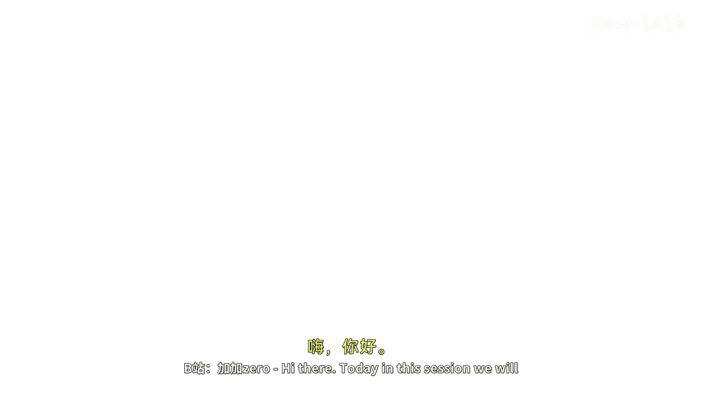
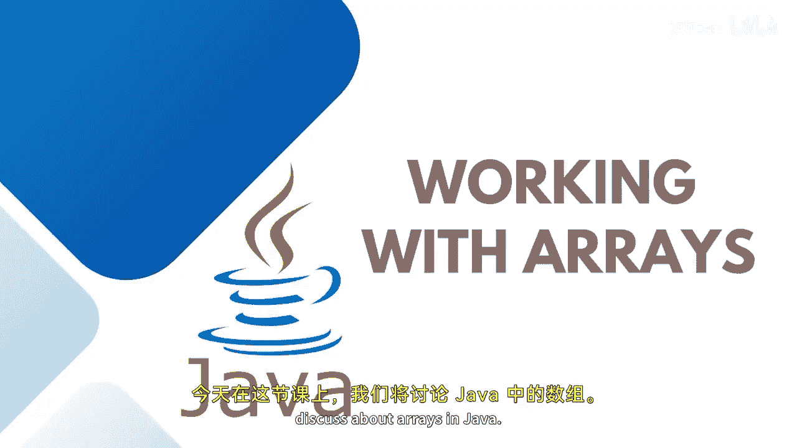

Java全栈开发：02：Java中的数组 📚

在本节课中，我们将学习Java中的数组。数组是一种用于存储多个相同类型数据的数据结构。通过使用数组，我们可以高效地管理和访问数据，避免为每个数据项单独创建变量。

---

在数字世界中，作为程序员，存储信息是一项至关重要的任务。每一小段信息都需要保存在内存位置中以备将来使用。为此，我们使用数组。数组是一种数据结构，用于存储相同数据类型的元素，而不是将成百上千个值存储在不同的变量中。

通过数组，我们可以将所有值存储在单个变量中，以便频繁使用数据。我们必须为这个变量分配一个名称。在数组中，每个元素都可以通过其索引号直接访问。假设数组的大小为5，那么索引从0开始，直到4（即5-1）。数组是一种同质的、非原始的数据类型，用于将多个元素保存到一个特定的变量中。

其核心思想是在数组中存储多个相同类型的项，这就是我们称之为“同质”的原因。通过将一个偏移量加到基值上，可以更容易地计算每个元素的位置。

假设你需要编写一个代码，用于记录五名学生的五门科目成绩。与其创建五个不同的变量，不如将数据存储并访问自一个名为 `marks` 的数组变量中。

---

与使用多个独立变量相比，使用数组有几个优点：
*   它有助于减少代码量，实现代码优化。
*   借助索引实现随机访问。
*   易于遍历数据。
*   易于操作和排序数据。

---

数组主要有两种类型：一维数组和多维数组。

如果你想将数据存储在特定的行中，那就是一维数组。例如，五名学生的成绩或五名学生的姓名。

如果你想存储多维数据，例如数组中的每个元素是一个学生对象，而每个对象又关联着多个属性，这种数据可以存储在**多维数组**中。同样，如果你需要处理任何依赖于矩阵表或向量的计算，也可以使用多维数组。

---

本节课我们一起学习了Java中数组的基本概念、优势以及主要类型。数组是组织和高效访问同类型数据集合的强大工具。在接下来的课程中，我们将通过实际实现来深入了解数组的更多细节。敬请关注，下节课见。