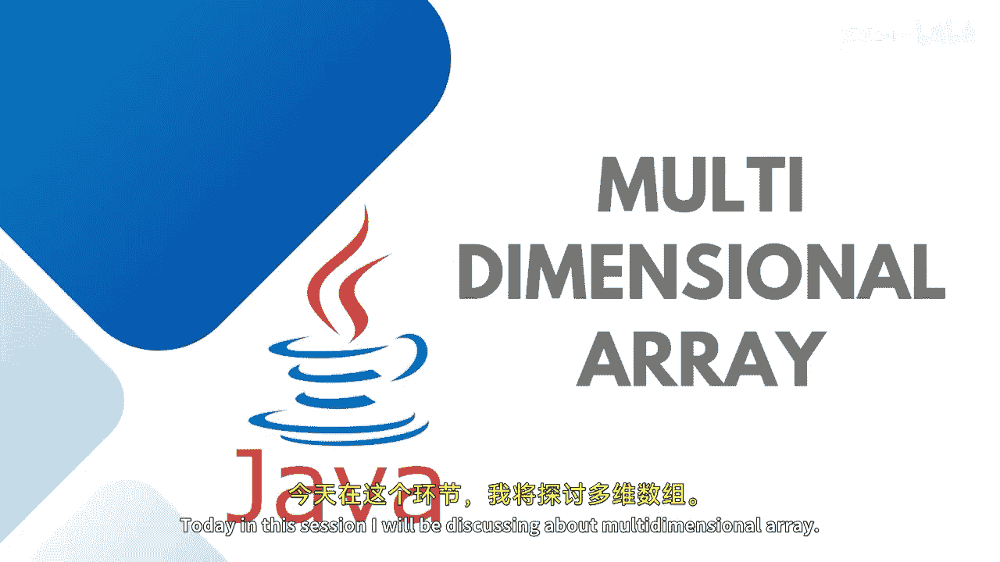

Java全栈开发：04：多维数组详解 📚




在本节课中，我们将要学习Java中的多维数组。我们将了解什么是多维数组，为什么需要它，以及如何声明、初始化和遍历多维数组。课程内容将尽可能简单直白，确保初学者能够理解。

---

并非所有情况下我们都使用一维数组。例如，当你需要以表格、矩阵或向量的形式存储数据时，就需要用到多维数组。

多维数组，或称二维及更多维度的数组，其结构看起来像一个矩形数组，因为它的每一行长度相同，但列数可以不同。它可以是二维数组、三维数组或更多维。但当我们称之为多维数组时，至少需要是二维的。

我们使用逗号分隔多个维度来声明数组。为了存储和访问多维数组中的元素，需要使用嵌套循环，其中外层循环处理行，内层循环处理列。

以下是声明多维数组的方式：
```java
int[][] arrayName = new int[3][3];
```
你可以看到这里我定义了两个维度。第一个维度是行，有三行；第二个维度是列，在我的例子中，有三列。所以这是一个3行3列的数组。

这里，第一行的行索引是0，列索引会不断变化；第二行的行索引是1，列索引同样会变化，依此类推。

---

接下来，让我们尝试实际实现一个多维数组。这里，我想存储一个成绩数组。我希望存储三个学生、每个学生五门科目的成绩。

我可以这样创建多维数组。我也可以不预先分配内存，而是直接根据这些值分配数据，内存会自动分配。
```java
int[][] marks = {
    {67, 78, 87, 89, 98},
    {76, 77, 56, 65, 90},
    {67, 79, 92, 63, 55}
};
```
如上所述，这将是一个3行5列的数组。我需要一个嵌套的for循环。第一个for循环将遍历行，第二个for循环将遍历列。

以下是遍历代码：
```java
for (int i = 0; i < 3; i++) {
    for (int j = 0; j < 5; j++) {
        System.out.print(marks[i][j] + " ");
    }
    System.out.println();
}
```
这样，你就可以处理多维数组了。

---

如果你不希望这样打印，而是希望以表格格式输出，只需在行变化时换行。我还会使用制表符转义字符 `\t`，以便在每个行的元素之间看到空格。

以表格格式打印的代码如下：
```java
for (int i = 0; i < 3; i++) {
    for (int j = 0; j < 5; j++) {
        System.out.print(marks[i][j] + "\t");
    }
    System.out.println();
}
```
这样，所有五门科目的成绩就会以整齐的表格形式打印出来。

---

我希望多维数组的概念对你来说已经清晰了。我们还有对象数组，并且在 `java.util` 包中有一个 `Arrays` 类，它包含许多预定义的方法。我们将在后续课程中讨论它们。


本节课中，我们一起学习了多维数组的基本概念、声明、初始化及遍历方法。掌握这些是处理更复杂数据结构的基础。我们下节课再见。