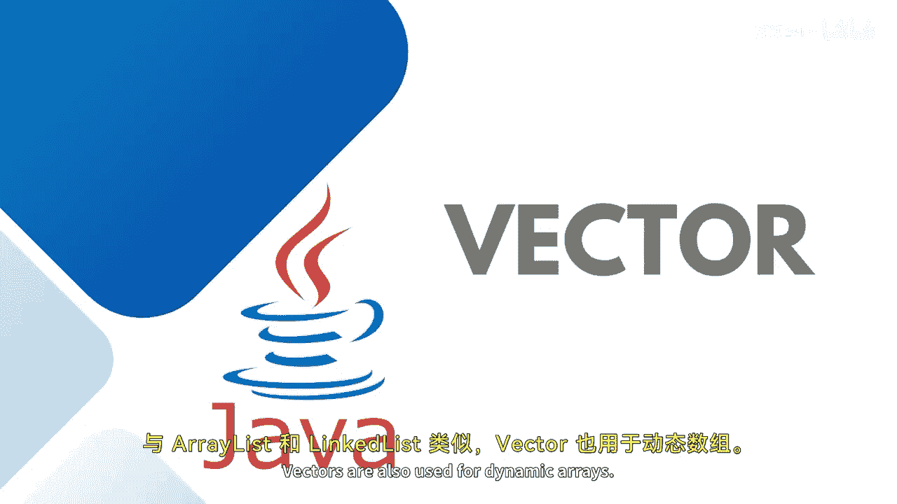
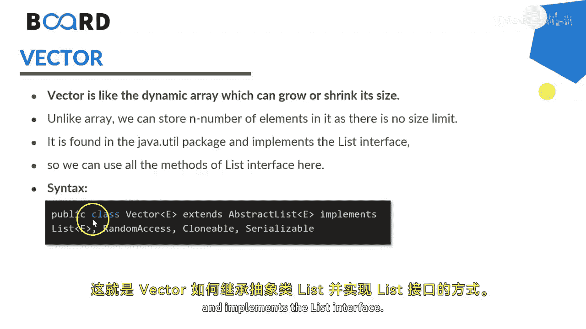

# 013：Vector详解 🧮


在本节课中，我们将要学习Java集合框架中的`Vector`类。我们将了解它的定义、特性、与`ArrayList`的区别，并通过一个简单的编程示例来掌握其基本用法。



---

## 概述

与`ArrayList`和`LinkedList`类似，`Vector`也用于实现动态数组。`Vector`就像一个可以动态增长或缩小的数组。它扩展了`AbstractList`类并实现了`List`接口。




## Vector的核心特性

上一节我们介绍了`Vector`的基本概念，本节中我们来看看它的一个核心特性。

`Vector`是**同步**的。这意味着在任意给定时间，只有一个线程可以访问代码。如果一个线程正在操作`Vector`，其他线程就无法获取它。因此，对`Vector`的操作一次只能执行一个。例如，如果一个线程正在执行添加操作，其他操作必须等待该操作完成。

`Vector`扩展了`AbstractList`类并实现了`List`接口。


## 访问与使用Vector

我们可以通过索引来访问`Vector`对象中的元素。


正如之前提到的，它类似于`ArrayList`，但存在一些关键区别。`Vector`是同步的，并且包含许多不属于集合框架接口的遗留方法。

以下是使用`Vector`的主要原因：
*   它具有动态大小，与`ArrayList`或`LinkedList`一样。
*   它提供了遗留类支持。
*   它的同步特性是一个附加优势，可以限制多个线程同时对列表进行操作或修改。

`Vector`提供了一些特定的方法，例如`addAll`、`addElement`、`capacity`、`contains`、`equals`、`get`、`indexOf`。你可以使用来自集合接口的方法，也可以使用`Vector`自身的一些方法来遍历列表。

## Vector 与 ArrayList 的比较

大多数时候，我们会将`Vector`与`ArrayList`进行比较。

以下是它们的主要区别：
*   `ArrayList`是Java集合框架的一部分，而`Vector`是Java的遗留类。
*   当容量达到上限时，`Vector`的容量会**翻倍增长**，而`ArrayList`的容量则**增长一半**。
*   `Vector`的方法是同步的，因此不允许在给定时间点由多个线程进行修改或操作，而`ArrayList`是不同步的。
*   `Vector`使用`Enumeration`和`Iterator`来遍历元素列表，而`ArrayList`只使用`Iterator`。
*   由于同步机制，`Vector`的操作速度较慢，而`ArrayList`更快。
*   `Vector`有一个增量大小（`capacityIncrement`）属性，可以用来控制容量增长，而`ArrayList`不提供此功能。
*   `Vector`是**线程安全**的，这意味着允许多个线程安全地使用它。而`ArrayList`不是线程安全的。

## 编程实现

让我们尝试在编程中实现`Vector`。

以下是创建一个`Vector`并演示其基本操作的示例代码：

```java
import java.util.Vector;

public class VectorDemo {
    public static void main(String[] args) {
        // 创建一个存储字符串的Vector
        Vector<String> vector = new Vector<>();

        // 首先，显示Vector的初始大小
        System.out.println("初始Vector大小: " + vector.size());

        // 向Vector中添加元素
        vector.add("Programming");
        vector.add("Networking");
        vector.add("Database");
        vector.add("Deployment");
        vector.add("Cloud Services");

        // 显示Vector的内容
        System.out.println("添加元素后的Vector: " + vector);
        // 检查Vector的大小
        System.out.println("当前Vector大小: " + vector.size());

        // 如果想移除某个元素，使用remove方法并传入要移除的索引
        vector.remove(1); // 移除索引为1的元素（"Networking"）
        System.out.println("移除一个元素后的Vector大小: " + vector.size());

        // 如果想移除所有元素，使用clear方法
        vector.clear();
        System.out.println("清空所有元素后的Vector大小: " + vector.size());
    }
}
```

执行这段代码，我们可以看到输出结果：
初始Vector大小是0。
添加五个字符串后，大小变为5。
移除一个元素后，大小变为4。
清空所有元素后，大小变回0。

这就是`Vector`在实际中的一个简单应用示例。在后续的示例中，我还会演示如何像使用`ArrayList`或`LinkedList`一样，使用`Vector`来存储对象或类类型的实例。

---

## 总结

本节课中我们一起学习了Java中的`Vector`类。我们了解了它是同步的动态数组，是Java的遗留类。我们探讨了它与`ArrayList`在多线程支持、性能、容量增长策略等方面的主要区别。最后，我们通过一个编程示例实践了`Vector`的创建、添加、移除和清空等基本操作。理解这些集合类的特性和适用场景，对于构建高效、稳定的Java应用程序至关重要。

我们下节课再见。保持关注，谢谢！🎼


