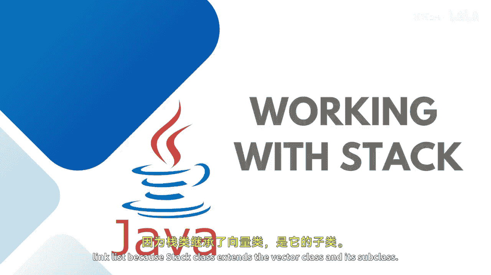
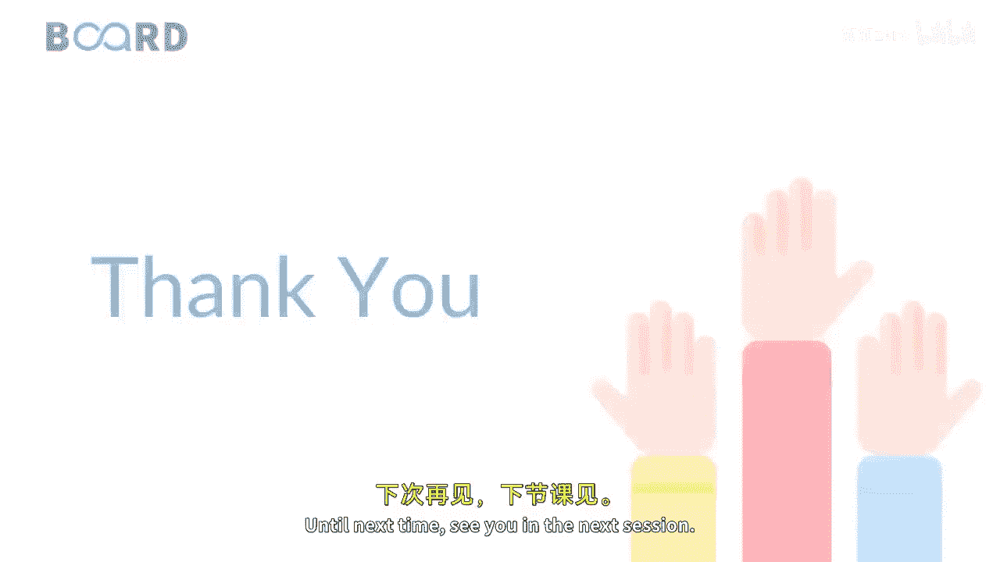
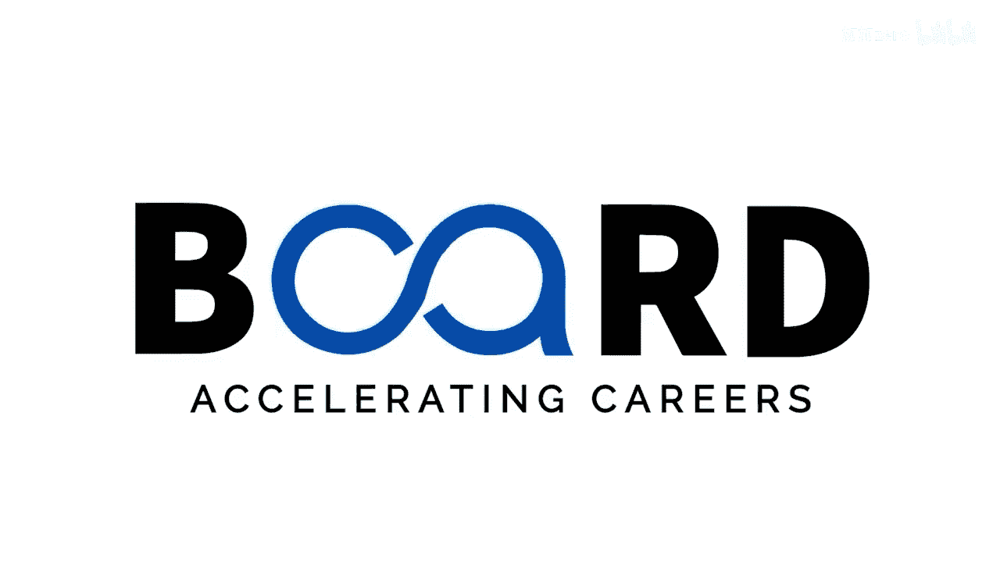

# 014：栈（Stack）数据结构详解

在本节课中，我们将要学习Java集合框架中的栈（Stack）数据结构。我们将了解它的定义、核心原理、实现方式以及实际应用场景。

---

上一节我们介绍了向量、列表和链表。本节中我们来看看栈，因为`Stack`类扩展了`Vector`类，是其子类。

栈是一种线性数据结构，其中元素的插入和删除只能在一端进行，这一端被称为**栈顶**。

实际上，操作栈时需要遵循一个原则，即**LIFO**（后进先出）。

栈也实现了诸如`List`、`Collection`、`Iterable`、`Cloneable`和`Serializable`等接口。

为了将一个对象放入栈顶，我们使用`push`方法。
为了移除并返回栈顶的元素，我们使用`pop`方法。

以下是基于现实场景的更多例子：当我们堆叠书本时，我们总是将最新的书放在最上面，然后一本接一本地从顶部取走。因此，只有一个端点用于元素的插入和删除。

栈的实例化方式如下所述。如前所述，`Stack`扩展了`Vector`类，而`Vector`在多级继承中实现了`Iterable`、`Collection`和`List`接口。简而言之，栈拥有来自`Iterable`、`Collection`、`List`接口以及`Vector`类的方法实现。

如果你基于实际应用来比较，以下是栈可以执行的技术应用：
*   浏览器历史记录遍历：当你点击特定链接时会发生，但当你想要返回上一页时，你需要逐一点击浏览器的后退按钮，无法直接跳转到第二个或第三个链接。
*   表达式求值。
*   树遍历（如二叉树）。
*   编辑器中的撤销操作。
*   递归。
*   编译器中的语法分析。

---

本节课中我们一起学习了栈数据结构的基本概念、LIFO原理、核心方法（`push`和`pop`）以及其广泛的应用场景。理解栈是掌握更复杂算法和数据结构的基础。