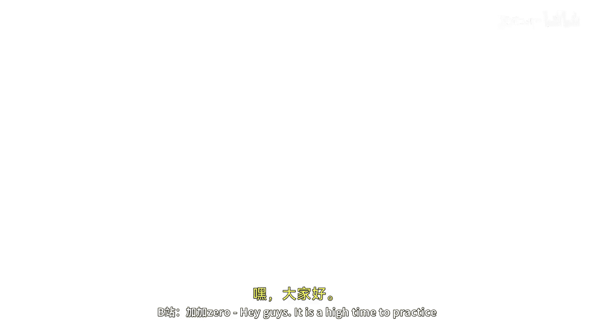

# 016：使用栈实现字符串反转练习 🧱



在本节课中，我们将学习如何使用栈（Stack）这种数据结构来实现一个字符串反转的操作。栈的“后进先出”（LIFO）特性使其非常适合完成此类任务。

## 概述


我们将创建一个名为 `StringReversal` 的类，其中包含一个 `reverse` 方法。该方法接收一个字符串作为输入，利用栈来反转字符的顺序，并返回反转后的字符串。最后，我们将在主方法中测试这个功能。

## 实现步骤

以下是实现字符串反转功能的具体步骤。

### 1. 创建类与方法

首先，我们创建一个类和一个用于反转字符串的方法。

```java
public class StringReversal {
    public String reverse(String input) {
        // 反转逻辑将在这里实现
        return "";
    }
}
```

### 2. 初始化栈

在 `reverse` 方法内部，我们需要一个栈来存储字符。我们使用 `Stack<Character>`。

```java
Stack<Character> stack = new Stack<>();
```

### 3. 将字符压入栈

接下来，我们需要遍历输入字符串，并将每个字符依次压入栈中。这利用了栈的“后进先出”特性。

```java
for (char ch : input.toCharArray()) {
    stack.push(ch);
}
```

### 4. 弹出字符以构建反转字符串

当所有字符都入栈后，我们通过依次弹出栈顶元素来构建反转后的字符串。

```java
StringBuilder reversed = new StringBuilder();
while (!stack.isEmpty()) {
    reversed.append(stack.pop());
}
return reversed.toString();
```

### 5. 测试程序

最后，我们在 `main` 方法中实例化类，传入测试字符串，并打印原始字符串与反转后的字符串进行对比。

```java
public static void main(String[] args) {
    String str = "ABCD";
    StringReversal reverser = new StringReversal();
    String result = reverser.reverse(str);
    System.out.println("原始字符串: " + str);
    System.out.println("反转后字符串: " + result);
}
```

## 核心概念与代码

本节的核心是理解栈的操作。主要涉及两个操作：
*   **`push(element)`**：将元素压入栈顶。
*   **`pop()`**：移除并返回栈顶元素。

完整的 `StringReversal` 类代码如下：

```java
import java.util.Stack;

public class StringReversal {
    public String reverse(String input) {
        Stack<Character> stack = new Stack<>();
        for (char ch : input.toCharArray()) {
            stack.push(ch);
        }
        StringBuilder reversed = new StringBuilder();
        while (!stack.isEmpty()) {
            reversed.append(stack.pop());
        }
        return reversed.toString();
    }

    public static void main(String[] args) {
        String str = "ABCD";
        StringReversal reverser = new StringReversal();
        String result = reverser.reverse(str);
        System.out.println("原始字符串: " + str);
        System.out.println("反转后字符串: " + result);
    }
}
```

## 运行结果

运行上述程序，控制台将输出：

```
原始字符串: ABCD
反转后字符串: DCBA
```

可以看到，输入字符串 “ABCD” 被成功反转为 “DCBA”。


## 总结


本节课中，我们一起学习了如何利用栈的“后进先出”特性来实现字符串反转。我们创建了一个完整的Java类，定义了反转方法，并进行了测试。通过这个练习，你不仅掌握了栈的基本操作（`push` 和 `pop`），也理解了如何将数据结构应用于解决实际问题。