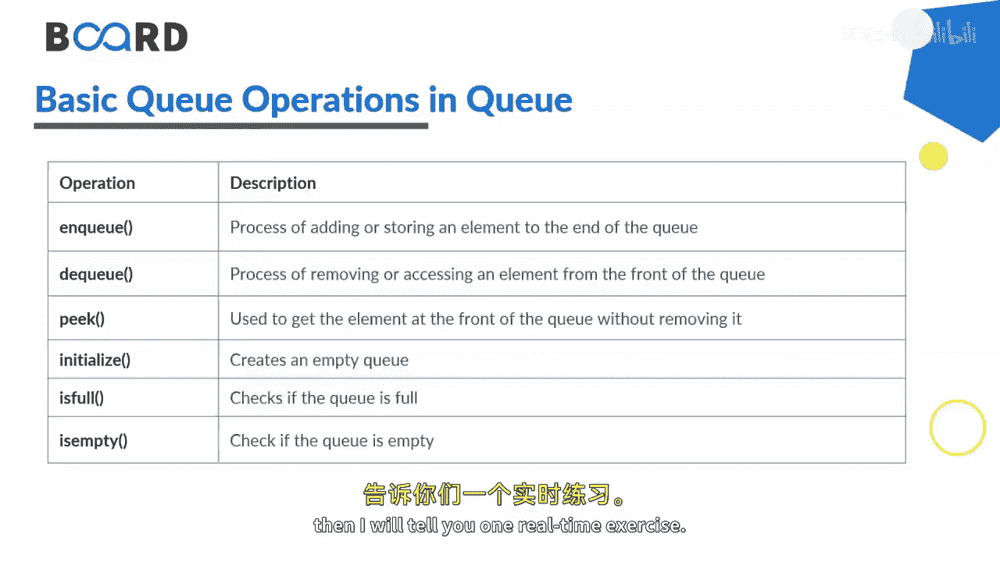
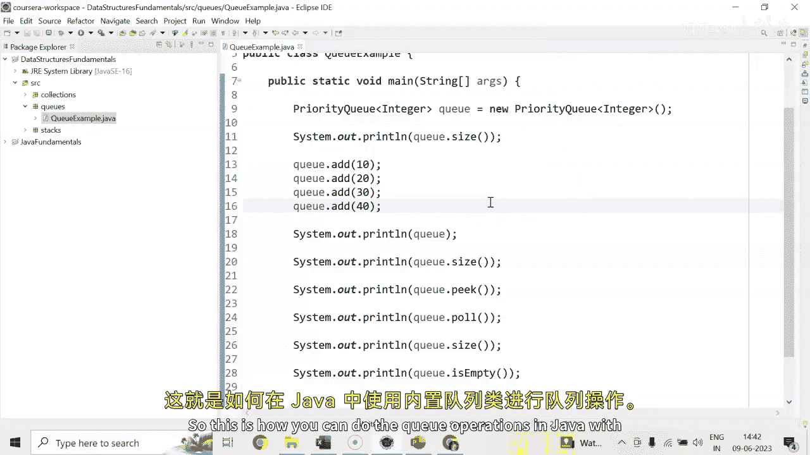
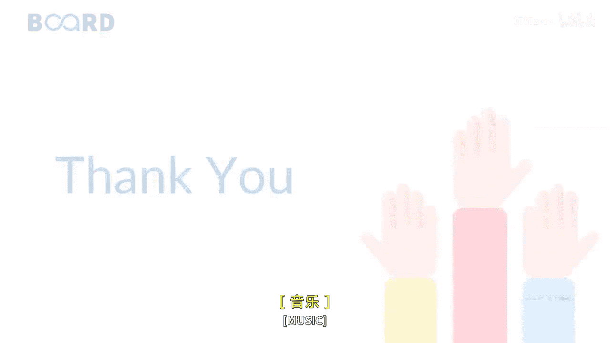
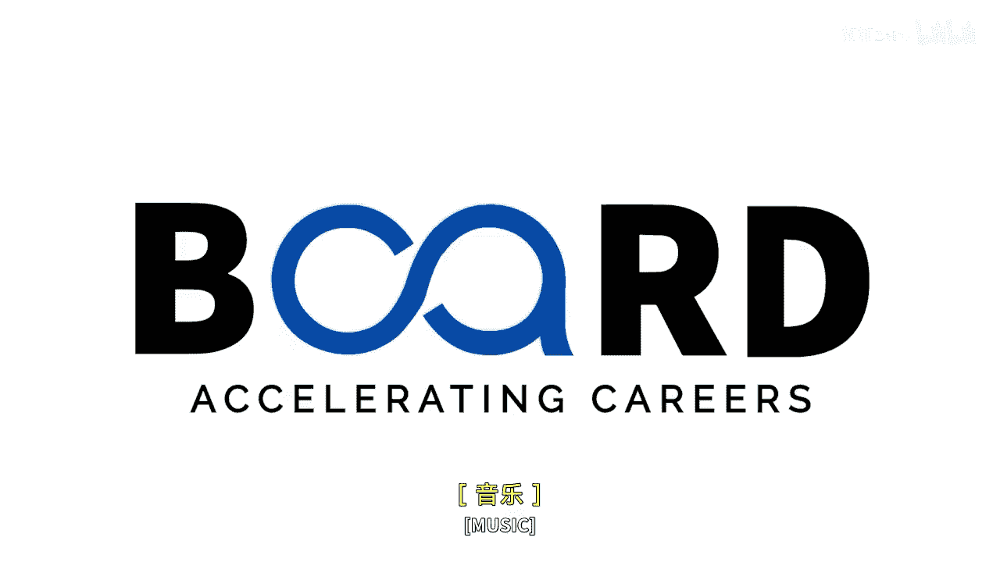

# 018：队列操作详解 🚶‍♂️➡️🚶‍♀️

在本节课中，我们将学习Java中队列（Queue）的基本概念、常见操作及其实现。队列是一种遵循“先进先出”（FIFO）原则的数据结构，类似于现实生活中的排队场景。

## 概述

队列在编程中应用广泛，例如处理任务调度、消息传递等。本节将介绍队列的基本操作，并通过Java代码演示如何实现这些操作。

## 队列的现实应用

以下是队列在现实生活中的一些应用场景，这些场景都遵循“先到先得”的原则：

*   自动扶梯上的乘客依次上下。
*   商店收银台前的排队。
*   银行柜台前的排队。
*   公交车站的候车队伍。
*   洗车店的车辆排队。

## 队列的基本操作

上一节我们了解了队列的应用场景，本节中我们来看看队列支持哪些核心操作。以下是队列最常用的几种方法：

*   **enqueue**：向队列**尾部添加**一个元素。在Java的`PriorityQueue`中，我们使用`add()`方法。
    ```java
    queue.add(element);
    ```
*   **dequeue**：从队列**头部移除**一个元素。在Java的`PriorityQueue`中，我们使用`poll()`方法。
    ```java
    queue.poll();
    ```
*   **peek**：**查看**队列头部的元素，但**不移除**它。
    ```java
    queue.peek();
    ```
*   **initialize**：创建一个空队列。
    ```java
    Queue<Integer> queue = new PriorityQueue<>();
    ```
*   **isFull** / **isEmpty**：检查队列是否已满或为空。`isEmpty()`返回一个布尔值。
    ```java
    queue.isEmpty(); // 返回 true 或 false
    ```



## 代码实践：实现队列操作

现在，让我们通过具体的Java代码来实践上述操作。我们将使用Java内置的`PriorityQueue`类。

首先，我们创建一个`PriorityQueue`实例并添加一些元素：

```java
// 创建一个优先级队列实例
PriorityQueue<Integer> queue = new PriorityQueue<>();

// 添加元素到队列
queue.add(10);
queue.add(20);
queue.add(30);
queue.add(40);

// 打印队列
System.out.println(queue);
```

接下来，我们检查队列的大小并查看队首元素：

```java
// 检查队列大小
System.out.println("Size: " + queue.size());

// 查看队首元素（不删除）
System.out.println("Element ready to remove (peek): " + queue.peek());
```

然后，我们从队列中移除元素并再次检查大小：

```java
// 移除队首元素
System.out.println("Element removed (poll): " + queue.poll());

// 再次检查队列大小
System.out.println("Size after removal: " + queue.size());
```

最后，我们可以检查队列是否为空：

```java
// 检查队列是否为空
System.out.println("Is queue empty? " + queue.isEmpty());
```

运行以上代码，输出结果将演示队列的FIFO行为：第一个添加的元素（10）会首先被移除。

## 总结



本节课中我们一起学习了Java队列的核心操作。我们了解了队列“先进先出”的特性，认识了`enqueue`（添加）、`dequeue`（移除）和`peek`（查看）等基本方法，并通过`PriorityQueue`类进行了代码实践。记住，`poll()`方法会移除元素，而`peek()`方法仅查看不移除。掌握这些操作为处理需要顺序管理的任务打下了基础。





敬请关注后续课程，以深入学习更多相关概念。我们下节课再见。