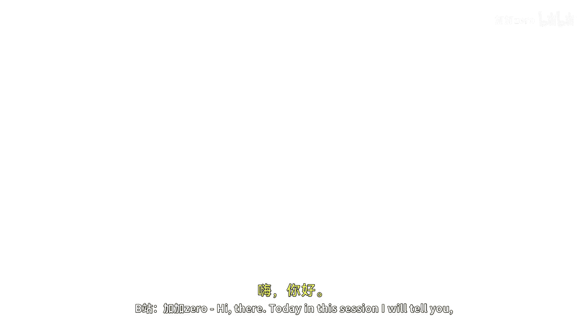
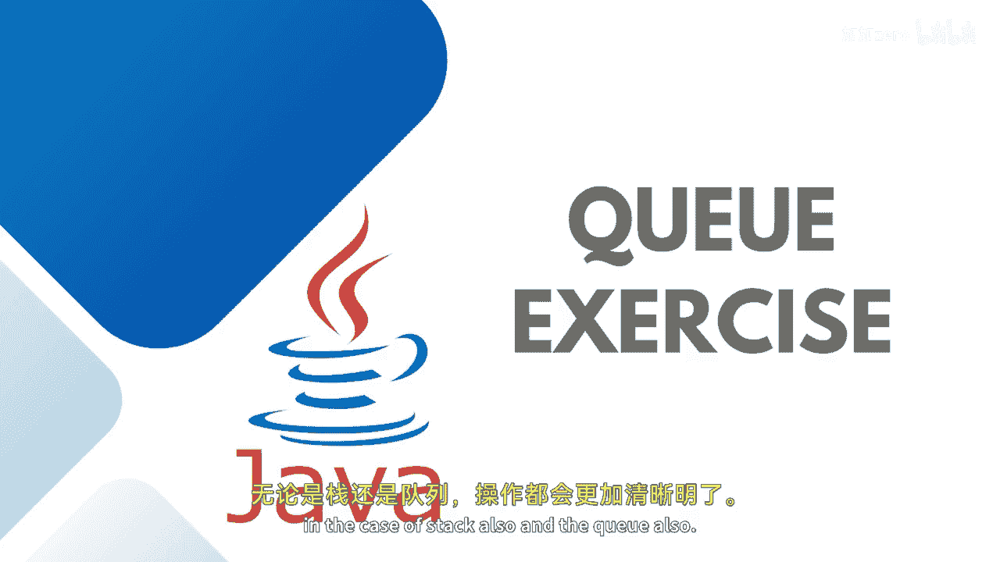

# 019：使用队列反转字符串



在本节课中，我们将学习如何使用队列（Queue）来反转一个字符串。在上一节中，我们介绍了如何使用栈（Stack）完成同样的操作，因此通过对比，您将对栈和队列的操作有更清晰的理解。

## 概述

本节课的目标是演示一个反转队列中元素顺序的静态方法。我们将创建一个方法，它接收一个队列作为参数，并使用一个辅助栈来反转队列中元素的顺序。最后，我们将通过一个简单的示例来验证方法的正确性。



## 实现步骤

以下是实现反转队列功能的核心步骤。

首先，我们创建一个静态方法，它接受一个泛型队列作为参数。这意味着该方法可以处理整数、字符串或任何其他类型的队列。

```java
public static <T> void reverse(Queue<T> queue) {
    // 反转逻辑将在这里实现
}
```

上一节我们介绍了栈的基本操作，本节中我们来看看如何结合栈来反转队列。我们将在方法内部创建一个栈，用于临时存储队列中的元素。

```java
Stack<T> stack = new Stack<>();
```

接下来，我们需要将队列中的所有元素依次移出并压入栈中。由于栈的“后进先出”特性，元素的顺序将被反转。

```java
while (!queue.isEmpty()) {
    stack.push(queue.remove());
}
```

当队列中所有元素都转移到栈中后，我们再将栈中的元素依次弹出并添加回队列。此时，队列中的元素顺序就是反转后的顺序。

```java
while (!stack.isEmpty()) {
    queue.add(stack.pop());
}
```

## 完整代码示例

为了清晰地展示整个过程，以下是将上述步骤整合后的完整静态方法，以及一个用于测试的 `main` 方法。

```java
import java.util.*;

public class QueueReversalDemo {
    // 反转队列的静态方法
    public static <T> void reverse(Queue<T> queue) {
        Stack<T> stack = new Stack<>();
        // 将队列元素转移到栈中
        while (!queue.isEmpty()) {
            stack.push(queue.remove());
        }
        // 将栈元素转移回队列（此时顺序已反转）
        while (!stack.isEmpty()) {
            queue.add(stack.pop());
        }
    }

    public static void main(String[] args) {
        // 创建一个整数队列并添加元素
        Queue<Integer> queue = new ArrayDeque<>();
        queue.add(20);
        queue.add(30);
        queue.add(40);

        System.out.println("原始队列: " + queue);
        // 调用反转方法
        reverse(queue);
        System.out.println("反转后队列: " + queue);
    }
}
```

## 运行结果分析

运行上述程序，您将看到类似以下的输出：

```
原始队列: [20, 30, 40]
反转后队列: [40, 30, 20]
```

输出结果明确显示，队列中元素的顺序已经从 `[20, 30, 40]` 成功反转为 `[40, 30, 20]`。

## 总结


本节课中我们一起学习了如何使用一个辅助栈来反转队列中的元素顺序。我们实现了一个通用的静态方法，并通过一个具体的例子验证了其功能。这个方法的核心思想是利用栈的“后进先出”特性来逆转队列的“先进先出”顺序。您也可以尝试使用其他数据结构，如 `LinkedList` 或 `Vector` 来实现相同的逻辑。希望这个概念对您来说已经非常清晰。