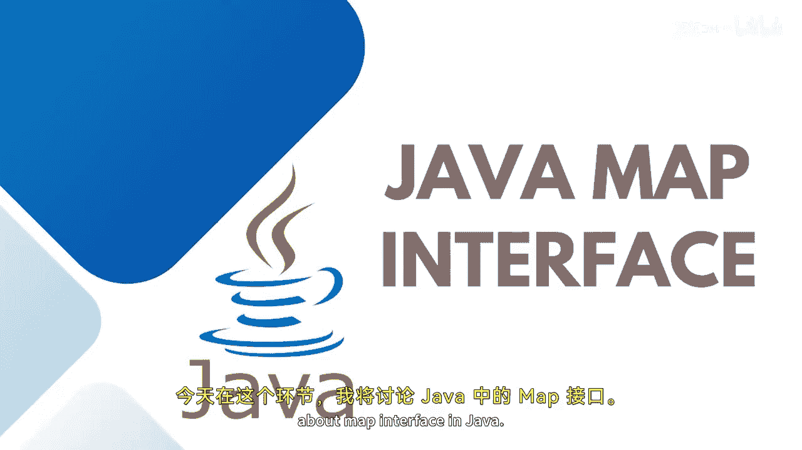

Java全栈开发：20：Java Map接口详解 🗺️

在本节课中，我们将要学习Java中的Map接口。Map是一种基于键值对存储数据的集合，类似于字典。我们将了解其核心概念、实现类、常用方法以及需要注意的异常。

---

### 概述

Map接口用于存储键值对，其中每个键都是唯一的。它提供了基于键进行搜索、更新和删除元素的高效方法。Java提供了多个实现Map接口的类，如HashMap、LinkedHashMap和TreeMap。

---

### Map的核心概念

Map包含基于键的值，即键值对。就像字典一样，每个键值对被称为一个条目，并且Map中的键始终是唯一的。您可以通过Map接口中提供的一些方法来单独访问键和条目。如果您需要基于键来搜索、更新或删除元素，Map会非常有用。

在Java中，有两个接口用于实现Map：`Map`和`SortedMap`。此外，还有三个主要的实现类：`HashMap`、`LinkedHashMap`和`TreeMap`。

Map不允许重复的键。正如前面提到的，Map中的键始终是唯一的。`HashMap`和`LinkedHashMap`允许空键和空值，这意味着空键和空值的迭代是非重复的。但`TreeMap`不允许任何空值和空键本身。

以下是Map的层次结构：
有两个接口，一个是`Map`，另一个是`SortedMap`。`NavigableMap`是`SortedMap`的子接口。它们被`HashMap`、`LinkedHashMap`和`TreeMap`类扩展或实现。

---

### 常用Map方法

以下是允许我们基于键及其值来实现和操作Map的一些常用方法：

*   `put(K key, V value)`：在Map中插入一个条目。
*   `putAll(Map<? extends K, ? extends V> m)`：将指定Map中的所有条目插入当前Map。
*   `putIfAbsent(K key, V value)`：检查插入的值是否存在；如果不存在，则插入；否则跳过。
*   `remove(Object key)`：删除指定键对应的条目。
*   `get(Object key)`：返回指定键对应的值。
*   `containsKey(Object key)`：检查Map集合中是否存在特定的键。
*   `entrySet()`：返回Map中所有条目的集合。
*   `keySet()`：仅获取所有键的集合。
*   `values()`：仅获取所有值的集合。

---

### Map的常见异常

在使用Map时，您可能会遇到以下异常：

*   `NoSuchElementException`：当调用的Map或条目中不存在项目时抛出。
*   `ClassCastException`：当尝试将对象分配给Map中不兼容的元素时发生。
*   `NullPointerException`：如果尝试使用空对象，并且在您使用的特定Map类型中不允许空值时发生。
*   `UnsupportedOperationException`：当尝试更改不可修改的Map时抛出。

因此，在使用Map时，您需要根据这些异常来调整您的操作。

---

### 总结

本节课我们一起学习了Java中的Map接口。我们了解了Map基于键值对存储数据的核心概念，认识了其主要的实现类（`HashMap`、`LinkedHashMap`、`TreeMap`）以及它们之间的区别。我们还介绍了Map接口中常用的方法，并指出了在使用过程中可能遇到的几种异常情况。掌握这些知识是有效使用Java集合框架进行数据管理的基础。在接下来的课程中，我们将继续深入探讨Map接口及其子类的更多细节。