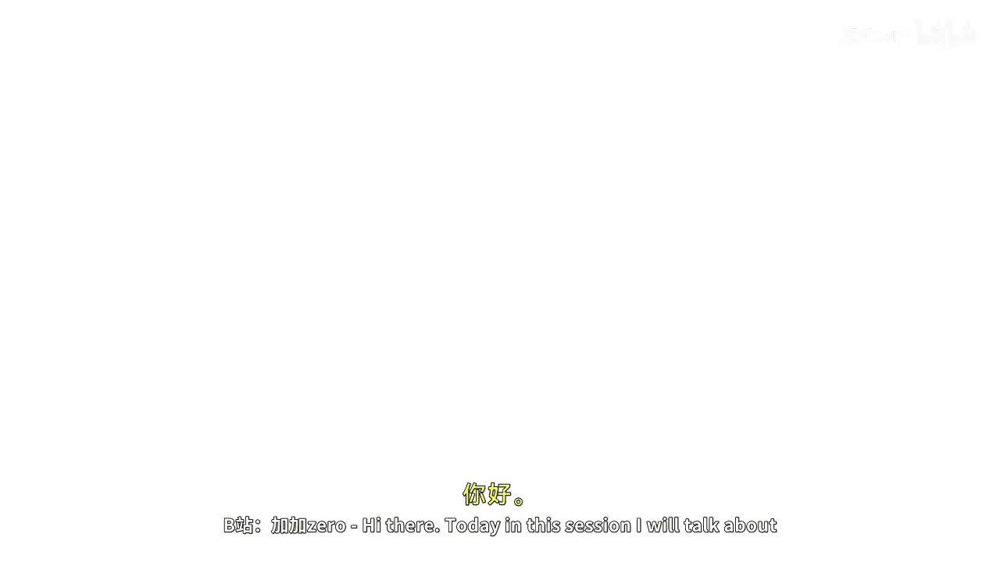
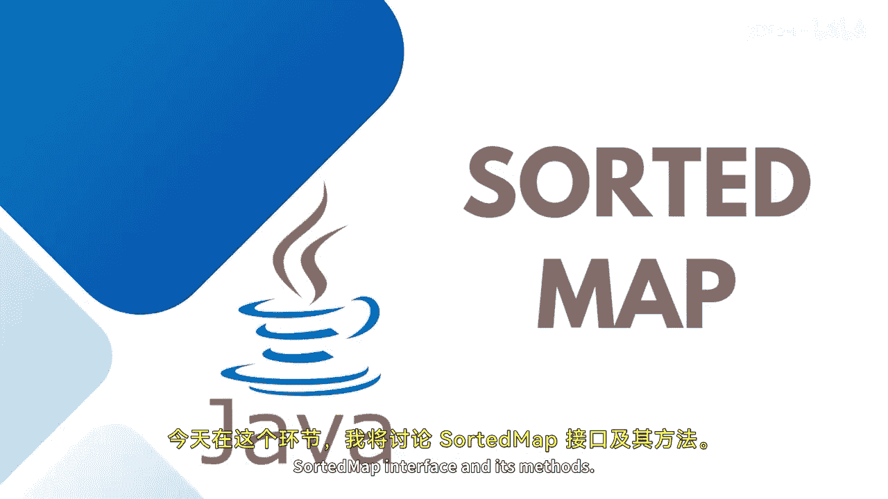

# 025：SortedMap接口详解 📚



在本节课中，我们将要学习Java中的SortedMap接口。SortedMap是Map接口的一个子接口，它能够根据键的自然顺序或指定的比较器对映射进行排序。我们将了解其核心概念、特性、常用方法，并通过一个简单的示例来掌握其基本用法。



---

## 概述

SortedMap接口是Java集合框架的一部分，它扩展了Map接口，并保证其条目按照键的升序排列。它本身是一个接口，不能直接实例化，通常通过实现类TreeMap来使用其功能。SortedMap提供了高效操作映射子集的能力。

## SortedMap的核心特性

SortedMap的主要特性是它能够根据键的自然顺序或通过特定的比较器来对键进行排序。这意味着存入SortedMap的条目会自动按照键的顺序进行组织。

**核心概念公式/代码表示：**
*   **接口继承关系**：`SortedMap<K, V>` extends `Map<K, V>`
*   **常用实现类**：`TreeMap<K, V>`
*   **排序依据**：键的**自然顺序** 或 **指定的Comparator**

上一节我们介绍了SortedMap的基本概念，本节中我们来看看它的具体实现和适用场景。

当您需要一个满足以下条件的映射时，可以考虑使用TreeMap（SortedMap的实现类）：
1.  不允许使用null键或null值（取决于具体实现和比较器）。
2.  需要键按照自然顺序或特定比较器排序。

下图展示了SortedMap在集合框架中的位置：
```
Map 接口
   ↑
SortedMap 接口
   ↑
TreeMap 类 / ConcurrentSkipListMap 类
```

## SortedMap的优势

使用SortedMap主要带来以下优势：
*   **元素有序排列**：数据始终按照键的顺序存储。
*   **易于搜索**：有序结构使得范围查询和特定顺序的搜索性能更佳。
*   **可预测的迭代顺序**：遍历映射时，条目会按照键的顺序依次出现，非常高效。

## SortedMap的常用方法

除了继承自Map接口的所有方法（如`put`, `get`, `remove`）外，SortedMap还定义了一些自身特有的方法，用于处理有序的键。

以下是SortedMap接口中新增的一些重要方法：

*   `Comparator<? super K> comparator()`: 返回用于对此映射中的键进行排序的比较器；如果此映射使用键的自然顺序，则返回null。
*   `K firstKey()`: 返回此映射中当前的第一个（最低）键。
*   `K lastKey()`: 返回此映射中当前的最后一个（最高）键。
*   `SortedMap<K, V> headMap(K toKey)`: 返回此映射的部分视图，其键严格小于`toKey`。
*   `SortedMap<K, V> tailMap(K fromKey)`: 返回此映射的部分视图，其键大于等于`fromKey`。
*   `SortedMap<K, V> subMap(K fromKey, K toKey)`: 返回此映射的部分视图，其键的范围从`fromKey`（包括）到`toKey`（不包括）。

## 实践示例

现在，让我们通过一个简单的代码示例来演示SortedMap（通过TreeMap）的基本使用。

```java
// 1. 创建SortedMap引用，并实例化TreeMap
SortedMap<String, Integer> numbers = new TreeMap<>();

// 2. 向映射中添加键值对
numbers.put("Two", 2);
numbers.put("One", 1);
numbers.put("Three", 3);

// 3. 打印整个有序映射。输出将按键（字符串）的字母顺序排列。
System.out.println("Sorted Map: " + numbers); // 输出: {One=1, Three=3, Two=2}

// 4. 获取第一个和最后一个键
String firstKey = numbers.firstKey(); // "One"
String lastKey = numbers.lastKey();   // "Two"
System.out.println("First Key: " + firstKey);
System.out.println("Last Key: " + lastKey);

// 5. 移除一个键值对
numbers.remove("One");
System.out.println("After removal: " + numbers); // 输出: {Three=3, Two=2}
```

此外，您还可以使用`headMap`, `tailMap`, `subMap`等方法来获取映射的子集视图，并进行迭代等操作。SortedMap继承了Map接口的所有方法，并在此基础上增加了针对有序键的操作方法，您可以据此进行更多练习。

---

## 总结


本节课中我们一起学习了Java的SortedMap接口。我们了解到SortedMap是一个保证条目按键排序的Map子接口，通常通过TreeMap类来使用。我们探讨了它的优势，如有序存储和高效的范围查询，并重点介绍了其特有的方法，如`firstKey()`, `lastKey()`, `headMap()`等。最后，通过一个简单的代码示例，我们实践了如何创建、填充和操作一个SortedMap。掌握SortedMap对于需要处理有序键值对数据的场景非常有帮助。