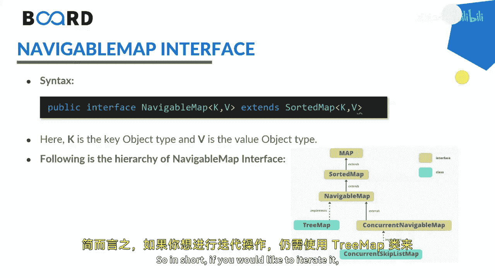

Java全栈开发：26：NavigableMap接口详解 🧭


在本节课中，我们将学习Java中的NavigableMap接口，并通过示例了解其方法。

NavigableMap接口是Java集合框架的一部分，它提供了在映射条目之间导航的功能，被视为SortedMap的一种类型。升序操作的性能和行为通常比降序操作更快、更高效。此外，它还提供了在现有映射中创建子映射的方法。

NavigableMap拥有多种实现特性，如`headMap`、`tailMap`和`subMap`，这些方法使我们能够更专注于导航操作。

以下是NavigableMap的语法：
```java
NavigableMap<K, V> numbers = new TreeMap<>();
```
其中，`K`是用于关联每个元素的唯一标识符（键），`V`是与键关联的值元素。



在继承层次上，Map接口扩展了SortedMap接口，而SortedMap接口又扩展了NavigableMap接口。NavigableMap主要由`TreeMap`类实现。简而言之，如果你想使用NavigableMap，通常需要使用`TreeMap`类来进行操作。

以下是NavigableMap特有的一些方法：
*   `ceilingEntry`
*   `descendingKeySet`
*   `descendingMap`
*   `firstEntry`
*   `floorEntry`
*   `lastEntry`
*   `pollFirstEntry`
*   `pollLastEntry`

上一节我们介绍了NavigableMap的基本概念和方法，本节中我们来看看如何通过代码实践来实现它。

以下是一个简单的实现示例：
```java
import java.util.NavigableMap;
import java.util.TreeMap;

public class NavigableMapExample {
    public static void main(String[] args) {
        // 创建一个NavigableMap，键为String类型，值为Integer类型
        NavigableMap<String, Integer> numbers = new TreeMap<>();

        // 向映射中添加元素
        numbers.put("Two", 2);
        numbers.put("One", 1);
        numbers.put("Three", 3);

        // 打印整个NavigableMap
        System.out.println("NavigableMap: " + numbers);

        // 获取第一个条目（不删除）
        System.out.println("First Entry: " + numbers.firstEntry());

        // 获取最后一个条目（不删除）
        System.out.println("Last Entry: " + numbers.lastEntry());

        // 获取并移除第一个条目
        System.out.println("Polled First Entry: " + numbers.pollFirstEntry());

        // 获取并移除最后一个条目
        System.out.println("Polled Last Entry: " + numbers.pollLastEntry());

        // 打印移除元素后的映射
        System.out.println("Updated NavigableMap: " + numbers);
    }
}
```
运行上述代码，输出结果可能如下：
```
NavigableMap: {One=1, Three=3, Two=2}
First Entry: One=1
Last Entry: Two=2
Polled First Entry: One=1
Polled Last Entry: Two=2
Updated NavigableMap: {Three=3}
```
可以看到，`firstEntry`返回映射的第一个条目（One=1），`lastEntry`返回最后一个条目（Two=2）。而`pollFirstEntry`方法会返回并移除第一个条目，`pollLastEntry`方法会返回并移除最后一个条目。这就是这些方法在实现中的迭代方式。


本节课中我们一起学习了Java的NavigableMap接口。我们了解了它是SortedMap的扩展，提供了强大的导航功能，如获取首尾条目、创建降序视图以及获取并移除条目。通过`TreeMap`的示例，我们实践了`firstEntry`、`lastEntry`、`pollFirstEntry`和`pollLastEntry`等核心方法的使用。掌握NavigableMap有助于更高效地处理需要排序和导航的键值对集合。