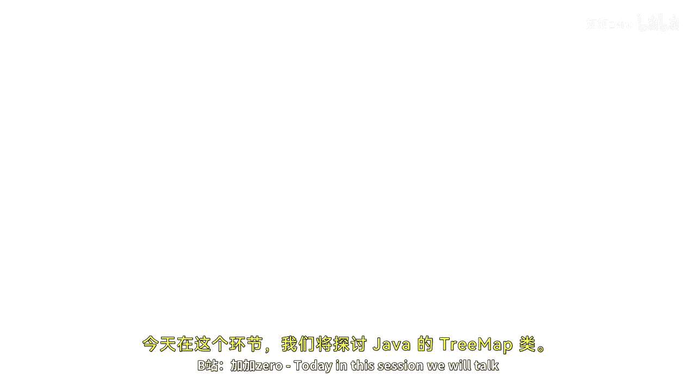

# 027：Java TreeMap详解 🌳

在本节课中，我们将要学习Java集合框架中的`TreeMap`类。我们将探讨它的定义、特性、继承层次结构以及基本操作方法。通过简单的示例，你将学会如何创建和使用`TreeMap`来存储和管理有序的键值对数据。

---




## 概述

`TreeMap`是Java集合框架中提供的一种基于红黑树（Red-Black tree）实现的`Map`接口。它能够高效地存储键值对，并**按照键的自然顺序或自定义比较器进行排序**。与`HashMap`不同，`TreeMap`保证了元素的有序性。

上一节我们介绍了不同的Map实现，本节中我们来看看`TreeMap`特有的操作和属性。

---

## TreeMap的继承层次

`TreeMap`类实现了`NavigableMap`接口，而`NavigableMap`又扩展了`SortedMap`接口，最终`SortedMap`扩展了基础的`Map`接口。其类声明如下：
```java
public class TreeMap<K,V> extends AbstractMap<K,V> implements NavigableMap<K,V>, Cloneable, Serializable
```

---

## TreeMap的核心特性

以下是`TreeMap`的一些关键特性：

1.  **有序存储**：`TreeMap`中的所有条目（键值对）都根据键的顺序进行排序。默认按键的**自然升序**排列，也可以通过提供的`Comparator`进行自定义排序。
2.  **不允许`null`键**：`TreeMap`**不允许使用`null`作为键**。尝试插入`null`键会抛出`NullPointerException`。
3.  **允许`null`值**：`TreeMap`**允许多个`null`值**与不同的键关联。
4.  **非线程安全**：与大多数集合类一样，`TreeMap`不是线程安全的。如果在多线程环境下使用，需要进行外部同步。
5.  **视图方法返回快照**：由`TreeMap`的方法（如`keySet()`、`entrySet()`）返回的集合视图，代表了方法调用时映射关系的一个**快照**。它们不支持结构修改操作（例如，通过迭代器直接移除元素）。

---

## 基本操作示例

让我们通过一个简单的例子来了解如何创建和使用`TreeMap`。

首先，我们创建一个键为`String`、值为`Integer`的`TreeMap`，并插入一些数据。

```java
import java.util.TreeMap;

public class TreeMapExample {
    public static void main(String[] args) {
        // 创建一个TreeMap
        TreeMap<String, Integer> numbers = new TreeMap<>();

        // 使用put方法添加键值对
        numbers.put("One", 1);
        numbers.put("Two", 2);
        numbers.put("Three", 3);

        // 使用putIfAbsent方法：仅当键不存在时才插入
        numbers.putIfAbsent("Three", 33); // 键"Three"已存在，此操作被忽略
        numbers.putIfAbsent("Four", 4);   // 键"Four"不存在，成功插入

        // 打印整个TreeMap
        System.out.println("完整的TreeMap: " + numbers);
    }
}
```

运行上述代码，输出将显示有序的键值对：
```
完整的TreeMap: {Four=4, One=1, Three=3, Two=2}
```
可以看到，键是按照字母顺序（`"Four"`, `"One"`, `"Three"`, `"Two"`）升序排列的。

---

## 遍历TreeMap

你可以通过多种方式遍历`TreeMap`中的元素。以下是几种常见的方法：

1.  **遍历所有键**：使用`keySet()`方法获取所有键的集合。
2.  **遍历所有值**：使用`values()`方法获取所有值的集合。
3.  **遍历所有条目（键值对）**：使用`entrySet()`方法获取所有条目的集合，这是最常用的方式。

以下是遍历的示例代码：

```java
// 遍历所有键
System.out.println("所有键：");
for (String key : numbers.keySet()) {
    System.out.println(key);
}

// 遍历所有值
System.out.println("\n所有值：");
for (Integer value : numbers.values()) {
    System.out.println(value);
}

// 遍历所有条目（键值对）
System.out.println("\n所有条目（键值对）：");
for (Map.Entry<String, Integer> entry : numbers.entrySet()) {
    System.out.println("Key: " + entry.getKey() + ", Value: " + entry.getValue());
}
```

---

## 性能与内存管理提示

`TreeMap`基于红黑树实现，因此其`put`、`get`、`remove`等操作的时间复杂度为**O(log n)**，这比`HashMap`的O(1)要慢，但换来了有序性。

在长时间运行且频繁修改`TreeMap`的程序中，为了优化内存，可以在批量操作后建议垃圾回收器运行。但这只是一个建议，并不保证立即执行。

```java
// 在可能进行大量增删操作后
System.gc(); // 建议JVM进行垃圾回收
```

---


## 总结


本节课中我们一起学习了Java中的`TreeMap`。我们了解到`TreeMap`是一个基于红黑树实现的有序映射，它不允许`null`键但允许多个`null`值。我们探讨了它的继承层次、核心特性，并通过代码示例演示了如何创建`TreeMap`、插入数据以及遍历其内容。记住，在选择使用`HashMap`还是`TreeMap`时，关键在于你是否需要元素保持有序。