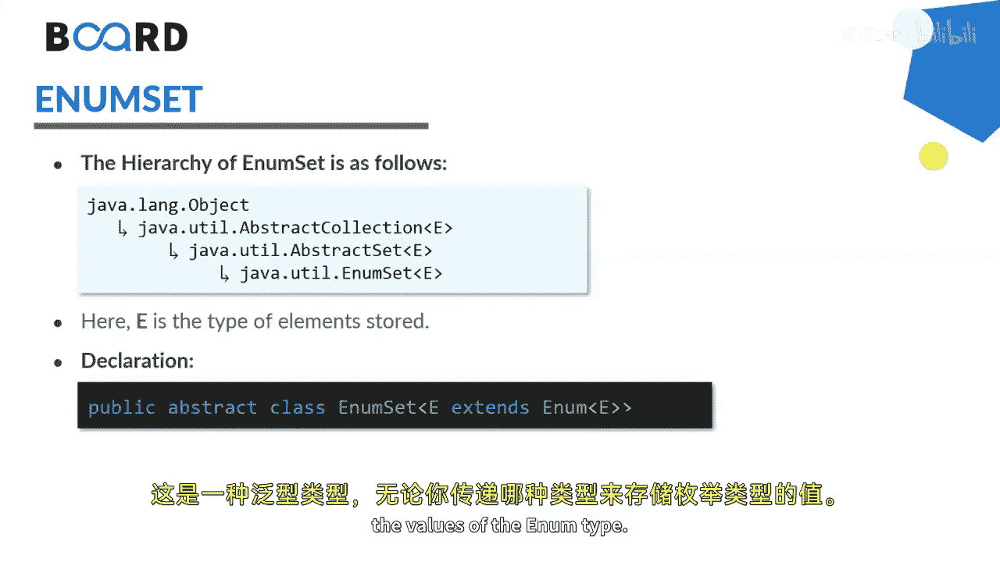
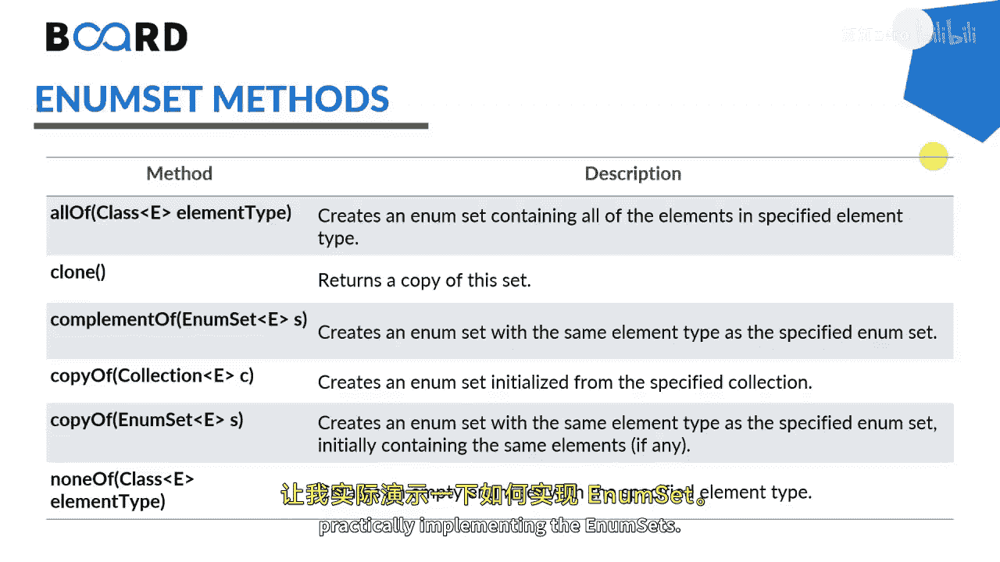

# 030：Java EnumSet类详解 🎯


在本节课中，我们将学习Java集合框架中的EnumSet类。我们将通过示例了解其定义、特性以及各种常用方法。EnumSet是一种专为枚举类型设计的高性能集合实现。

---

## 概述

EnumSet是Java集合框架中一个特殊的Set实现，它专门用于存储单个枚举类型的元素。它继承了`AbstractSet`类并实现了`Set`接口。与`HashSet`或`TreeSet`相比，EnumSet在性能上更具优势，因为它内部使用位向量实现，JVM预先知道所有可能的枚举值。

## EnumSet的特性

上一节我们介绍了EnumSet的基本概念，本节中我们来看看它的核心特性。



*   **单一枚举类型**：EnumSet中的所有元素必须来自创建时指定的同一个枚举类型。
*   **高性能**：内部使用位向量（bit vector）实现，因此速度非常快。
*   **无公共构造器**：不能使用`new`关键字创建EnumSet实例，必须使用其提供的静态工厂方法。
*   **故障安全迭代器**：使用迭代器遍历时，如果集合被修改，不会抛出`ConcurrentModificationException`。
*   **继承体系**：其类声明为 `EnumSet<E extends Enum<E>>`，其中`E`表示具体的枚举类型。



## 创建EnumSet

了解了EnumSet的特性后，我们来看看如何创建它。EnumSet提供了多个静态方法来创建实例。

以下是创建EnumSet的几种常用方法：

1.  **`EnumSet.allOf(Class<E> elementType)`**：创建一个包含指定枚举类型所有值的EnumSet。
    ```java
    EnumSet<Size> allSizes = EnumSet.allOf(Size.class);
    ```
2.  **`EnumSet.noneOf(Class<E> elementType)`**：创建一个指定枚举类型的空EnumSet。
    ```java
    EnumSet<Size> noSizes = EnumSet.noneOf(Size.class);
    ```
3.  **`EnumSet.range(E from, E to)`**：创建一个包含从`from`到`to`范围内（包括两端）所有枚举值的EnumSet。
    ```java
    EnumSet<Size> rangeSizes = EnumSet.range(Size.MEDIUM, Size.EXTRA_LARGE);
    ```
4.  **`EnumSet.of(E e1, E e2, ...)`**：创建一个包含一个或多个指定枚举值的EnumSet。
    ```java
    EnumSet<Size> specificSizes = EnumSet.of(Size.SMALL, Size.LARGE);
    ```

## 常用操作示例

现在我们已经知道如何创建EnumSet，接下来通过一个完整的代码示例来演示其常用操作。

```java
// 1. 定义一个枚举类型
enum Size {
    SMALL, MEDIUM, LARGE, EXTRA_LARGE
}

public class EnumSetDemo {
    public static void main(String[] args) {
        // 2. 创建包含所有枚举值的集合
        EnumSet<Size> sizes1 = EnumSet.allOf(Size.class);
        System.out.println("All sizes: " + sizes1); // 输出: [SMALL, MEDIUM, LARGE, EXTRA_LARGE]

        // 3. 创建空集合
        EnumSet<Size> sizes2 = EnumSet.noneOf(Size.class);
        System.out.println("Empty set: " + sizes2); // 输出: []

        // 4. 使用range方法
        EnumSet<Size> sizes3 = EnumSet.range(Size.MEDIUM, Size.EXTRA_LARGE);
        System.out.println("Range (MEDIUM to XL): " + sizes3); // 输出: [MEDIUM, LARGE, EXTRA_LARGE]

        // 5. 使用of方法指定元素
        EnumSet<Size> sizes4 = EnumSet.of(Size.SMALL, Size.LARGE);
        System.out.println("Specific sizes: " + sizes4); // 输出: [SMALL, LARGE]

        // 6. 添加元素
        sizes2.add(Size.MEDIUM);
        sizes2.addAll(sizes4); // 合并集合
        System.out.println("After add operations: " + sizes2); // 输出: [SMALL, MEDIUM, LARGE]

        // 7. 使用迭代器遍历
        System.out.print("Iterating: ");
        Iterator<Size> iterator = sizes1.iterator();
        while (iterator.hasNext()) {
            System.out.print(iterator.next() + " ");
        }
        // 输出: Iterating: SMALL MEDIUM LARGE EXTRA_LARGE

        System.out.println();

        // 8. 移除元素
        boolean isRemoved = sizes1.remove(Size.MEDIUM);
        System.out.println("Removed MEDIUM? " + isRemoved); // 输出: true
        System.out.println("After removal: " + sizes1); // 输出: [SMALL, LARGE, EXTRA_LARGE]

        // 9. 清空集合
        sizes1.clear();
        System.out.println("After clear: " + sizes1); // 输出: []
    }
}
```

## 总结


本节课中我们一起学习了Java的EnumSet类。我们了解到EnumSet是一个专为枚举类型设计的高性能`Set`实现，它要求所有元素来自同一个枚举。我们重点掌握了如何使用`allOf`、`noneOf`、`range`和`of`等静态工厂方法创建EnumSet，并演示了添加、遍历、移除等常规集合操作。由于其内部基于位向量的实现，在处理枚举集合时，EnumSet通常是比`HashSet`更高效的选择。