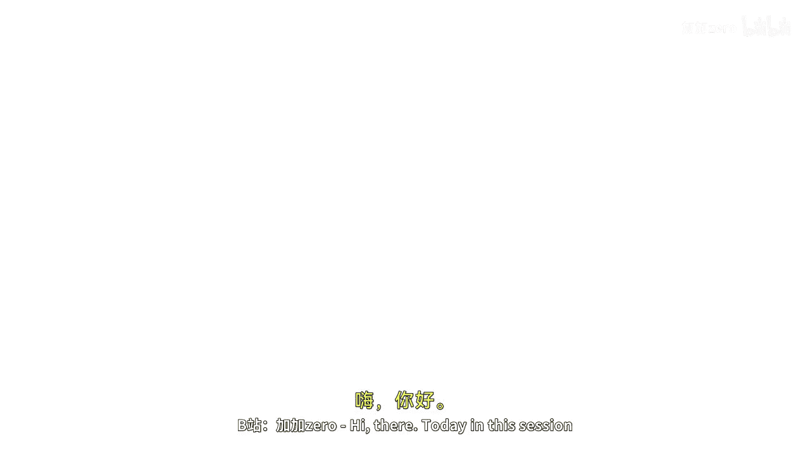
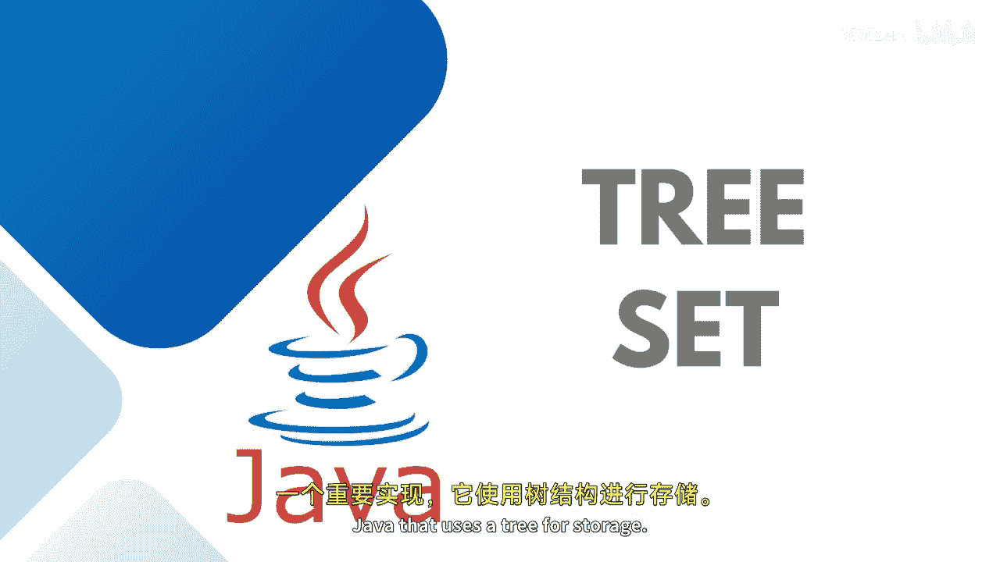
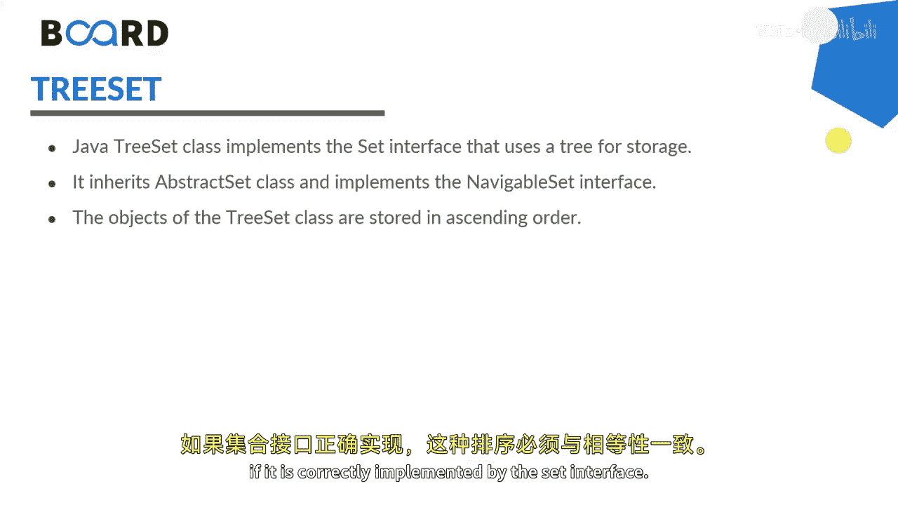
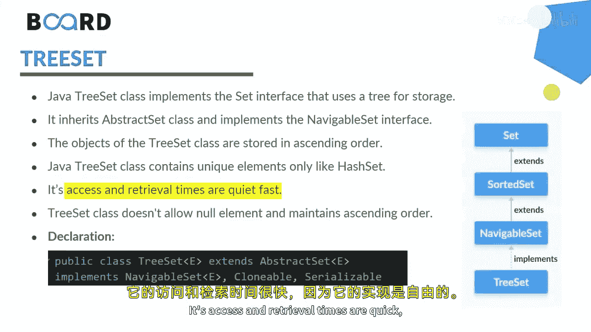

# 034：TreeSet详解 🌳





在本节课中，我们将要学习Java集合框架中的一个重要成员——TreeSet。TreeSet是SortedSet接口的一个关键实现，它使用树形结构来存储元素，并自动维护元素的排序。

## 概述

TreeSet继承自AbstractSet类，并实现了NavigableSet接口。这意味着，当我们使用NavigableSet接口中的方法时，需要实例化TreeSet。TreeSet会维护元素的自然排序，无论是否提供了显式的比较器。这种排序必须与equals方法保持一致，这是Set接口正确实现的要求。

由于TreeSet基于树形结构实现，其访问和检索速度非常快。具体来说，TreeSet使用了一种自平衡的二叉搜索树（如红黑树）来实现。因此，搜索、删除和添加等操作的时间复杂度为**O(log n)**。这是因为在自平衡树中，树的高度永远不会超过**log n**，从而保证了操作的高效性。

## TreeSet的特点





以下是TreeSet的一些核心特点：

*   **有序性**：TreeSet中的元素总是处于排序状态。
*   **唯一性**：与所有Set实现一样，TreeSet不允许存储重复元素。
*   **高效性**：基于红黑树实现，使得添加、删除和查找操作都非常高效。
*   **导航方法**：实现了NavigableSet接口，提供了如`first()`、`last()`、`higher()`、`lower()`等导航方法。

## 核心操作与代码示例

上一节我们介绍了TreeSet的基本概念，本节中我们来看看如何在实际代码中使用它。

以下是一个简单的TreeSet使用示例：

```java
import java.util.TreeSet;
import java.util.NavigableSet;

public class TreeSetDemo {
    public static void main(String[] args) {
        // 创建一个TreeSet
        TreeSet<String> set = new TreeSet<>();

        // 向集合中添加元素
        set.add("E");
        set.add("B");
        set.add("C");
        set.add("A");
        set.add("C"); // 重复元素不会被添加

        // 打印TreeSet，元素将按自然顺序（字母顺序）排序
        System.out.println("TreeSet内容: " + set); // 输出: [A, B, C, E]

        // 检查元素是否存在
        System.out.println("集合是否包含'D'? " + set.contains("D")); // 输出: false

        // 获取第一个和最后一个元素
        System.out.println("第一个元素: " + set.first()); // 输出: A
        System.out.println("最后一个元素: " + set.last()); // 输出: E

        // 使用NavigableSet的导航方法
        NavigableSet<String> navigableSet = set;
        System.out.println("大于'B'的最小元素: " + navigableSet.higher("B")); // 输出: C
        System.out.println("小于'B'的最大元素: " + navigableSet.lower("B")); // 输出: A

        // 移除并返回第一个和最后一个元素
        System.out.println("移除的第一个元素: " + navigableSet.pollFirst()); // 输出: A
        System.out.println("移除的最后一个元素: " + navigableSet.pollLast()); // 输出: E
        System.out.println("操作后的集合: " + navigableSet); // 输出: [B, C]
    }
}
```

## 方法详解

以下是TreeSet中一些特定方法的说明，这些方法与其继承或实现的接口中的方法一同构成了TreeSet的功能集。

*   **`add(E e)`**: 将指定元素添加到集合中（如果尚未存在）。
*   **`remove(Object o)`**: 从集合中移除指定元素。
*   **`contains(Object o)`**: 如果集合包含指定元素，则返回true。
*   **`first()`**: 返回集合中当前第一个（最低）元素。
*   **`last()`**: 返回集合中当前最后一个（最高）元素。
*   **`higher(E e)`**: 返回集合中严格大于给定元素的最小元素，如果没有这样的元素则返回null。
*   **`lower(E e)`**: 返回集合中严格小于给定元素的最大元素，如果没有这样的元素则返回null。
*   **`pollFirst()`**: 检索并移除第一个（最低）元素，如果集合为空则返回null。
*   **`pollLast()`**: 检索并移除最后一个（最高）元素，如果集合为空则返回null。

## 总结

本节课中我们一起学习了TreeSet。TreeSet是Java中一个基于树结构实现的有序集合，它高效地结合了元素的唯一性和自动排序功能。其核心实现是红黑树，这保证了基本操作（添加、删除、查找）的时间复杂度为**O(log n)**。通过实现NavigableSet接口，它还提供了丰富的导航方法。StringBuffer等类内部也利用了TreeSet的特性来去重和排序。希望通过本次讨论，你能理解在何种实际场景下应该选择使用TreeSet。


下次再见！