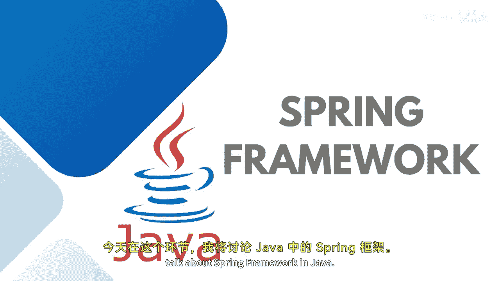
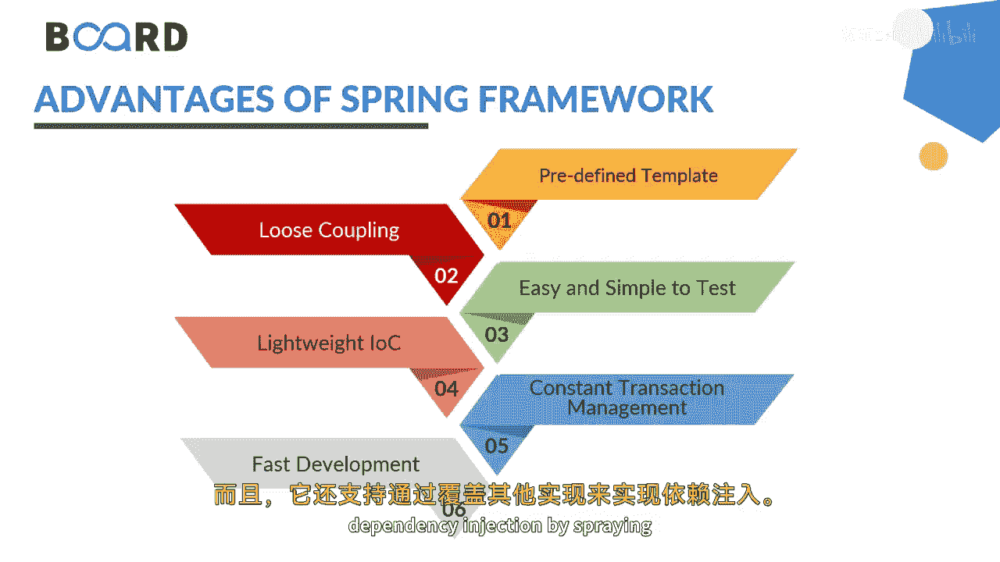
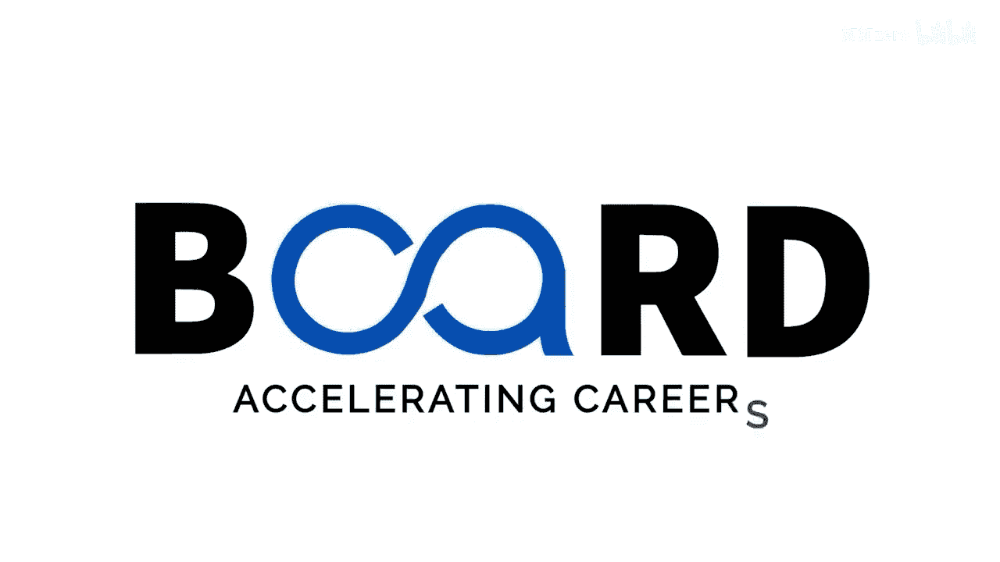

Java全栈开发：P36：什么是Spring框架

在本节课中，我们将学习Spring框架的基础知识。Spring是一个为Java应用程序开发提供全面基础设施支持的平台。我们将了解它的核心特性、优势以及它为何在Java开发中如此重要。

Spring框架本质上是一个Java平台，它为开发Java应用程序提供了全面的基础设施支持。Spring负责处理底层基础设施，使得应用程序开发者可以专注于业务逻辑。它是一个现成的框架，最初由Rod Johnson编写，并于2003年6月在Apache 2.0许可证下首次发布。从大小和透明度来看，它是一个非常轻量级的框架。

Spring框架有一些核心特性，可用于开发任何Java应用程序。虽然我们主要关注Spring MVC或Spring Boot应用，但它还有扩展功能，可用于在Java EE平台或企业级平台上构建更多类型的应用。

使用Spring框架有一些优势。它是一个框架，因此提供了一个方便的预定义模板供使用，有助于实现松耦合架构。它支持Spring MVC框架，而MVC本身就是一种松耦合的设计模式。它易于测试，是一个轻量级的IOC容器，借助事务管理技术（这些技术你在数据库课程中也学过）提供稳定的事务管理。同时，它有助于快速开发，因为它是一个模板化的框架，各种库和功能（如AOP、事务管理、核心上下文、Bean以及最重要的依赖注入）都是现成可用的。

选择Spring而非其他实现框架有许多原因。它简单、轻量，并能构建安全的Web应用，因为它也支持Spring Security。它支持MVC模式，易于与数据库通信。虽然你可以讨论任何数据库集成（如Hibernate或JDBC），但我们主要讨论与Hibernate这类ORM框架结合，用于构建大型可扩展应用。它有助于实现模块化设计模式，并且可以与其他框架集成。

依赖注入在其中扮演着非常重要的角色。我们创建Bean，在XML或基于Java注解的文件中配置它们，然后可以将它们注入到我们的MVC模式中。同时，由于集成了测试功能，测试也变得非常容易。

本节课中，我们一起学习了Spring框架的定义、核心特性、主要优势以及依赖注入等关键概念。它是一个强大且灵活的框架，能显著提升Java应用开发的效率和质量。请继续关注，以了解更多关于Spring框架及其核心组件与架构的知识。