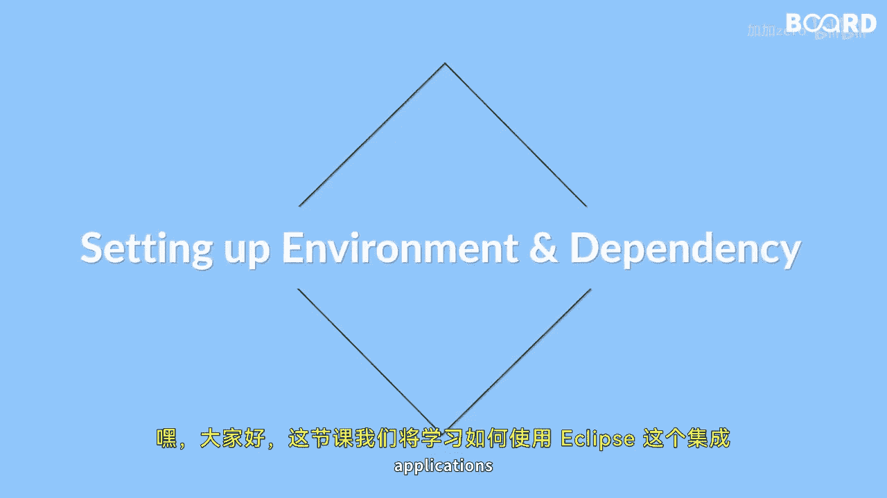

# 041：Spring应用开发入门指南 🚀

在本节课中，我们将学习如何使用Eclipse集成开发环境来开发Spring应用程序。我们将深入理解控制反转容器的概念及其在Spring框架中的应用。此外，我们还将探索Spring框架的核心特性——依赖注入技术。

## 环境搭建与工具介绍 💻



上一节我们概述了本课的学习目标，本节中我们来看看如何为Spring应用开发搭建环境。

我们将从在Eclipse中设置Spring应用开发环境开始。Eclipse是一个功能强大的Java集成开发环境，它提供了丰富的插件和工具来简化开发流程。

以下是设置环境的关键步骤：

*   确保已安装Java开发工具包。
*   下载并安装Eclipse IDE for Java Developers。
*   在Eclipse中安装或配置Spring相关插件，如Spring Tools Suite。

## 理解控制反转容器 🔄

环境准备就绪后，现在我们来深入探讨控制反转容器的概念。

控制反转是Spring框架的基石。传统上，程序代码主动创建和管理其所依赖的对象。而在IoC模式中，这个控制权被反转了——由一个外部容器来负责对象的创建、组装和管理。这个容器就是IoC容器。

Spring框架主要提供了两种类型的IoC容器：

*   **BeanFactory**：这是最基础的容器，提供了基本的依赖注入支持。其核心接口是 `org.springframework.beans.factory.BeanFactory`。
*   **ApplicationContext**：这是BeanFactory的子接口，增加了更多企业级功能，如国际化、事件传播等，是更常用的容器。其核心接口是 `org.springframework.context.ApplicationContext`。

## 探索依赖注入技术 💉

理解了IoC容器如何管理对象生命周期后，本节我们来看看容器实现控制反转的具体技术——依赖注入。

依赖注入是IoC的一种具体实现方式。它指的是由容器在运行时动态地将某个对象所依赖的其他对象注入进去，而不是由对象自己创建依赖。这极大地降低了组件间的耦合度。

Spring框架支持以下几种主要的依赖注入方式：

*   **构造器注入**：通过类的构造方法来注入依赖。这能保证对象在创建完成后就处于完全初始化的状态。
    ```java
    public class ExampleService {
        private final DependencyRepository repository;
        // 构造器注入
        public ExampleService(DependencyRepository repository) {
            this.repository = repository;
        }
    }
    ```
*   **Setter方法注入**：通过类的setter方法来注入依赖。这种方式更为灵活。
    ```java
    public class ExampleService {
        private DependencyRepository repository;
        // Setter方法注入
        public void setRepository(DependencyRepository repository) {
            this.repository = repository;
        }
    }
    ```

使用依赖注入的优势在于，它使代码更易于测试、更模块化，并且遵循了面向接口编程的原则，提升了应用程序的可维护性和可扩展性。

## 总结 📚

本节课中，我们一起学习了使用Eclipse开发Spring应用程序的基础。我们从环境搭建开始，逐步理解了控制反转容器的核心思想，并深入探讨了其实现手段——依赖注入的两种主要方式：构造器注入和Setter方法注入。

通过掌握这些概念，你现在已经具备了使用Eclipse进行Spring应用开发的基础知识，并对Spring框架的基本原理有了清晰的认识。这些是构建更复杂、更松耦合的Java企业级应用的重要基石。