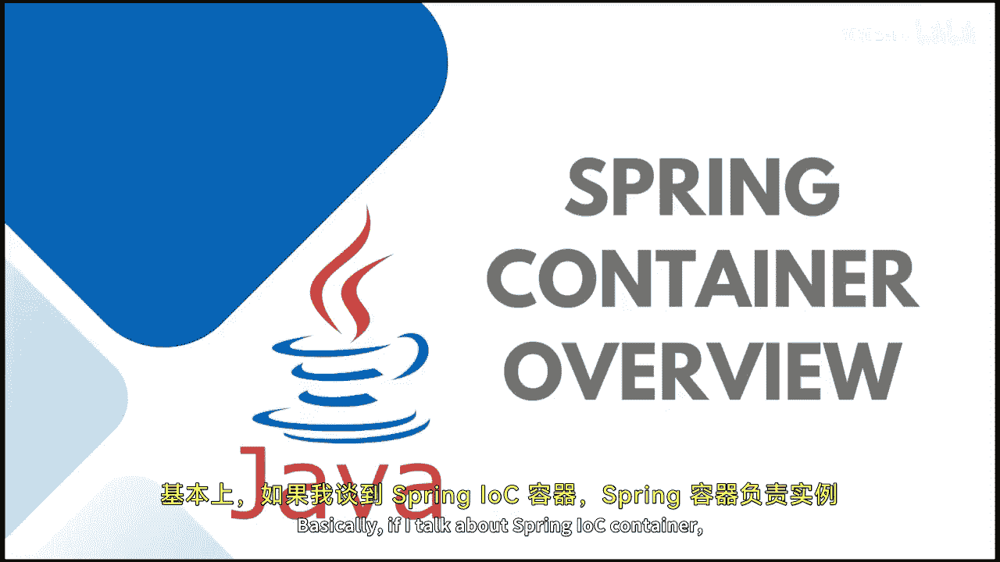

**Java全栈开发：42：Spring容器概述** 🏺

在本节课中，我们将学习Spring框架的核心——IoC容器。我们将探讨它的工作原理、如何创建Spring IoC容器，以及如何从容器中检索Bean。通过本课，你将理解Spring容器如何管理对象的生命周期。

---

Spring容器是Spring框架的核心，它负责实例化、配置和组装Spring Bean。容器通过读取配置元数据来获取关于需要实例化、配置和组装哪些对象的指令。

配置元数据可以通过三种方式表示：XML配置文件、Java注解或Java代码。这些元数据告诉容器需要执行哪些职责。

Spring IoC容器主要有两种类型：BeanFactory容器和ApplicationContext容器。

**BeanFactory容器**是Spring IoC容器的根接口，它支持Spring框架中定义的依赖注入。其核心接口是 `org.springframework.beans.factory.BeanFactory`。

**ApplicationContext容器**是BeanFactory的实现，并且是BeanFactory的子接口。它提供了更多企业级特定的功能。例如，它包含像 `getBean()` 这样的特定方法，并且会在容器启动时立即实例化所有单例Bean，而不是等到 `getBean()` 方法被调用时才进行实例化。

由于ApplicationContext是BeanFactory的子接口，因此它包含了BeanFactory容器的所有功能。

---

上一节我们介绍了Spring容器的基本概念和类型，本节中我们来看看如何创建和使用这些容器。

以下是创建配置元数据的几种主要方式：
*   **XML配置**：使用传统的XML文件来定义Bean及其依赖关系。
*   **注解配置**：在Java类中使用注解（如 `@Component`, `@Autowired`）来声明Bean和注入依赖。
*   **Java配置**：使用 `@Configuration` 注解的Java类，通过 `@Bean` 注解的方法来定义Bean。

在后续课程中，我们将深入学习如何使用这些不同的配置方式来创建元数据，并调用Spring容器。

---

本节课中我们一起学习了Spring IoC容器的基础知识。我们了解了容器负责Bean的生命周期管理，认识了两种主要的容器类型——基础的BeanFactory和功能更强大的ApplicationContext，并简要介绍了三种配置元数据的方式。理解这些是掌握Spring依赖注入和面向切面编程等高级特性的基础。