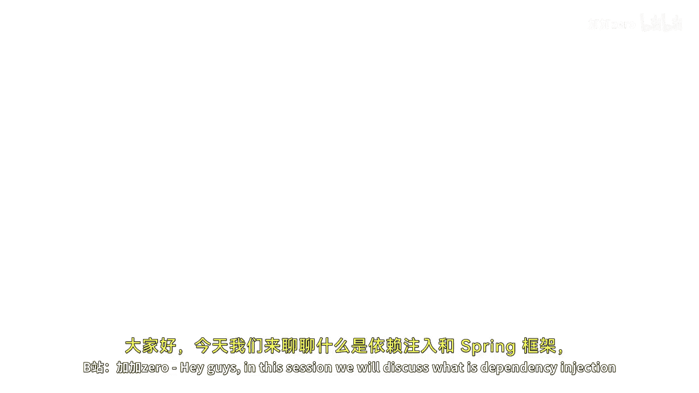
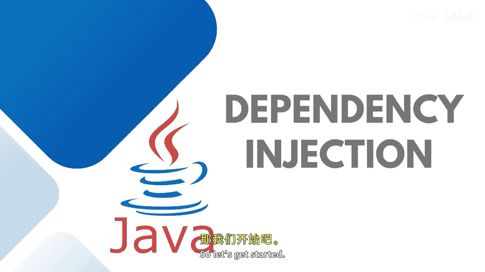
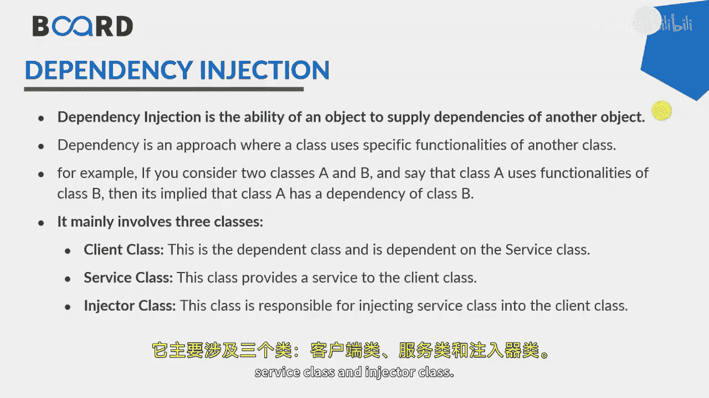

# 045：使用构造器和Setter方法进行依赖注入





在本节课中，我们将讨论Spring中的依赖注入是什么，以及依赖注入的不同类型。

## 概述

依赖注入是Spring框架中的一个基本概念，它指的是一种设计模式。对象由其外部提供依赖项，而不是在内部创建它们。依赖注入通过控制反转实现，其中一个类的对象需要被注入到另一个类中，而不是由该类自行实例化。这样可以避免两个类或对象之间的紧耦合。

## 依赖注入的核心概念



假设有两个类A和B，如果类A使用了类B的功能，那么就意味着类A依赖于类B。依赖注入主要涉及三个角色：**客户端类**、**服务类**和**注入器类**。

在这个架构中，**服务**是作为依赖项被创建的对象，供客户端使用。**注入器**则是负责创建构造器或Setter方法的部分。

以下是依赖注入的主要好处：
*   提高应用程序各部分的**内聚性**。
*   减少应用程序各部分之间的**耦合度**，有助于创建**松耦合架构**。
*   更好地设计应用程序，因为它本身就是设计模式的一部分。
*   减少**样板代码**。

## 依赖注入的类型

依赖注入主要有两种实现方式：一种是基于构造器的依赖注入，另一种是基于Setter方法的依赖注入（有些人也称之为基于字段的依赖注入）。

### 基于构造器的依赖注入

在基于构造器的依赖注入中，你的Bean中需要有一个构造器，用于初始化你想要传递的属性。

**代码示例：**
```java
public class MyBean {
    private String message;

    // 构造器注入
    public MyBean(String message) {
        this.message = message;
    }
}
```

### 基于Setter方法的依赖注入

在基于Setter方法的依赖注入中，我们需要通过Setter方法来传递属性。为此，Bean中至少需要一个默认构造器，以及与我们想要实例化的属性相关联的Setter方法。

**代码示例：**
```java
public class MyBean {
    private String message;

    // 默认构造器
    public MyBean() {}

    // Setter方法注入
    public void setMessage(String message) {
        this.message = message;
    }
}
```

## 实践演示

上一节我们介绍了依赖注入的类型，本节我们来看看如何在实践中实现依赖注入。

在之前的演示中，我们有一个`HelloWorld.java`作为Bean，其中包含了属性的Getter和Setter方法。如果我们不编写任何构造器，程序应该不会报错。

当我们通过XML配置文件使用`<property>`标签时，我们使用的是Setter方法注入。你可以在Bean中通过`System.out.println`打印一条消息来验证Setter方法是否被调用。

**Setter方法注入验证：**
```java
public void setMessage(String message) {
    this.message = message;
    System.out.println("Setting message property.");
}
```

如果你想通过构造器进行注入，则需要修改配置文件。在配置文件中，不使用`<property>`，而是使用`<constructor-arg>`标签。你需要定义参数的类型、名称和要赋予的值。

**构造器注入配置示例 (XML)：**
```xml
<bean id="helloAnotherBean" class="com.example.HelloWorld">
    <constructor-arg name="message" value="Hello via Constructor!" />
</bean>
```

当然，为了实现构造器注入，你的Bean中必须要有相应的构造器。首先，需要一个默认构造器，然后还需要一个参数化构造器。

**Bean中的构造器示例：**
```java
public class HelloWorld {
    private String message;

    // 默认构造器
    public HelloWorld() {
        System.out.println("Default constructor invoked.");
    }

    // 参数化构造器
    public HelloWorld(String message) {
        this.message = message;
        System.out.println("Parameterized constructor invoked.");
    }

    // Setter方法
    public void setMessage(String message) {
        this.message = message;
        System.out.println("Set message property invoked.");
    }
}
```

运行程序后，你将在控制台看到类似以下的输出，这证明了默认构造器、Setter方法和参数化构造器都被成功调用：
```
Default constructor invoked.
Set message property invoked.
Parameterized constructor invoked.
```

## 总结


本节课中，我们一起学习了Spring依赖注入的核心概念。我们了解了依赖注入是一种由外部提供对象依赖的设计模式，它能有效降低代码耦合度。我们重点探讨了两种主要的依赖注入方式：**基于构造器的注入**和**基于Setter方法的注入**，并通过代码示例和配置演示了它们的具体实现。现在，我们已经准备好在自己的Spring或Spring Boot应用中使用依赖注入了。