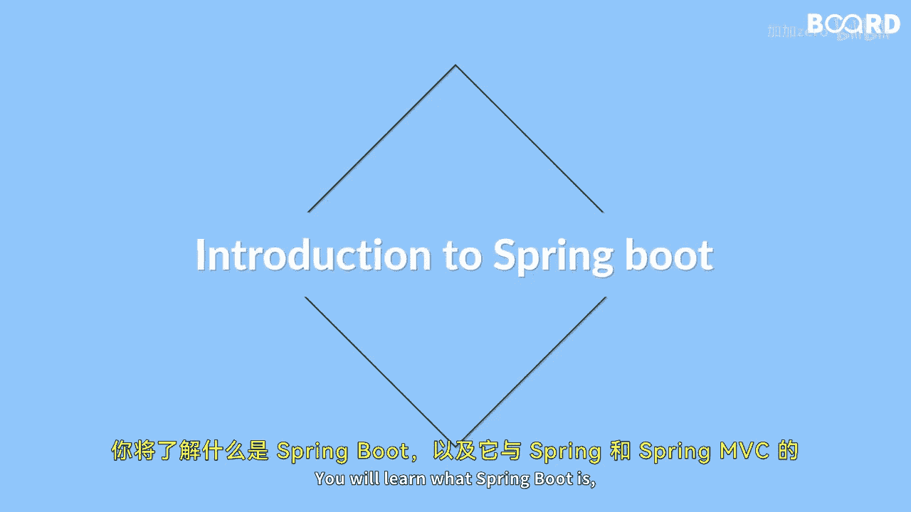

**Java全栈开发：第46课：Spring Boot基础入门**

在本节课中，我们将学习Spring Boot的基础知识。你将了解什么是Spring Boot，它与Spring和Spring MVC有何不同，探索其架构，并学习如何使用Spring Initializr和Maven来搭建一个Spring Boot项目。

---

**什么是Spring Boot？**

Spring Boot是一个开源框架，旨在简化基于Spring的应用程序开发。它提供了一种更快速、更直接的方式来创建独立的、生产级的应用程序。



上一节我们介绍了课程目标，本节中我们来看看Spring Boot的核心定义。

**Spring Boot的核心优势**

以下是Spring Boot的几个关键特性和优势：

*   **简化配置**：Spring Boot采用“约定优于配置”的原则，提供了大量自动配置，减少了繁琐的XML或Java配置。
*   **独立运行**：Spring Boot应用可以打包成可执行的JAR或WAR文件，内嵌了Tomcat、Jetty或Undertow等服务器，无需部署到外部Web容器即可直接运行。
*   **生产就绪**：它集成了健康检查、指标、外部化配置等特性，方便监控和管理生产环境中的应用。
*   **无代码生成**：Spring Boot不需要代码生成，也不要求XML配置。

---

**Spring Boot架构概览**

Spring Boot的架构建立在Spring框架之上，并进行了高度封装和自动化。其核心组件包括：

*   **自动配置**：根据项目中的类路径、已定义的Bean以及其他属性设置，自动配置Spring应用。
*   **起步依赖**：一组预定义的依赖描述符，可以轻松地将所需的功能（如Web、数据访问、安全等）添加到项目中。
*   **Actuator**：提供了一系列生产级功能，用于监控和管理应用。
*   **嵌入式Servlet容器**：允许将Web服务器（如Tomcat）作为应用的一部分打包和运行。

---

**搭建Spring Boot项目**

了解了Spring Boot的基本概念和架构后，本节我们将动手实践，学习如何搭建一个Spring Boot项目。我们将使用两种主要工具：Spring Initializr和Maven。

**使用Spring Initializr**

Spring Initializr是一个基于Web的工具，用于生成Spring Boot项目的基本配置和结构。以下是使用步骤：

1.  访问Spring Initializr网站。
2.  选择项目类型（如Maven Project）、语言（Java）和Spring Boot版本。
3.  填写项目的元数据（Group, Artifact）。
4.  添加项目所需的依赖（如Spring Web, Spring Data JPA）。
5.  点击“Generate”按钮下载项目压缩包。

**使用Maven构建和管理依赖**

Maven是一个构建和项目管理工具，它自动化了构建过程并管理项目依赖。在Spring Boot项目中，Maven的`pom.xml`文件是核心配置文件。

以下是一个典型的Spring Boot Maven项目`pom.xml`文件的关键部分示例：

```xml
<?xml version="1.0" encoding="UTF-8"?>
<project>
    <parent>
        <groupId>org.springframework.boot</groupId>
        <artifactId>spring-boot-starter-parent</artifactId>
        <version>2.7.0</version> <!-- 示例版本号 -->
    </parent>

    <dependencies>
        <!-- Spring Boot Web起步依赖 -->
        <dependency>
            <groupId>org.springframework.boot</groupId>
            <artifactId>spring-boot-starter-web</artifactId>
        </dependency>
        <!-- 其他依赖... -->
    </dependencies>

    <build>
        <plugins>
            <!-- Spring Boot Maven插件 -->
            <plugin>
                <groupId>org.springframework.boot</groupId>
                <artifactId>spring-boot-maven-plugin</artifactId>
            </plugin>
        </plugins>
    </build>
</project>
```

*   **`spring-boot-starter-parent`**：作为父项目，它提供了默认的Maven配置和依赖管理。
*   **`spring-boot-starter-*`**：这些是起步依赖，只需声明一个，即可引入相关功能所需的所有库。
*   **`spring-boot-maven-plugin`**：这个插件可以将应用打包成可执行的JAR文件。

---

**总结**

本节课中，我们一起学习了Spring Boot的基础知识。我们首先明确了Spring Boot是一个用于简化Spring应用开发的框架。接着，我们探讨了它的核心优势，如自动配置和独立运行能力。然后，我们概述了Spring Boot的架构及其关键组件。最后，我们通过介绍Spring Initializr和Maven，掌握了搭建和管理一个Spring Boot项目的基本方法。这些知识为你开始使用Spring Boot进行高效开发奠定了坚实的基础。