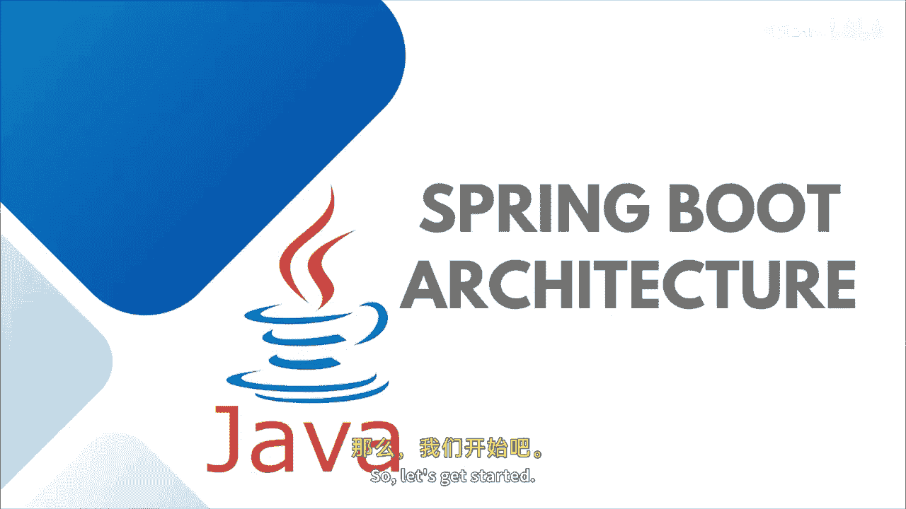
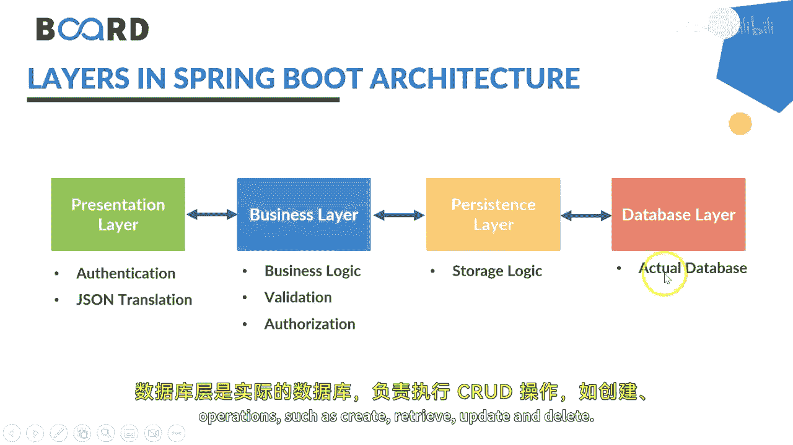
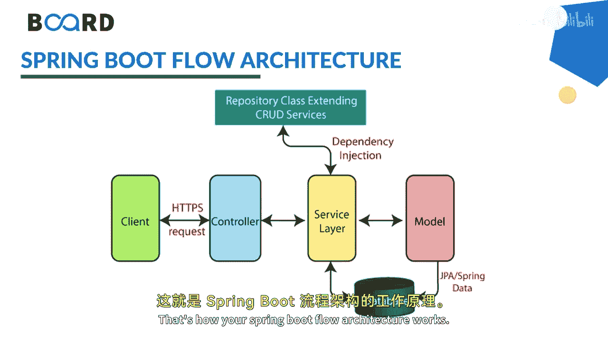
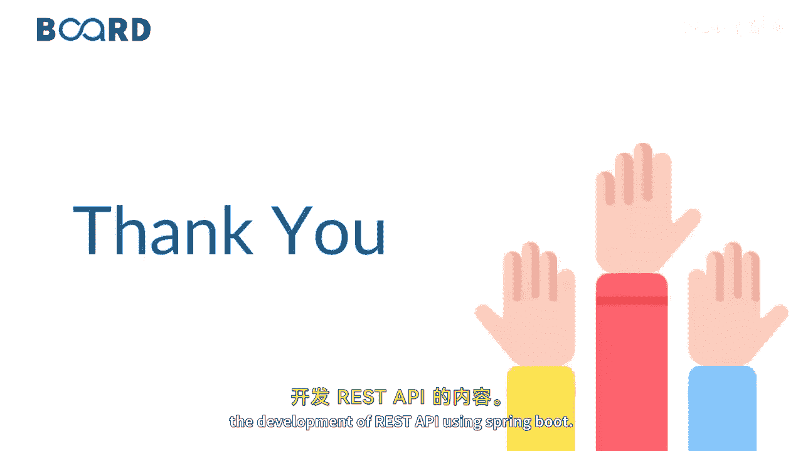

# 049：Spring Boot 架构详解 🏗️

在本节课中，我们将学习 Spring Boot 的内部架构，了解其各层如何协同工作以构建独立的生产级应用程序。

## 概述

Spring Boot 是 Spring 框架的一个模块，用于以最少的配置创建独立的、生产级的 Spring 应用程序。它建立在 Spring 框架核心之上，并支持分层架构，其中每一层直接与其上下层通信，形成一个类似树形的层次结构。

## 架构分层

Spring Boot 架构主要包含四个层次，理解这些层次是掌握其工作原理的关键。

以下是这四个层次及其功能：

1.  **表示层**
    *   处理 HTTP 请求。
    *   将 JSON 参数转换为对象。
    *   对请求进行身份验证。
    *   将请求转发至业务层。
    *   简而言之，它包含所有的视图或前端部分。

2.  **业务层**
    *   处理所有业务逻辑。
    *   包含服务类。
    *   使用数据访问层提供的服务。
    *   协助进行授权和验证。

3.  **持久层**
    *   包含所有存储逻辑。
    *   在业务对象和数据库行之间进行转换。

4.  **数据库层**
    *   这是实际的数据库。
    *   负责执行 CRUD 操作，即创建、检索、更新和删除。

## 工作流程

上一节我们介绍了架构的静态分层，本节中我们来看看数据在这些层之间是如何流动的。

Spring Boot 的流程架构与 Spring MVC 基本相同，但有一个关键区别：在 Spring Boot 中，我们使用数据访问对象（DAO）实现类与数据库通信。

以下是 Spring Boot 应用程序的典型工作流程：

1.  客户端发起一个 HTTP 请求（如 GET、POST、PUT、DELETE）。
2.  该请求首先到达**控制器**。
3.  控制器映射并处理该请求。
4.  如果需要，控制器会调用**服务层**的业务逻辑。
5.  在服务层，所有业务逻辑都在映射到 JPA 模型类的数据上执行。
6.  如果没有错误，相应的 JSP 页面（或响应）将返回给用户。

Spring Boot 在内部整合了 Spring 的各个模块，如 Spring MVC、Spring Data 等，并利用验证类、视图类和工具类来实现上述流程。

## 总结

本节课中，我们一起学习了 Spring Boot 的四层架构：表示层、业务层、持久层和数据库层，并了解了请求从客户端发出到返回响应的完整工作流程。掌握这个架构有助于我们更好地设计和理解 Spring Boot 应用程序。