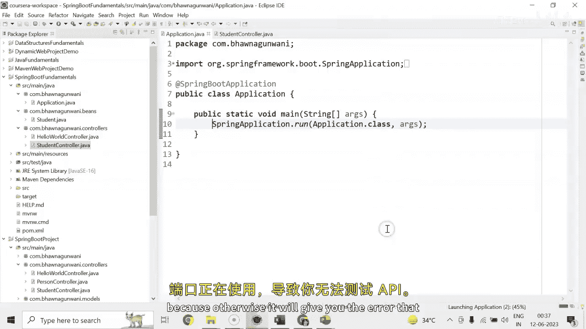
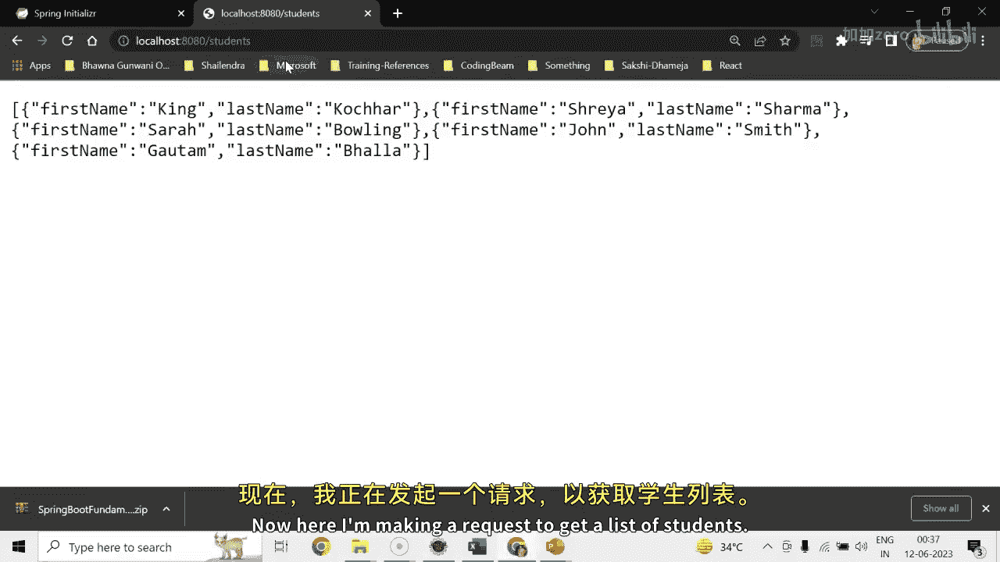
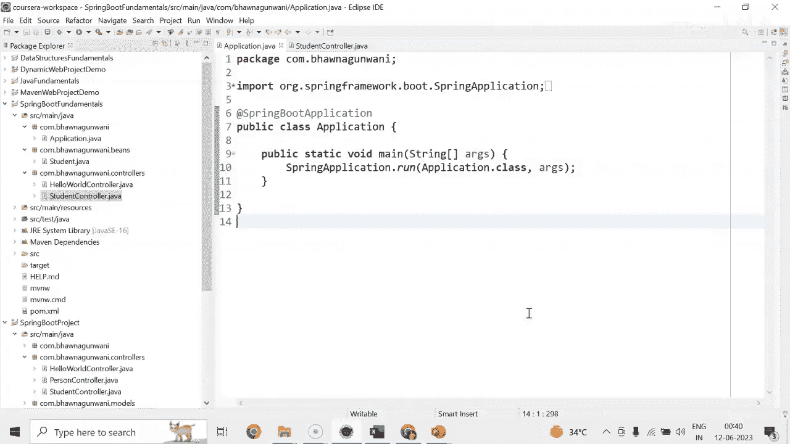
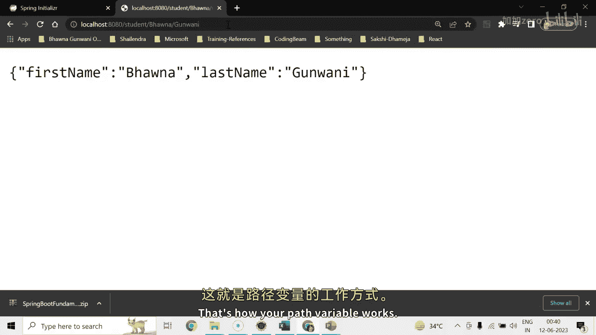

# 053：实现获取用户资源的GET服务 🚀


在本节课中，我们将学习如何在Spring Boot应用中实现一个GET服务，用于检索学生资源。我们将创建一个学生模型、一个控制器，并实现两个不同的GET端点：一个用于获取所有学生列表，另一个用于根据路径变量（Path Variable）获取特定学生。

---


## 概述 📋

我们将分步构建一个简单的学生信息API。首先，创建一个表示学生的Java Bean。然后，创建一个REST控制器，其中包含两个GET请求处理方法。第一个方法返回所有学生的列表，第二个方法根据提供的名（first name）和姓（last name）返回一个特定的学生对象。我们将使用路径变量来传递这些参数。

---

## 创建学生模型 🧱

首先，我们需要创建一个`Student`类来表示学生数据。这个类将作为我们应用程序中的数据模型。

在`com.pavna.gvani.beans`（或`model`）包下，右键创建名为`Student`的类。

以下是`Student`类的代码：

```java
package com.pavna.gvani.beans;

public class Student {
    private String firstName;
    private String lastName;

    // 默认构造函数
    public Student() {}

    // 带参数的构造函数
    public Student(String firstName, String lastName) {
        this.firstName = firstName;
        this.lastName = lastName;
    }

    // Getter 和 Setter 方法
    public String getFirstName() {
        return firstName;
    }

    public void setFirstName(String firstName) {
        this.firstName = firstName;
    }

    public String getLastName() {
        return lastName;
    }

    public void setLastName(String lastName) {
        this.lastName = lastName;
    }

    // toString 方法，便于打印对象信息
    @Override
    public String toString() {
        return "Student{" +
                "firstName='" + firstName + '\'' +
                ", lastName='" + lastName + '\'' +
                '}';
    }
}
```

这个类定义了两个属性：`firstName`和`lastName`。我们生成了构造函数、Getter和Setter方法以及`toString`方法。

---

## 创建学生控制器 🎮

上一节我们创建了数据模型，本节中我们来看看如何创建控制器来处理HTTP请求。

在`controller`包下，创建一个名为`StudentController`的类。这个类将被标记为`@RestController`。

**注意**：避免让多个控制器使用默认的请求路径（如“/”），以免应用程序混淆该将请求路由到哪个控制器。

以下是`StudentController`的初始代码，包含一个返回学生列表的GET端点：

```java
package com.pavna.gvani.controller;

import com.pavna.gvani.beans.Student;
import org.springframework.web.bind.annotation.GetMapping;
import org.springframework.web.bind.annotation.RestController;
import java.util.ArrayList;
import java.util.List;

@RestController
public class StudentController {

    // 创建一个静态的学生列表
    public static List<Student> students = new ArrayList<>();

    // 构造函数，用于初始化学生列表
    public StudentController() {
        students.add(new Student("King", "Coachcher"));
        students.add(new Student("Sya", "Sharma"));
        students.add(new Student("Sarah", "Bowling"));
        students.add(new Student("John", "Smith"));
        students.add(new Student("Gotem", "Ella"));
    }

    // 处理 GET 请求，路径为 "/students"
    @GetMapping("/students")
    public List<Student> getStudents() {
        return students;
    }
}
```

在这个控制器中，我们创建了一个静态的`students`列表，并在构造函数中初始化了一些学生数据。`getStudents`方法映射到`/students`路径，当收到GET请求时，它会返回整个学生列表。

---

## 测试获取所有学生的API ✅

在测试API之前，请确保停止占用8080端口的任何其他应用程序进程，否则会导致端口冲突，无法启动当前应用。

启动Spring Boot应用程序后，你可以使用浏览器或API测试工具（如Postman）访问以下URL来测试第一个端点：



```
http://localhost:8080/students
```

该请求将返回一个包含所有学生对象的JSON数组。



---

## 实现根据路径变量获取学生 🔍

我们已经实现了获取所有学生的服务，现在我们来创建一个更具体的服务，根据学生的姓名来检索单个学生。

我们将使用`@PathVariable`注解来实现这个功能。在`StudentController`类中添加以下方法：

```java
import org.springframework.web.bind.annotation.PathVariable;
// ... 其他导入

@RestController
public class StudentController {
    // ... 之前的代码（students列表和构造函数）

    // 处理 GET 请求，路径为 "/student/{firstName}/{lastName}"
    @GetMapping("/student/{firstName}/{lastName}")
    public Student getStudentByPath(
            @PathVariable("firstName") String firstName,
            @PathVariable("lastName") String lastName) {
        // 目前直接返回一个新的Student对象，实际应用中通常会从数据库或列表中查询
        return new Student(firstName, lastName);
    }
}
```

这个方法映射到`/student/{firstName}/{lastName}`路径。`{firstName}`和`{lastName}`是路径中的占位符。当请求到达时，Spring会自动将路径中的值绑定到方法参数`firstName`和`lastName`上。

**注意**：当前实现为了演示，直接根据传入的参数创建并返回一个新的`Student`对象。在实际应用中，你通常会根据这些参数从`students`列表或数据库中查询并返回匹配的学生。

---

## 测试路径变量API ✅

重启应用程序后，你可以通过访问以下格式的URL来测试这个新的端点：

```
http://localhost:8080/student/Goham/Bla
```

将`Goham`和`Bla`替换为任何名和姓。API将返回一个包含这些信息的JSON对象，例如：

```json
{
  "firstName": "Goham",
  "lastName": "Bla"
}
```



这演示了路径变量如何工作：它们允许你将数据作为URL路径的一部分进行传递。

---

## 总结 🎯

本节课中我们一起学习了如何实现一个基本的GET服务来检索资源。

1.  **创建模型**：我们首先创建了一个`Student`类作为数据模型。
2.  **创建控制器**：接着，我们创建了一个`StudentController`，并使用`@RestController`进行标记。
3.  **实现GET端点**：
    *   我们实现了`/students`端点，用于返回所有学生的列表。
    *   我们实现了`/student/{firstName}/{lastName}`端点，使用`@PathVariable`来接收参数并返回特定的学生信息。
4.  **测试**：我们学习了如何启动应用并测试这些API端点。



目前，根据路径变量获取学生的端点只是简单地回显输入的数据。在后续课程中，我们将学习如何使用请求参数（Request Parameter）来实现类似功能，并添加逻辑来从列表中实际查找学生。

---


**下节预告**：在下一节课中，我们将探讨如何使用`@RequestParam`注解来实现相同的查询功能，并完善我们的服务逻辑。敬请关注！