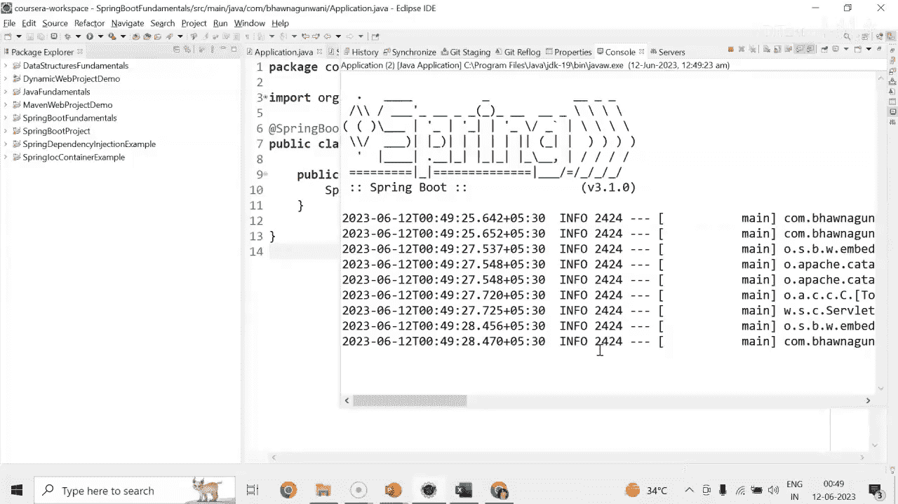
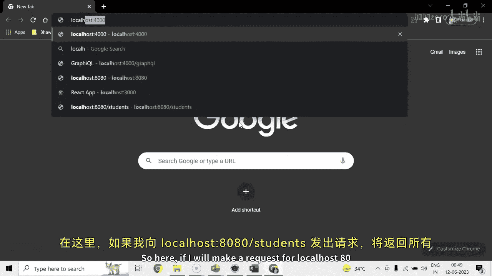

# 054：实现POST方法创建用户资源

在本节课中，我们将学习如何在Spring Boot应用中实现一个POST方法，用于创建新的学生资源。我们还将学习如何通过查询参数传递数据，并使用Postman工具测试我们的API。

## 概述

上一节我们介绍了如何使用GET方法和路径变量获取资源。本节中，我们来看看如何实现POST方法来创建新的学生资源，并理解查询参数与请求体的区别。

## 实现GET方法并传递查询参数

首先，我们回顾一下在`StudentController`中如何通过GET方法并利用查询参数返回学生信息。

以下是实现代码：



```java
@GetMapping("/student")
public Student getStudentWithQueryParam(@RequestParam(name = "firstName") String firstName,
                                        @RequestParam(name = "lastName") String lastName) {
    return new Student(firstName, lastName);
}
```



*   **`@GetMapping`**: 注解表明这是一个处理HTTP GET请求的方法。
*   **`@RequestParam`**: 注解用于从请求URL的查询字符串中获取参数值。
*   **方法逻辑**: 该方法接收`firstName`和`lastName`两个查询参数，并使用它们创建一个新的`Student`对象返回。

### 如何传递查询参数

理解了代码后，我们来看看如何在浏览器中测试这个带有查询参数的GET请求。

以下是测试步骤：
1.  启动Spring Boot应用程序。
2.  在浏览器地址栏中构造URL。格式为：`基础URL?参数1=值1&参数2=值2`。
3.  例如，访问 `http://localhost:8080/student?firstName=John&lastName=Smith`。
4.  浏览器将显示一个包含`John`和`Smith`的JSON对象，表明查询参数已成功传递并处理。

## 实现POST方法创建资源

接下来，我们实现核心功能：创建一个处理POST请求的方法来新增学生。

以下是实现代码：

```java
@PostMapping("/student")
public void addStudent(@RequestBody Student student) {
    // 此处通常会有将student对象保存到数据库的逻辑
    // 例如：studentService.save(student);
    System.out.println("学生已添加: " + student.getFirstName() + " " + student.getLastName());
}
```

*   **`@PostMapping`**: 注解表明这是一个处理HTTP POST请求的方法。
*   **`@RequestBody`**: 注解用于将HTTP请求体中的JSON数据自动绑定到`Student`对象上。
*   **方法逻辑**: 该方法接收一个`Student`对象作为参数。在实际应用中，你会在这里调用服务层方法将学生数据保存到数据库。本例中，我们仅打印一条日志。

### 使用Postman测试POST请求

由于浏览器默认发送GET请求，我们需要使用Postman这类API测试工具来发送POST请求。

以下是测试步骤：
1.  确保应用程序正在运行。
2.  打开Postman，创建一个新的请求。
3.  将请求方法设置为 **POST**。
4.  输入URL：`http://localhost:8080/student`。
5.  在 **Headers** 选项卡中，添加一个键值对：`Content-Type: application/json`。
6.  切换到 **Body** 选项卡，选择 **raw** 和 **JSON**，然后输入要创建的学生数据：
    ```json
    {
      "firstName": "Roger",
      "lastName": "Lee"
    }
    ```
7.  点击 **Send** 按钮发送请求。
8.  如果看到状态码 **200 OK**，表示请求成功。控制台会打印出添加的学生信息。
9.  为了验证，可以再次使用浏览器访问 `http://localhost:8080/students`（假设你有这个列表接口），检查新学生“Roger Lee”是否已在列表中。

## 总结


本节课中我们一起学习了Spring Boot中POST方法的实现。我们首先回顾了如何通过`@RequestParam`接收查询参数，然后重点实现了使用`@PostMapping`和`@RequestBody`来接收JSON请求体并创建新的学生资源。最后，我们使用Postman工具成功测试了POST API。理解如何创建和处理POST请求是构建交互式Web应用的基础。