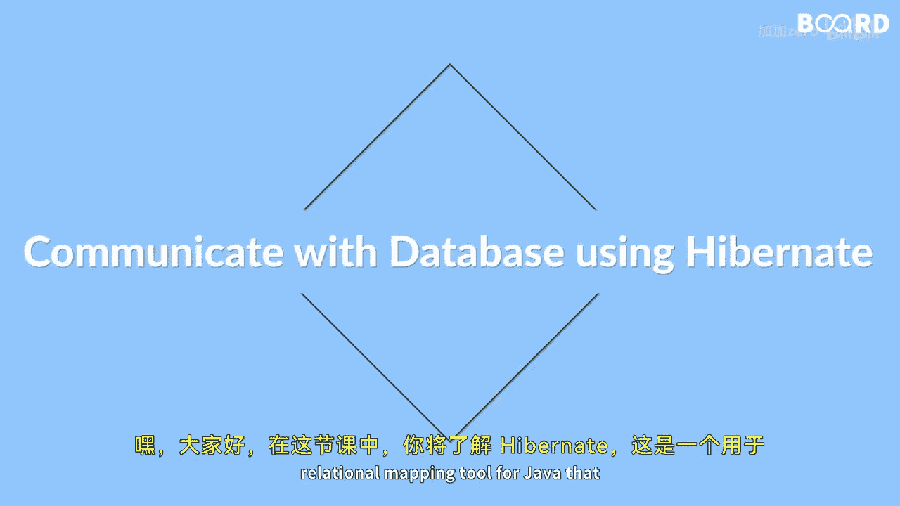

Java全栈开发：57：Hibernate入门指南

在本节课中，我们将学习Hibernate，这是一个用于Java的对象关系映射工具，它能简化与数据库交互的过程。

我们将理解Hibernate架构的基础知识、配置方法，以及使用Hibernate执行数据库操作的不同方式。

---



### 🏗️ Hibernate及其特性介绍

首先，我们来介绍Hibernate及其核心特性。Hibernate是一个开源的对象关系映射框架，它允许开发者以面向对象的方式来操作关系型数据库。其主要特性包括：
*   **简化数据库操作**：开发者无需编写复杂的SQL语句。
*   **对象关系映射**：将Java类与数据库表、对象属性与表字段进行映射。
*   **事务管理**：提供简单的事务管理接口。
*   **缓存机制**：支持一级和二级缓存，提升应用性能。
*   **数据库无关性**：通过配置即可切换不同的数据库。

---

### 🧱 Hibernate架构概览

上一节我们介绍了Hibernate的特性，本节中我们来看看它的核心架构。理解架构有助于我们更好地使用Hibernate。Hibernate架构主要包括以下几个关键组件：
*   **SessionFactory**：这是一个重量级对象，是`Session`的工厂。通常一个应用只有一个`SessionFactory`实例，它在应用启动时创建。
*   **Session**：这是一个轻量级对象，代表与数据库的一次会话。它提供了保存、获取、删除对象等操作方法。Session对象不是线程安全的。
*   **Transaction**：代表一次原子性的数据库操作单元。它封装了底层的事务管理。
*   **ConnectionProvider**：管理数据库连接池。
*   **TransactionFactory**：工厂类，用于创建`Transaction`对象。

这些组件协同工作，使得Hibernate能够高效地管理数据库连接和操作。

---

### ⚙️ Hibernate配置方法

了解了架构之后，我们需要知道如何配置Hibernate以连接到数据库。Hibernate可以通过两种主要方式进行配置：XML文件或注解。

以下是配置Hibernate的核心步骤：
1.  **添加依赖**：在项目构建文件（如Maven的`pom.xml`）中添加Hibernate依赖。
2.  **创建配置文件**：通常是一个名为`hibernate.cfg.xml`的文件，用于配置数据库连接信息、映射关系等。
    ```xml
    <hibernate-configuration>
        <session-factory>
            <property name="hibernate.connection.driver_class">com.mysql.cj.jdbc.Driver</property>
            <property name="hibernate.connection.url">jdbc:mysql://localhost:3306/testdb</property>
            <property name="hibernate.connection.username">root</property>
            <property name="hibernate.connection.password">password</property>
            <property name="hibernate.dialect">org.hibernate.dialect.MySQL8Dialect</property>
            <!-- 指定映射文件或带注解的实体类 -->
        </session-factory>
    </hibernate-configuration>
    ```
3.  **建立映射关系**：使用XML映射文件（`.hbm.xml`）或在Java实体类上使用注解（如`@Entity`, `@Table`, `@Id`）来定义对象与表的映射。

---

### 📝 使用Hibernate执行CRUD操作

配置完成后，我们就可以使用Hibernate来执行核心的数据库操作了，即CRUD（创建、读取、更新、删除）。Hibernate的`Session`接口提供了相应的方法。

以下是使用Hibernate进行CRUD操作的基本流程：
1.  **创建对象并保存**：使用`session.save(Object)`方法将一个新对象持久化到数据库。
2.  **读取对象**：使用`session.get(Class, id)`或`session.load(Class, id)`方法根据主键从数据库获取对象。
3.  **更新对象**：先获取对象，修改其属性后，使用`session.update(Object)`方法更新，或让Hibernate在事务提交时自动检测更改（脏检查）。
4.  **删除对象**：使用`session.delete(Object)`方法从数据库中移除一个对象。

所有这些操作都应在事务边界内进行，以确保数据的一致性。

---

### 🎬 操作演示与总结

最后，我们将通过一个简单的演示，展示如何创建一个实体类，配置Hibernate，并完成一套完整的CRUD操作流程。这将帮助你直观地理解Hibernate如何简化数据库交互。

本节课中我们一起学习了Hibernate的基础知识。我们从Hibernate的特性和架构入手，了解了其核心组件。接着，我们学习了通过XML和注解两种方式来配置Hibernate。最后，我们详细讲解了如何使用Hibernate的Session API来执行创建、读取、更新和删除等数据库操作。掌握这些内容，你就能在Java应用中利用Hibernate更高效、更面向对象地处理数据持久化任务了。