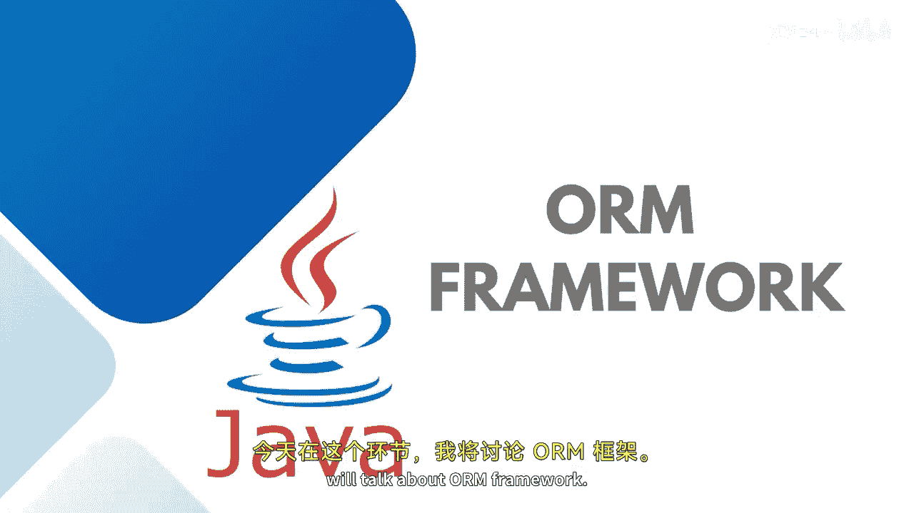
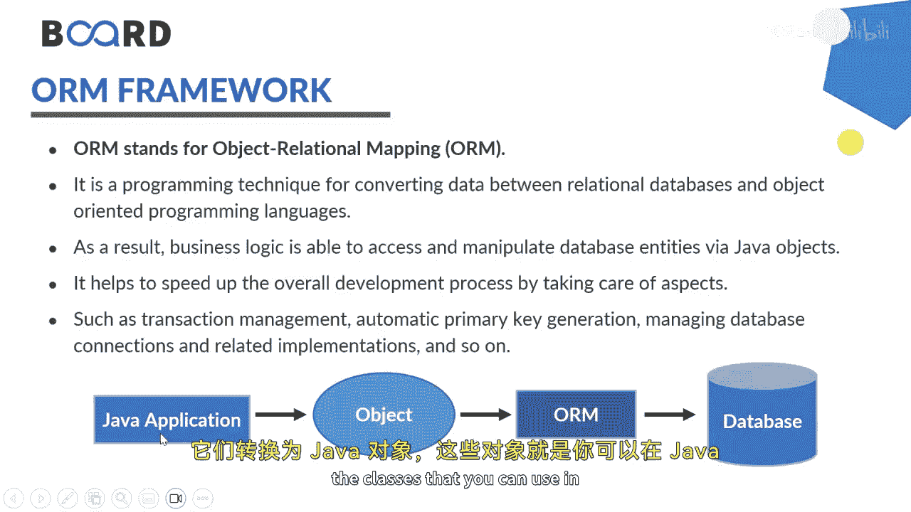

Java全栈开发：58：ORM框架入门 🚀

在本节课中，我们将学习对象关系映射（ORM）框架的基本概念。ORM是一种编程技术，用于在关系型数据库和面向对象编程语言之间转换数据。通过使用ORM，业务逻辑能够以实体（即Java对象）的形式访问和操作数据。ORM通过处理数据库交互的各个方面，例如事务管理、脏数据检查、延迟关联、数据抓取和优化功能，帮助我们加速整体开发过程。

---

### 什么是ORM？ 🤔

ORM，即对象关系映射，是一种编程技术。它的核心作用是在关系型数据库和面向对象编程语言之间进行数据转换。这使得业务逻辑能够以实体（即Java对象）的形式访问和操作数据。

**核心公式**：`Java对象 <-> ORM框架 <-> 数据库表`

---

### ORM如何工作？ ⚙️

ORM框架通过提供一系列服务来简化与关系型数据库的交互。它不仅限于Java应用，也可用于其他技术栈，如.NET。

以下是ORM工作的两个主要方向：

1.  **从对象到数据库**：当你编写Java实体类或POJO类时，ORM框架会将这些类转换为数据库中的表。
2.  **从数据库到对象**：当你已有数据库表时，ORM框架可以将这些表转换为Java对象，供你的Java应用程序使用。

---

### ORM的优势 💪

ORM通过处理底层数据库交互的复杂性，为开发者带来了显著优势：

*   **提高开发效率**：开发者可以更专注于业务逻辑，而非繁琐的SQL语句和数据库连接管理。
*   **简化数据操作**：以操作对象的方式操作数据，代码更直观、更符合面向对象思维。
*   **提供高级功能**：ORM框架通常内置了事务管理、缓存、延迟加载等优化功能。

---

### 总结与展望 📚

本节课我们一起学习了ORM框架的基本概念、工作原理及其优势。ORM作为连接对象世界与关系数据库的桥梁，是现代企业级应用开发中的重要工具。

在接下来的课程中，我们将借助Hibernate框架，通过实践来深入了解ORM的具体实现。敬请期待，我们下节课再见！