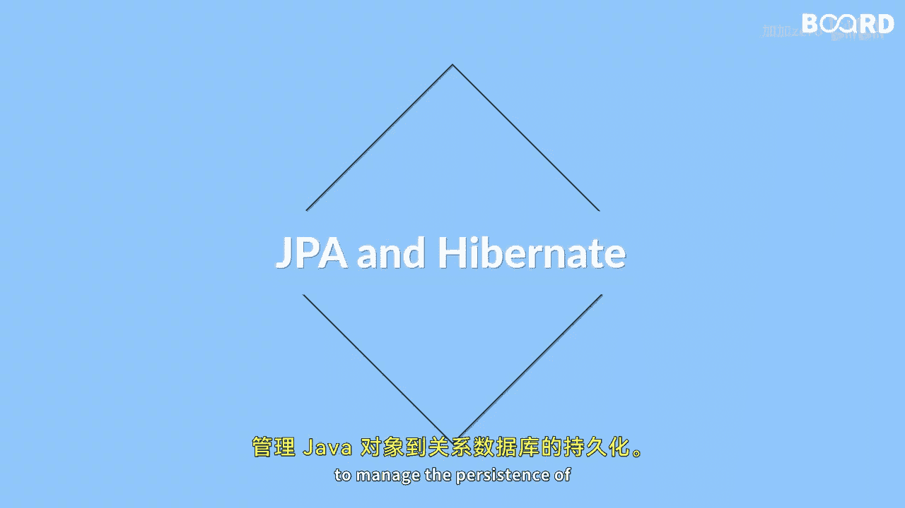

Java全栈开发：专项课程（下）：第62课：本课内容概述

在本节课中，我们将学习Java持久化API。我们将了解JPA的基础知识、其架构、如何使用Hibernate注解进行对象关系映射，以及如何执行基本的数据库操作。

---

Java全栈开发：专项课程（下）：第62课：JPA基础与架构

在Java编程中，当需要将数据存储到应用程序生命周期之外时，就需要持久化存储。

Java持久化API是Java应用程序中进行对象关系映射时广泛使用的标准。

上一节我们介绍了本课的学习目标，本节中我们来看看JPA的基础概念和架构。

JPA是一个ORM框架的规范，它允许你将Java对象映射到关系型数据库。

以下是JPA架构中的不同层次及其协作方式：
*   **持久化对象层**：由实体类组成，这些类使用注解映射到数据库表。
*   **实体管理器层**：作为与持久化上下文交互的主要接口，用于管理实体的生命周期。
*   **持久化提供者层**：由JPA的实现框架（如Hibernate）构成，负责底层的数据库操作。
*   **数据库层**：最终存储数据的关系型数据库。

这些层次共同工作，将面向对象的Java代码与关系型数据库连接起来。



---

Java全栈开发：专项课程（下）：第62课：Hibernate注解与JPA配置

了解了JPA的整体架构后，本节我们将聚焦于具体的实现工具——Hibernate，以及如何使用它进行配置和映射。

Hibernate是最流行的JPA提供商之一，它提供了一套丰富的注解，用于将Java对象映射到关系型数据库。

你将学习如何使用这些注解来映射Java对象到数据库表，以及如何配置JPA以与Hibernate协同工作。

以下是核心的Hibernate/JPA注解示例：
*   **`@Entity`**：将一个Java类声明为JPA实体，对应数据库中的一张表。
*   **`@Id`**：指定实体的主键字段。
*   **`@GeneratedValue`**：配置主键的生成策略，例如自增。
*   **`@Column`**：将实体字段映射到数据库表的特定列，可指定列名等属性。

一个简单的实体类代码示例如下：
```java
@Entity
public class Product {
    @Id
    @GeneratedValue(strategy = GenerationType.IDENTITY)
    private Long id;

    @Column(name = "product_name")
    private String name;

    // 构造函数、Getter和Setter方法
}
```

JPA的配置通常通过一个名为`persistence.xml`的文件完成，该文件定义了数据库连接、提供商等持久化单元信息。

---

Java全栈开发：专项课程（下）：第62课：使用JPA执行数据库操作

掌握了对象映射和配置之后，本节我们来看看如何使用JPA对数据库进行增删改查等核心操作。

最后，你将学习如何使用JPA执行操作，例如持久化、更新和删除数据库中的数据。

这些操作主要通过`EntityManager`接口来完成。以下是关键的操作方法：
*   **持久化数据**：使用`entityManager.persist(object)`方法将一个新的实体对象插入数据库。
*   **更新数据**：通过`entityManager.merge(object)`方法更新一个已存在实体的状态。
*   **删除数据**：调用`entityManager.remove(object)`方法从数据库中删除一个实体。
*   **查询数据**：使用JPQL（Java持久化查询语言）或Criteria API来查询数据，例如`entityManager.createQuery("SELECT p FROM Product p", Product.class).getResultList()`。

---

Java全栈开发：专项课程（下）：第62课：课程总结

本节课中，我们一起学习了Java持久化API的核心内容。

我们从JPA解决数据持久化需求入手，了解了其作为ORM规范的基本架构。接着，我们深入探讨了如何使用Hibernate提供的注解（如`@Entity`， `@Id`）来定义实体映射，并介绍了JPA的配置文件。最后，我们学习了如何通过`EntityManager`执行数据的持久化、更新、删除和查询等基本操作。

通过本课的学习，你应该对如何使用JPA在Java应用程序中管理数据库持久化有了一个初步而完整的认识。