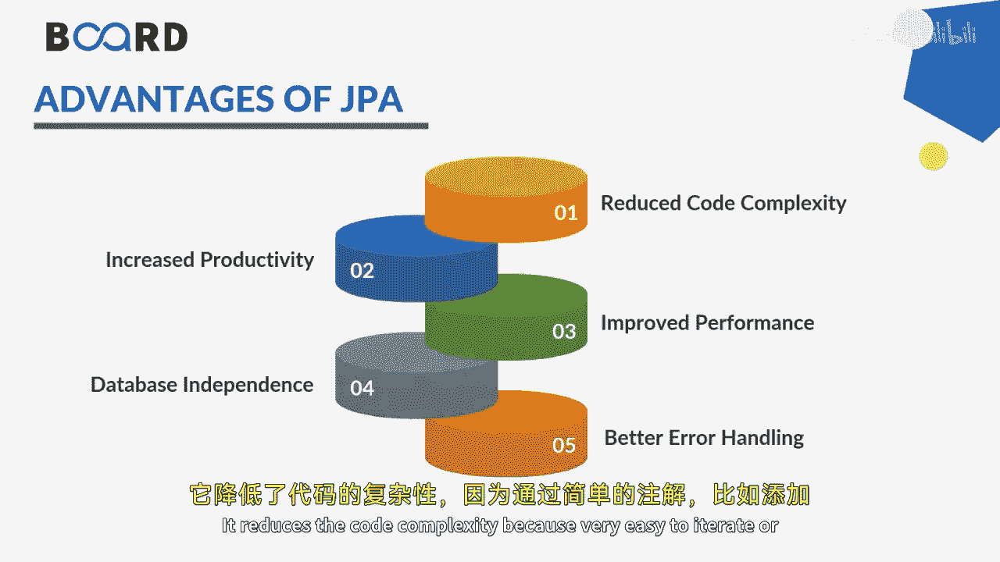
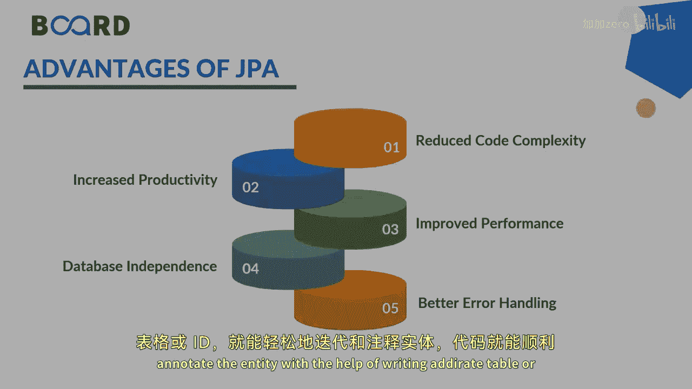

Java全栈开发：64：什么是JPA？🤔

在本节课中，我们将学习Java持久化API（JPA）。JPA是Java平台的一个规范，用于在Java对象和关系型数据库之间进行数据持久化操作。我们将了解它的基本概念、工作原理以及优势。

---

上一节我们介绍了课程背景，本节中我们来看看JPA的核心定义。

JPA是Java Persistence API的缩写。它是一个Java规范，用于在Java对象和关系型数据库表之间持久化数据。正如我们讨论过的Hibernate一样，数据以对象形式存储和通信，但在关系型数据库中，数据以表的形式存储。JPA使得你的实体或对象能够以对象的形式与数据库表进行交互。

例如，`Employee`在Java中是一个类，但在关系型数据库中它是一张表。因此，JPA充当了对象关系模型和关系数据库系统之间的桥梁。

由于JPA只是一个规范，它本身不执行任何操作。它主要负责在数据库表和Java对象之间进行通信。像Hibernate、TopLink、EclipseLink这样的ORM工具实现了JPA规范，从而提供了Java持久化的具体功能。

---

了解了JPA的定义后，接下来我们看看在现实应用中使用JPA有哪些优势。

以下是使用JPA的主要优点：

*   **降低代码复杂度**：通过使用注解（如`@Entity`、`@Table`）来映射实体和表，代码编写变得非常简单。
*   **提高生产力**：可以轻松地使用一个Java对象执行多种数据库操作。
*   **提升性能**：JPA实现通常包含缓存和优化机制。
*   **数据独立性**：如果需要更改数据库设置，只需修改一次配置。JPA会处理所有相关的配置变更。
*   **更好的错误处理**：在整个Java持久化操作中，可以利用自定义异常或JPA规范中预定义的异常进行更有效的错误处理。

---

本节课中，我们一起学习了Java持久化API（JPA）。我们了解到JPA是一个连接Java对象世界和关系型数据库表的规范，它本身不直接操作，而是由Hibernate等ORM工具实现。我们还探讨了JPA在降低代码复杂度、提高开发效率和维护性方面的主要优势。希望这个简要的介绍能帮助你理解JPA的基本概念。