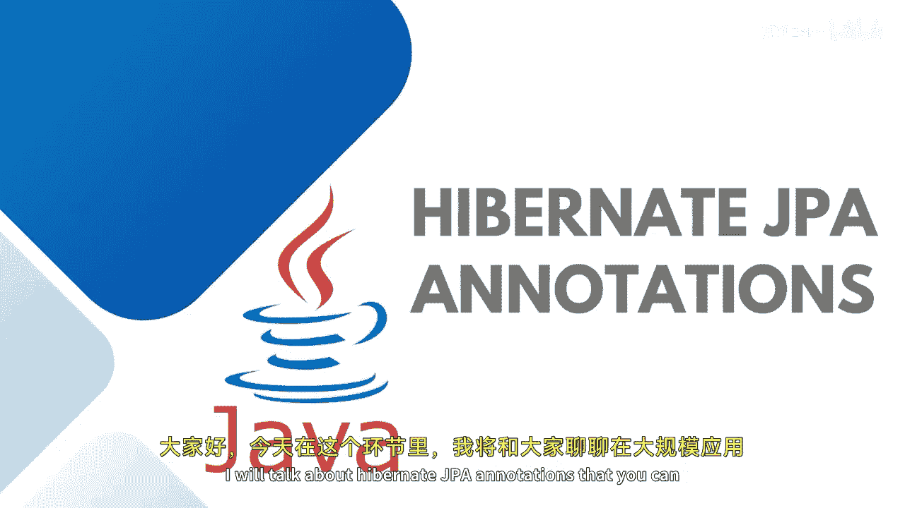

Java全栈开发：专项课程（下）：05：Hibernate JPA 注解详解 🏷️

在本节课中，我们将学习 Hibernate JPA 中的核心注解。这些注解是连接 Java 对象与关系型数据库表的桥梁，对于构建数据持久层至关重要。我们将逐一介绍每个注解的作用和用法。

上一节我们了解了 JPA 的基本概念，本节中我们来看看具体有哪些注解可以帮助我们定义实体和映射关系。

**@Entity** 注解用于标记一个 Java 类，表明这个类是一个 JPA 实体，需要与数据库进行映射。被 `@Entity` 注解的类不需要实现任何接口或继承特定的超类。

默认情况下，每个实体类会映射到数据库默认模式（schema）中一个同名的表。**@Table** 注解允许我们自定义这种映射关系。

以下是 `@Table` 注解可以配置的主要属性：
*   **name**：指定映射的数据库表名。
*   **schema**：指定表所在的数据库模式。
*   **catalog**：指定表所在的数据库目录。

JPA 和 Hibernate 要求为每个实体至少指定一个主键属性。**@Id** 注解用于标记实体类中作为主键的字段。

当主键的值需要由数据库自动生成时（例如使用序列或自增列），我们需要使用 **@GeneratedValue** 注解。

以下是 `@GeneratedValue` 的两种常用生成策略：
*   **GenerationType.SEQUENCE**：使用数据库序列来生成主键值。
*   **GenerationType.IDENTITY**：使用数据库的自增列来生成主键值。

在关系型数据库中，表与表之间通过外键关联。JPA 提供了一系列注解来定义这些关联关系。

以下是四种核心的关系映射注解：
*   **@OneToOne**：定义一对一关联。
*   **@OneToMany**：定义一对多关联。
*   **@ManyToOne**：定义多对一关联。
*   **@ManyToMany**：定义多对多关联。

这些注解使得我们的对象模型能够更精确地反映数据库中的表关系。

除了上述核心注解，JPA 还提供了一些其他有用的注解来处理特定场景。

**@Lob** 注解用于映射大型对象字段，例如很长的文本（`String`）或二进制数据（`byte[]`）。关系型数据库通常对普通字段有长度限制，而 `@Lob` 类型则几乎没有限制。数据库会将其映射为 `BLOB`（二进制大对象）或 `CLOB`（字符大对象）类型。

如果你在实体中使用了 `java.util.Date` 或 `java.util.Calendar` 类型的属性，需要使用 **@Temporal** 注解来指定如何将其持久化到数据库。

使用 `@Temporal` 注解时，你需要指定 `TemporalType`，例如：
*   **`TemporalType.DATE`**：只存储日期部分。
*   **`TemporalType.TIME`**：只存储时间部分。
*   **`TemporalType.TIMESTAMP`**：存储日期和时间。

**@Transient** 注解用于标记一个属性，表明该属性不需要持久化到数据库中。它仅存在于 Java 对象层面。

在定义关联关系（如 `@ManyToOne`）时，JPA 会自动创建一个外键列。如果你想自定义此外键列的名称或其他属性，可以使用 **@JoinColumn** 注解进行手动配置。

本节课中我们一起学习了 Hibernate JPA 的核心注解。我们从定义实体本身的 `@Entity` 和 `@Table` 开始，接着学习了主键注解 `@Id` 和 `@GeneratedValue`，然后探讨了四种关系映射注解，最后介绍了一些处理特殊数据类型的注解，如 `@Lob`、`@Temporal`、`@Transient` 和 `@JoinColumn`。理解并熟练运用这些注解，是使用 JPA 进行高效、准确数据持久化开发的基础。在后续的实际编码练习中，这些概念会变得更加清晰。