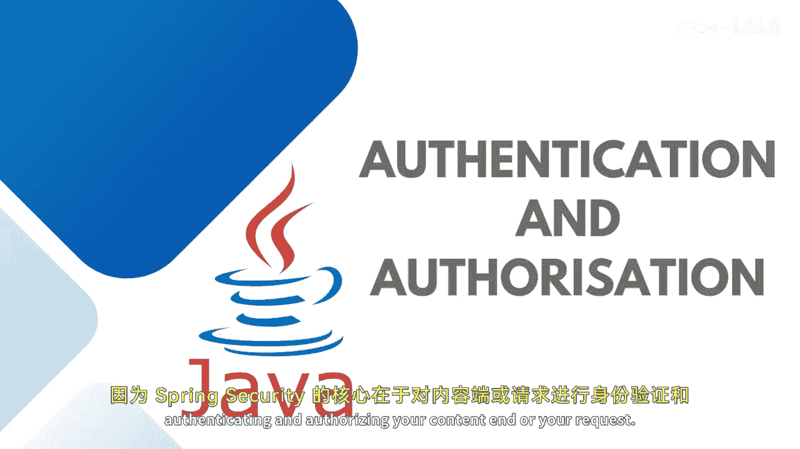

# 070：理解认证与授权

在本节课中，我们将学习Spring Security的核心概念：认证与授权。理解这两个概念对于构建安全的应用程序至关重要。

## 概述

Spring Security的核心目标是保护应用程序的内容和请求，其实现主要围绕认证和授权展开。要掌握Spring Security，必须理解三个关键概念：认证、授权和过滤器链。本节将逐一介绍前两个概念。

## 认证：验证用户身份

上一节我们概述了Spring Security的重要性，本节中我们来看看第一个核心概念：认证。

保护资源的一个基本方法是确保访问者是其声称的身份。在一个典型的应用程序中，你需要用户进行认证。这意味着应用程序需要验证用户是否是其声称的那个人。这通常通过用户名和密码来完成。例如，用户声称自己是“用户A”，并提供了密码。如果密码和用户名正确，则允许该用户访问，否则拒绝。

为了实现认证，Spring Security使用了认证过滤器和认证提供者。认证提供者处理特定类型的认证请求，并检查是否支持该类型的认证。

在大型或完整的应用程序中，我们通常使用仓库设计模式和数据访问对象。认证过滤器或提供者会从用户详情服务中检索用户详细信息。用户详情服务是一个核心接口，用于加载Spring框架中用户特定的数据。通过特定的验证过滤器进行认证，并判断请求是否来自正确的用户。

## 授权：管理用户权限

理解了如何验证用户身份后，接下来我们需要控制用户能做什么，这就是授权。

在简单的应用中，仅靠认证可能不够。一旦用户通过认证，理论上她可以访问应用的每个部分。但大多数应用程序都有权限或角色的概念，这时就需要授权。授权指的是确定用户是否拥有执行特定操作的适当权限的过程。

例如，作为管理员，我可以查看有多少用户在我的电商网站上注册，但作为客户的你则无法看到这些数据。这取决于你拥有何种权限。权限通常以角色或规则的形式出现。再举一个例子：可以访问网店前台的客户，和可以访问独立管理后台的管理员，这两种用户都需要登录，但我们需要规定认证用户或普通用户可以执行哪些活动。

以下是我们可以执行的不同类型的授权配置：

*   **基于URL的配置**
*   **基于注解的配置**

应用程序的授权检查可能很复杂，如果将所有规则定义在一个地方，会变得难以阅读和维护。因此，基于注解的配置更受青睐。

以下是你可以使用的一些注解示例：

*   `@PreAuthorize`：在授权前需要执行哪些操作。
*   `@PostAuthorize`：在授权后需要执行哪些操作。
*   `@PreFilter` 和 `@PostFilter`
*   `@Secured`
*   `@RolesAllowed`：允许特定用户执行操作。

这就是认证和授权在Spring Security中的工作方式。

## 总结

本节课中，我们一起学习了Spring Security的两个基石：**认证**与**授权**。认证负责验证“你是谁”，通常通过用户名和密码实现。授权则负责决定“你能做什么”，通过权限和角色来管理用户的访问范围。我们还简要了解了基于注解的授权配置方式，这种方式更清晰、更易于管理。

在接下来的课程中，我将讨论**过滤器链**，这是连接和协调认证与授权过程的另一个关键组件。

🎼 下次再见，敬请期待，谢谢。