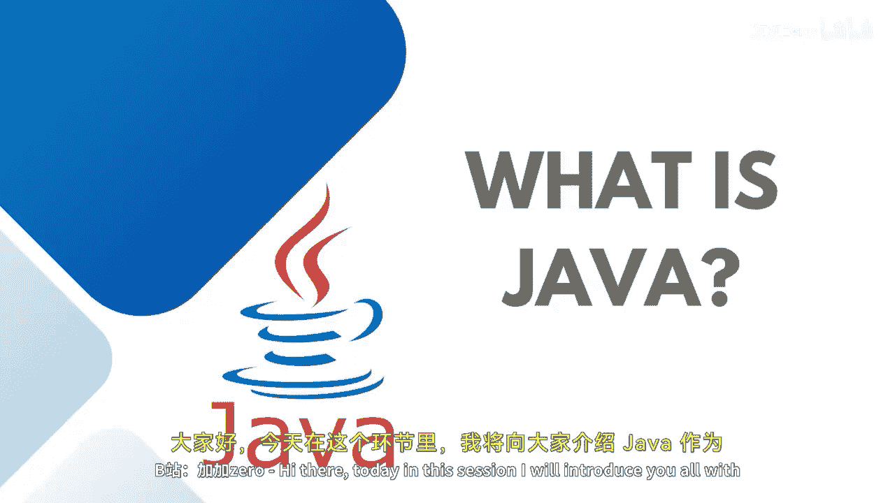
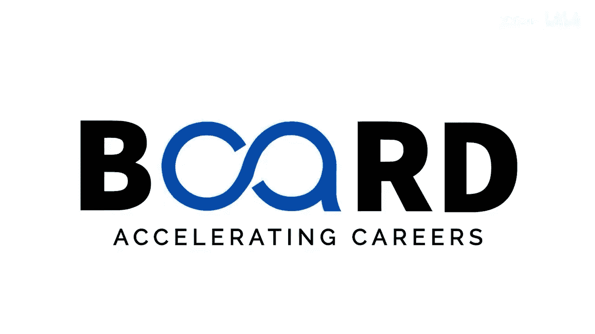

# 【Java全栈开发 专项课程（上）】Board Infinity—中英字幕 p05 p4_02_what-is-java -BV1tAygYoEj5_p5-

Hi， there。Today in this session， I will introduce you all with Java as a programming language。

Java is a programming language and a platform which is a high level， robust。

 object oriented and secure programming language。It is a computing platform first released by Sun Microsystem in 1995。

And created by a team， lead by James Cosling。Java helps in developing。

Small application modules or apps for use as a part of web page。

Along with it helps in developing the console application， web application， mobile application。

 client server architectures， and so on。Very important point。

 Java is a platform independent language that follows the logic of write once and run anywhere。

 Any hardware or software environment in which a Java runs is known as a platform。

And we need a Java runtime environment to run our Java， once we compile。

The Java file into the dot class file that file can run anywhere。This is the history of Java。

 As I discussed， Java was first released by Sun Microsystem in year 1995。

With the latest integration and updates coming after each iteration。

 Java was having their next iteration and released with the new features imbibed into them。😊。

After S 8， the Java standard edition 9 came into the picture where we really didn't want to install JDK and JRE separately。

 it comes as a one unit or a package。Before learning about Java as a programming language。

 a big question to understand why Java， if we have more of a programming languages。As I said。

 the most powerful point to be discussed here is Java is a platform independent。

As it follows the rule of write funds and run anywhere。

 whatever dot class file gets generated from your dot Java file after the compilation。

 it is easy and simple to read as a programming language。

 The new developers can easily understand if they are not coming from any programming background。

 or they are very well versed with the basic programming like C plus plus or any other programming language。

 Java is pure object oriented language， because without writing a class。

 you do not even write a mean method， Its completely based on object oriented approach。

Helps in developing distributed， interpreted， Rob and secure application。

 We call it as a portable programming language because you can write it once and。

Run it anywhere or everywhere。Provides a strong networking infrastructure for server site computing。

 And also， this implementation helps in developing the client server architecture。

 Java is used in top mobile Os。 For example， Android uses Java for coding。

 Java has a very high range of。Libraries created through the modifications from the existing C libraries headerophiles that we use to implement the iteration of different implementations。

🎼So this is how and why we are learning Java as a programming language I'm super excited to teach you the programming and the practical aspects of this programming language hope to see you soon until next time stay tuned。

 Thank you。

