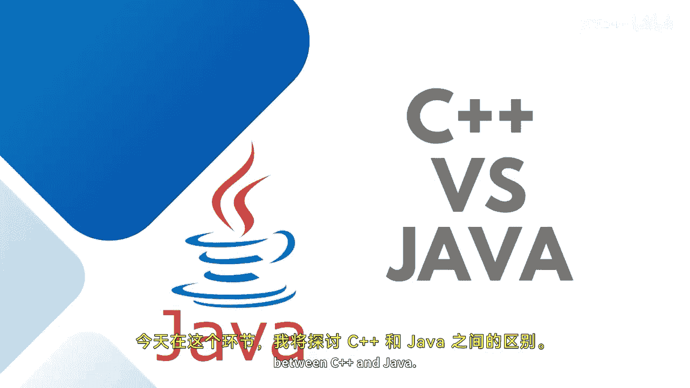

# 【Java全栈开发 专项课程（上）】Board Infinity—中英字幕 p07 p6_04_c-vs-java -BV1tAygYoEj5_p7-

Hi there。 Today， In this session， I will discuss about the differences between C plus+ and Java。😊。

There are many differences in similarities between the C plus plus programming language and Java。

 couple of I would like to discuss here， as I told you in my previous session， generally。

 developers learn C or C plus+ before migrating to learn Java or donet。

So they compare it with the implemented and the fundamental concepts of object oriented programming with Java。

As I discuss， C plus plus is platform dependent。Where Java is platform independent。

 which has a rule to be followed write once and run anywhere。

Java can be both compiled and interpreted， but C plus plus is only compiled and cannot be interpreted。

Memory management in Java is system controlled。But in C plus plus， it's completely manual。

Java can run on any OSs。 That is the reason we call it as independent platform。

 independent and portable。The moment we talk about C plus plus it completely a platform dependence wherever you develop your C plus+ file runs it over there only。

 depends upon your OS。We have more diverse libraries with a lot of support for the code reusability In the case of Java。

 But in C plus+， we use headophiles and their implementations are limited。

 Java has no longer support for global scope， where the global scope for the namespaces and the variables are supported in C plus plus。

These are the couple of differences， which I have told There are more onto。

 There is a go to statement。 Java doesn't support go to statement， but C plus plus supports。

In C++ multiple inheritance is possible with the help of classes where a class can inherit multiple classes at the same time。

 but Java doesn't support multiple inheritance through class because it can be achieved by using interfaces in Java as one class can inherit only one class at the same point of time。

 so the more you will practice the more you will practically implement the Java in your aspects in your requirements。

 you will learn more about the differences。See in the next session to tell you more about the Java as a programming language until next time stay tuned。

 Thank you。🎼。

