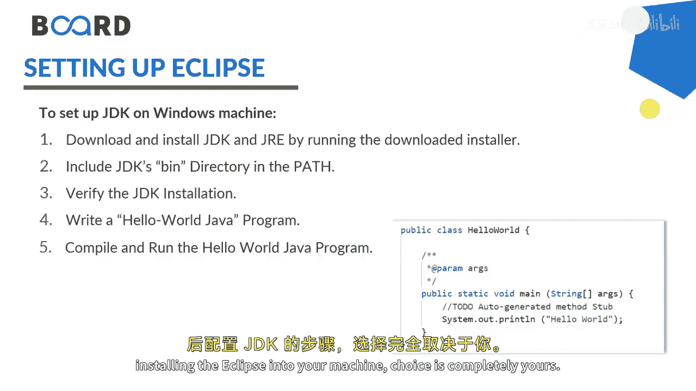
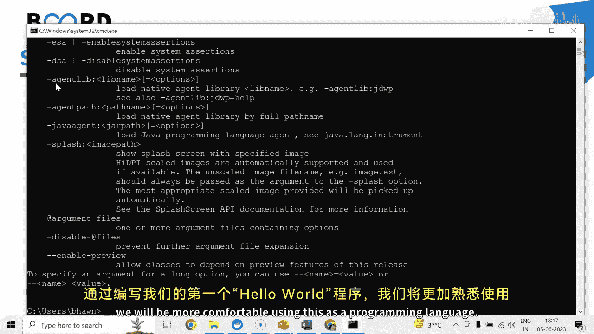

# 【Java全栈开发 专项课程（上）】Board Infinity—中英字幕 p08 p7_05_setting-up-the-development-environment -BV1tAygYoEj5_p8-

Hi there today in this session I'm going to talk about the setting of the development environment for Java on Windows。

Basically， to work with Java， you need one， I D E and one。Java Jdi K， I'll be using I D E Eclipse。

You can use eclipse， you can use Vi Studio code， you can use Inligj or you can even use Noteepad。

 but to write your Java programs I will suggest to go for eclipse first of all it's available free of cost。

 but intelligentligj and other IDs needs to be paid Vis Studio code is also free of cost available。

 but it will not give you the templates and the library's installation you need to go with in hand command。

Rest is up to your choice。 Which I D E you would like to use。 There are many Ides available。

 as I told you。Eclipse is basically standardized for Java。To set up the eclipse IDdeE。

 what you need to do is you need to go to the Eclipse official website。

 download and install the Eclipse IDdeE。You need to configure the eclipse plugin to start under any specific GDPDK version that you are going to use and set up the development environment。

All the steps are already given here， but let me tell you three things here。

 So this is the official eclipse OG where you can download your very latest eclipse IDdeE version 202303 if you are using Windows then you can click on this download x 8664 and install it。

 but if you are using any other operating system you need to go to the download packages。

You can just look it up as per your OS and install the EXC or the package and install it。

I would like to give you one suggestion when you just go for this particular option。

 it will give you the option to install the Java for web development as well as standard edition。

But if you will go for download packages， you need to take care of it。

 if you will go for Java web development， you can also create the core Java projects here。

 but in the case of Java developers only the web development packages and the templates wouldn't be available I will suggest you to go for Java and web developers。

 that is for enterprise edition development that if in case you would like to develop the web applications later。

But before that， I will tell you that you should install JDK which version you wanted to opt out if you will install eclipse first。

 you need to configure the JDK for eclipse。 if you will install JDK first when you will be installing the eclipse。

 JDK will automatically gets detected in the installation procedure。

 So for installing the JDK which version you wanted to opt out is completely your choice as mentioned JDK 20 is the latest release of the standard deviation。

 but JDK 17 is the latest LTS latest long term support。I should suggest to go for JDK 70， but not 20。

Because the features can be anytime downgraded in the case of JDK 20。

If in case you wanted to get some support， just go for this official website。

 which I am managing codingingdein do com。 you can go to the B section and the Java block section。

And here you can see that I have given the step by step procedure to install intelligentlig Eclipse and GDK。

 so you can just look it up and just go with the step by step procedure that might helps you。

In case you install eclipse first and JDK later， then it is also giving you the steps to configure the JDK after installing the eclipse into your machine。

Choice is completely yours。 You can also go to the command， prompt， and verify。

Java hyphen hyphen version， which version you are using。

 I am already having JDK installed in my machine， so I am having Java 19。

 but that's completely okay for the training and development purpose。

 but I'll suggest you if you are going for your project development go for this table long term support that is GDK 17 as of now。

I hope the concept is pretty clear to all of you， and we are all set to use Java as a programming language。

 And by writing our first hall programme， we will be more comfortable using this as a programming language。

 See you in the next session until next time， Stay tuned。 Thank you。😊。

。

