# CSS布局基础：第28章：CSS display属性详解

在本节课中，我们将要学习CSS中一个核心的布局属性——`display`。我们将了解它如何控制HTML元素的显示类型，并学习其三个最常用的值：`block`、`inline`和`inline-block`。通过本教程，你将能够使用`display`属性来控制网页元素的布局方式。

---

## 课程回顾与引入

上一节我们介绍了CSS的`float`属性，并利用它为HTML页面创建了多列布局，调整了文本和图像的排列。本节中，我们来看看另一个强大的布局属性——`display`。

`display`属性用于控制HTML元素的盒子类型，从而直接影响元素在网页上的呈现方式。我们将探讨如何使用`display`属性及其不同的值，并了解一些最佳实践和常见用例。

---

## 理解display属性

CSS `display`属性用于指定HTML元素所使用的盒子类型，这决定了元素在网页上的渲染方式。

`display`属性最常用的三个值是：
*   **`block`** （块级元素）
*   **`inline`** （行内元素）
*   **`inline-block`** （行内块元素）

以下是这三个值的核心区别：
*   **`block`** 元素会独占一行，并占据其容器的全部可用宽度。
*   **`inline`** 元素会与文本流同行排列，只占据其内容所必需的宽度。
*   **`inline-block`** 元素是前两者的混合体，它允许元素像行内元素一样水平排列，但同时可以像块级元素一样设置宽度、高度等属性。

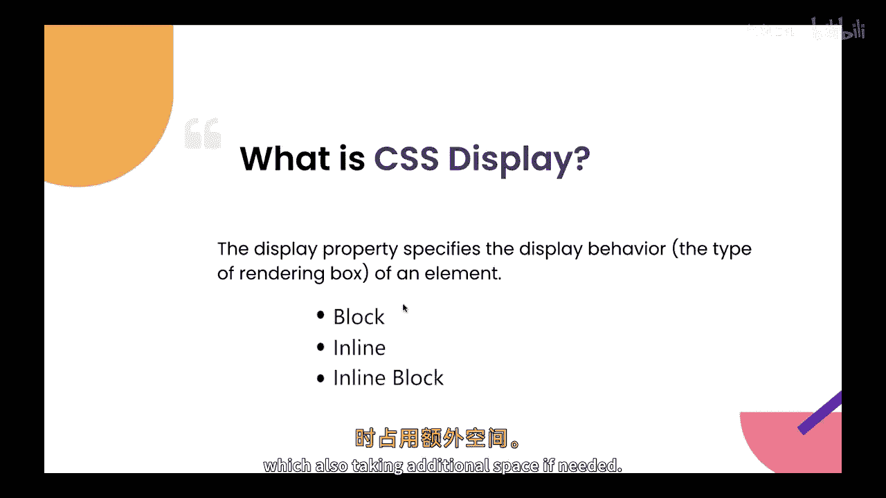

让我们通过代码示例来观察这三个值的实际效果。

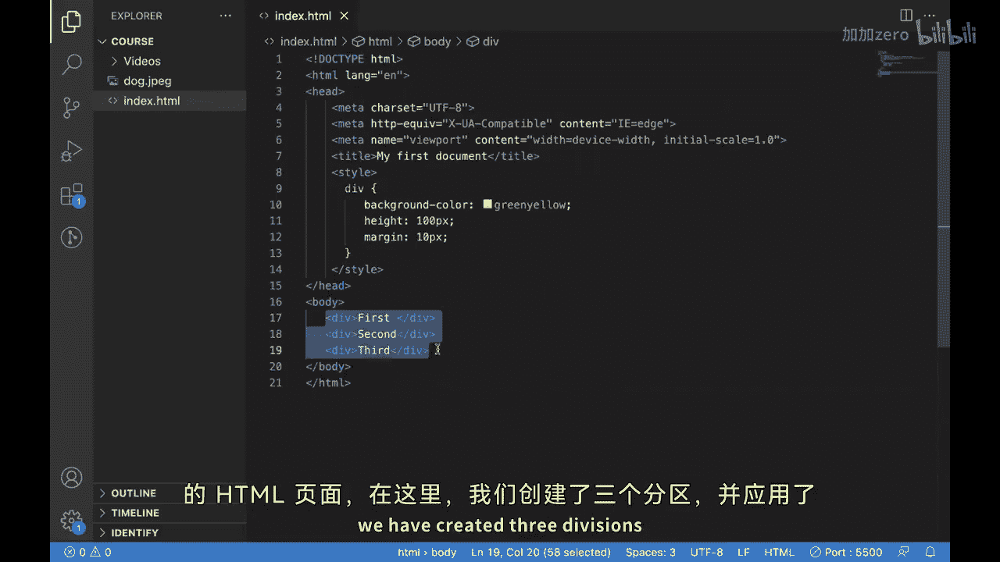

---

## 代码示例与实践

首先，我们创建一个包含三个`<div>`元素的简单HTML页面，并为其应用一些基础CSS样式。

```html
<!DOCTYPE html>
<html>
<head>
    <style>
        div {
            width: 100px;
            height: 100px;
            background-color: red;
            margin: 5px;
        }
    </style>
</head>
<body>
    <div>1</div>
    <div>2</div>
    <div>3</div>
</body>
</html>
```

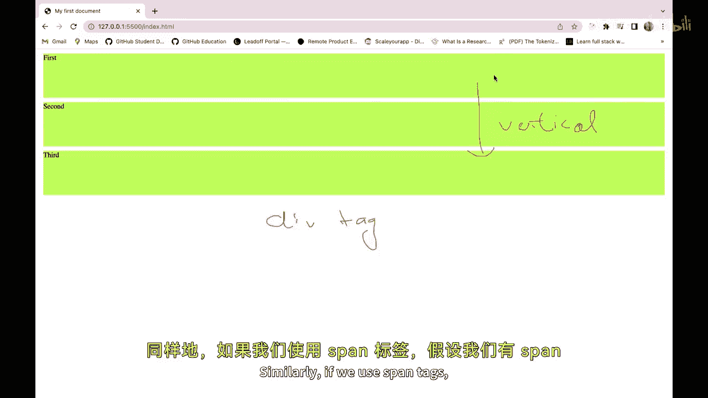

在浏览器中查看，你会发现这三个红色的方块垂直堆叠排列。这是因为`<div>`标签的默认`display`属性值就是**`block`**，所以它们会各自占据一整行。

接下来，我们看看`<span>`标签的默认行为。我们将上面的`<div>`替换为`<span>`，并将颜色改为蓝色。

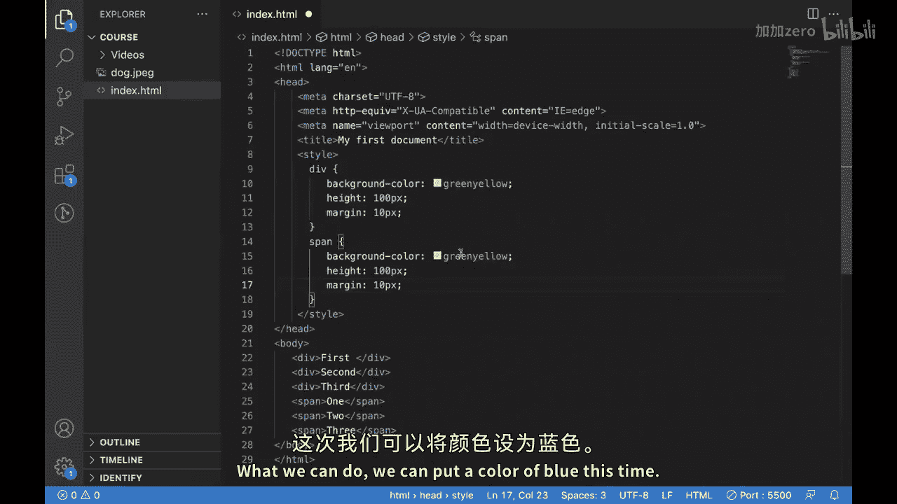

```html
<span>1</span>
<span>2</span>
<span>3</span>
```

```css
span {
    width: 100px; /* 注意：这对inline元素通常无效 */
    height: 100px; /* 注意：这对inline元素通常无效 */
    background-color: blue;
    margin: 5px;
}
```

此时，你会看到数字“1”、“2”、“3”水平排列在一行。这是因为`<span>`标签的默认`display`属性值是**`inline`**。

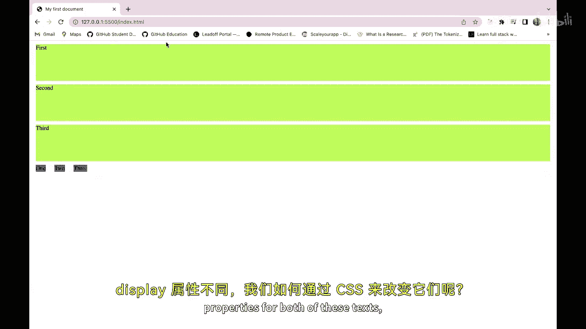

---

## 使用CSS改变display属性

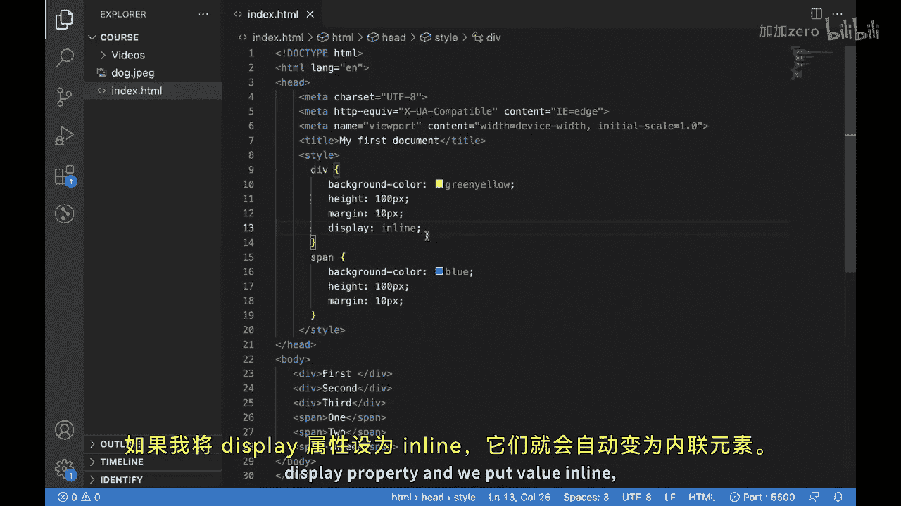

元素的默认显示类型并非一成不变，我们可以通过CSS轻松地改变它。

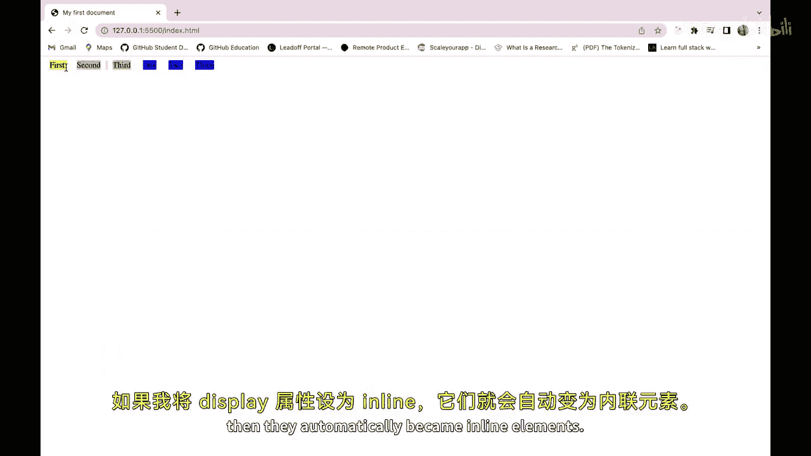

例如，我们可以将`<div>`的`display`属性改为`inline`：

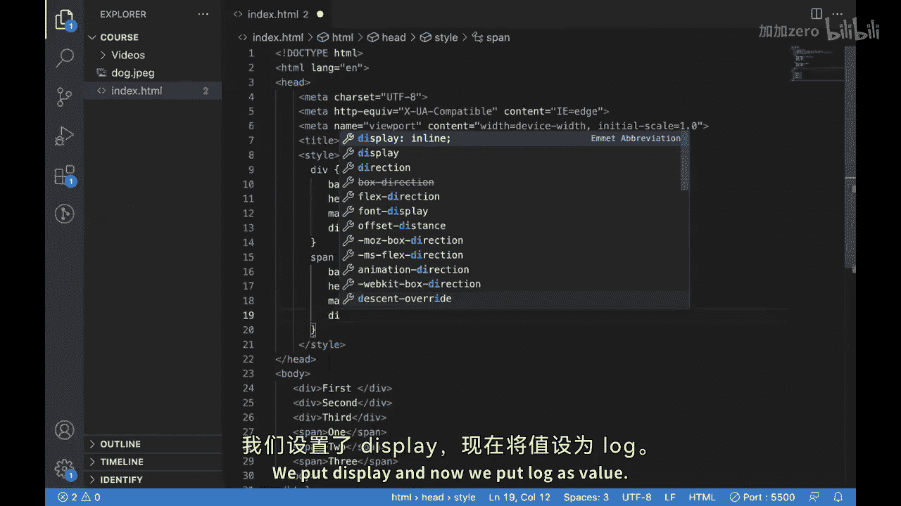

```css
div {
    display: inline;
}
```

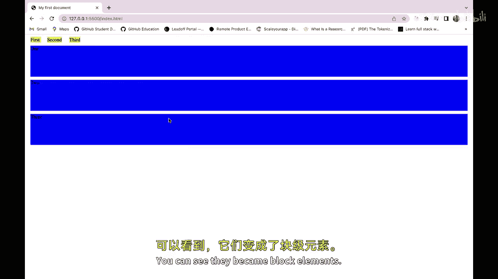

应用此样式后，原本垂直排列的`<div>`方块会立刻变为水平排列，表现得像行内元素一样。

同理，我们也可以将`<span>`的`display`属性改为`block`：

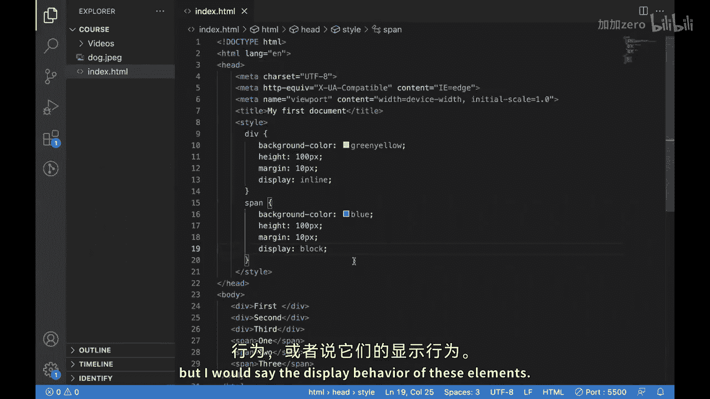

```css
span {
    display: block;
}
```

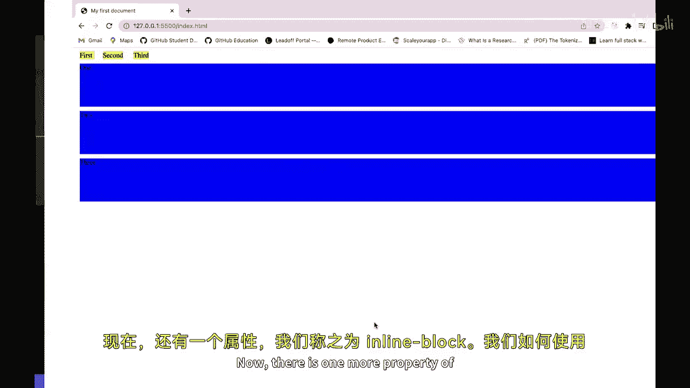

这样，原本水平排列的`<span>`就会各自独占一行，表现得像块级元素一样。

---

## 深入inline-block的妙用

现在，让我们关注一个更实用的值：**`inline-block`**。回顾之前的例子，当我们为`<span>`（`display: inline`）设置`height`和`width`时，这些属性并未生效。这是因为标准的`inline`元素不支持设置高度、上边距(`margin-top`)、上内边距(`padding-top`)等盒模型属性。

这时，`inline-block`就派上用场了。它兼具两者的优点：
1.  像`inline`元素一样，可以在水平方向与其他元素并列。
2.  像`block`元素一样，可以设置宽度(`width`)、高度(`height`)、内边距(`padding`)和外边距(`margin`)。

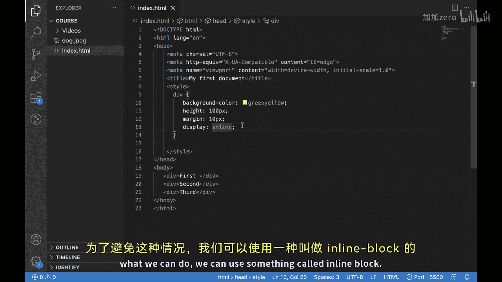

让我们将`<div>`的显示类型改为`inline-block`：

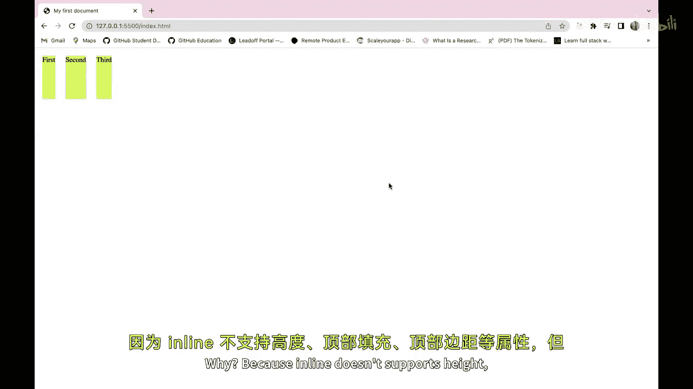

```css
div {
    display: inline-block;
}
```

现在，这些`<div>`既能水平排列，又能完美地应用我们之前设置的`height: 100px`属性，呈现出规整的方块效果。这解决了纯`inline`元素在布局上的诸多限制。

---

## 课程总结

本节课中我们一起学习了CSS `display`属性的核心知识。我们了解了`block`、`inline`和`inline-block`这三种基本显示类型的特性与区别，并通过实践掌握了如何使用CSS来改变元素的默认显示行为。

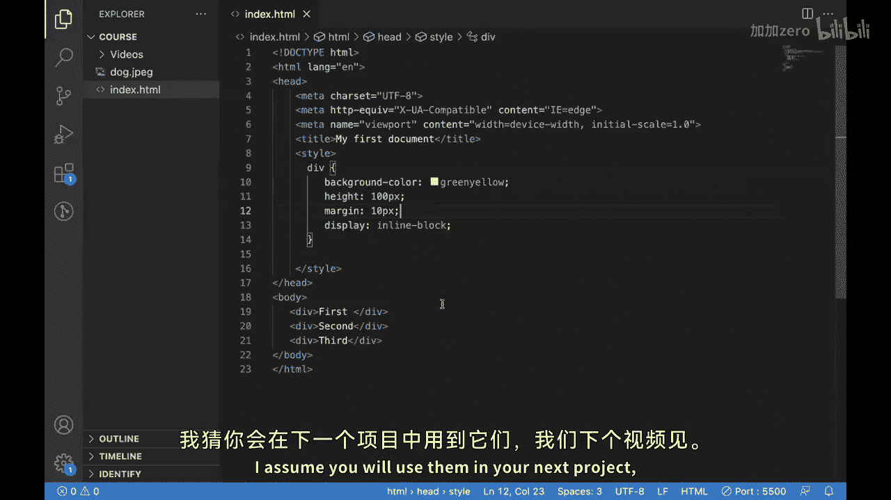

掌握这些知识和技巧后，你现在应该能够运用`display`属性来控制网页的布局，为创建更复杂、更动态的网页设计打下基础。希望你能在接下来的项目中灵活运用它们。


我们下个视频再见！