# 【Java全栈开发 专项课程（上）】Board Infinity—中英字幕 p104 p32_03_css-background-colors -BV1tAygYoEj5_p104-

Hi there In our previous video we have seen color property in CSS。And we have seen different type。

Of using the color in our HTML Cs project。In this video， we'll be looking into background color。

As a web developers using the right background color for your website is crucial for creating an engaging user experience。

😊，The background color sets the tone of the entire page and can greatly impact the readability and overall aesthetic of your website。

In this video we'll explore how to set background color at CSS using various techniques。

 including name colors， xx and colors and RGB colors。

We' will also discuss the importance of choosing colors that complement each other and how to use contrast to improve redability。

Like you see background color in action in our HTMLl page。

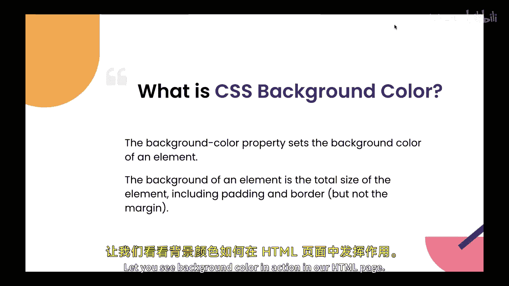

So this is our HTMLl page。

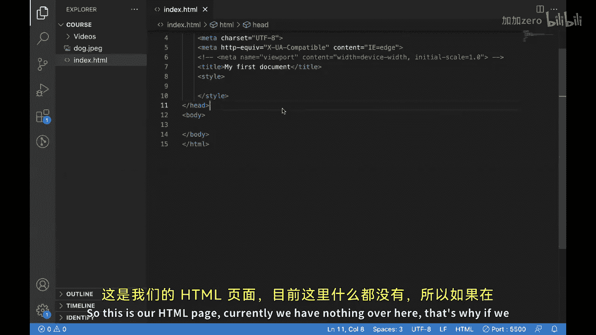

Currentpparentlyly， we have nothing over here。That's why if we check this out in browser。

 you won't be able to see anything。

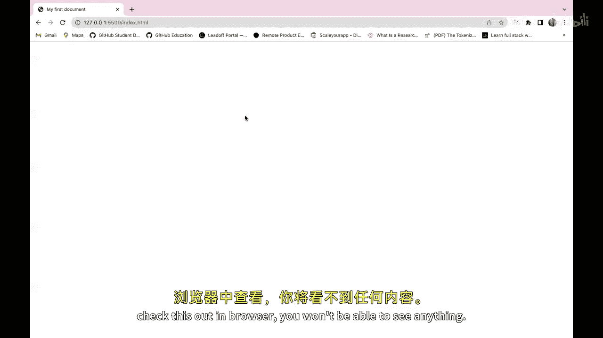

Now what we can do。We can directly put。Some color to it。So we can use the background color property。

And now。When you supply this coral color to this。

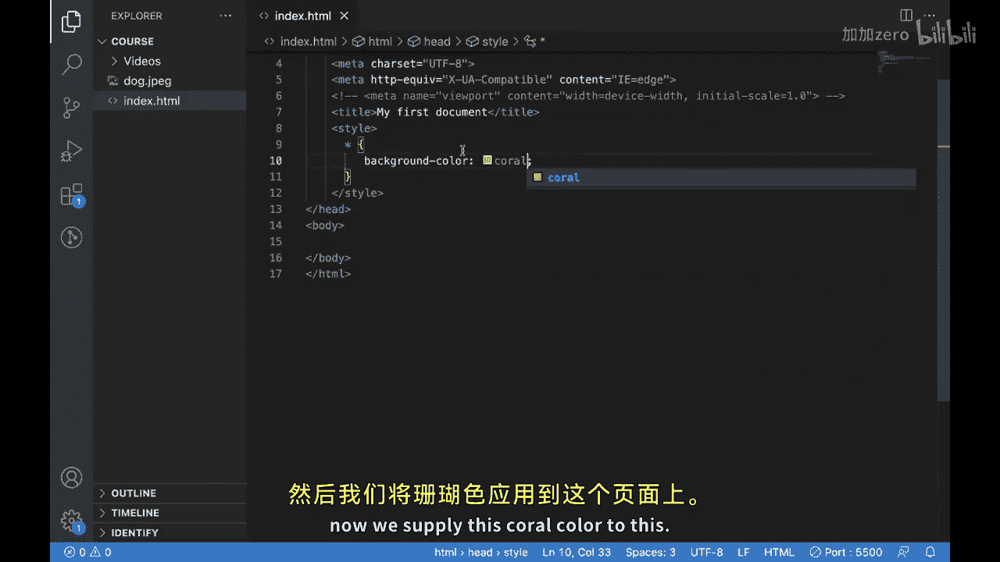

this is how we can put a background color in our HTML。

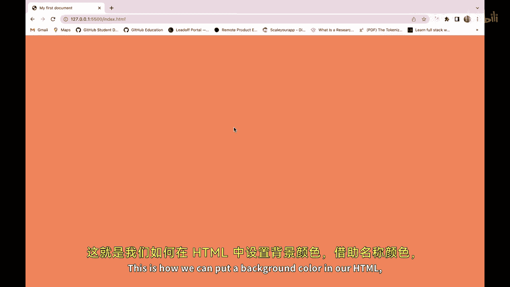

With the help of name color。You can make it anything。But as we know that with the name colors。

Our variety of colors is very limited。Because some good。Have different。

 different shades to them and for applying those shades， what do we need to use？We need to use RGB。

And here you can see just after putting RGBs and these values inside it。We are able to see。

A darker shade of our blue wallet columnlum。

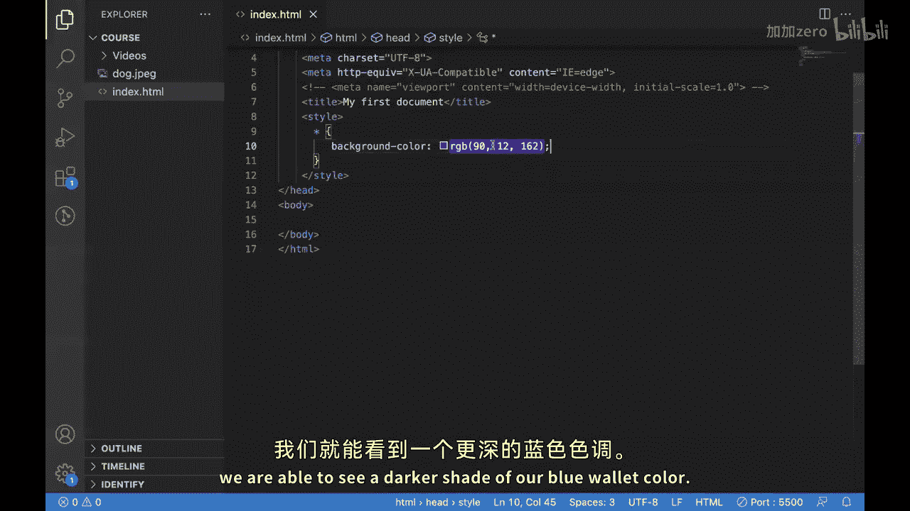

We can even change this。

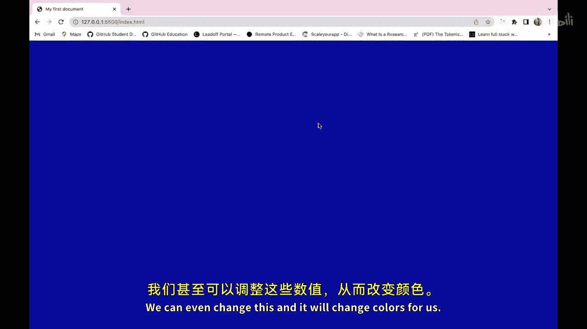

哎，这坚确的说的。Similarly， like RGB， we have something called RGBA。Will the here。We got a fourth value。

 which is for opity。

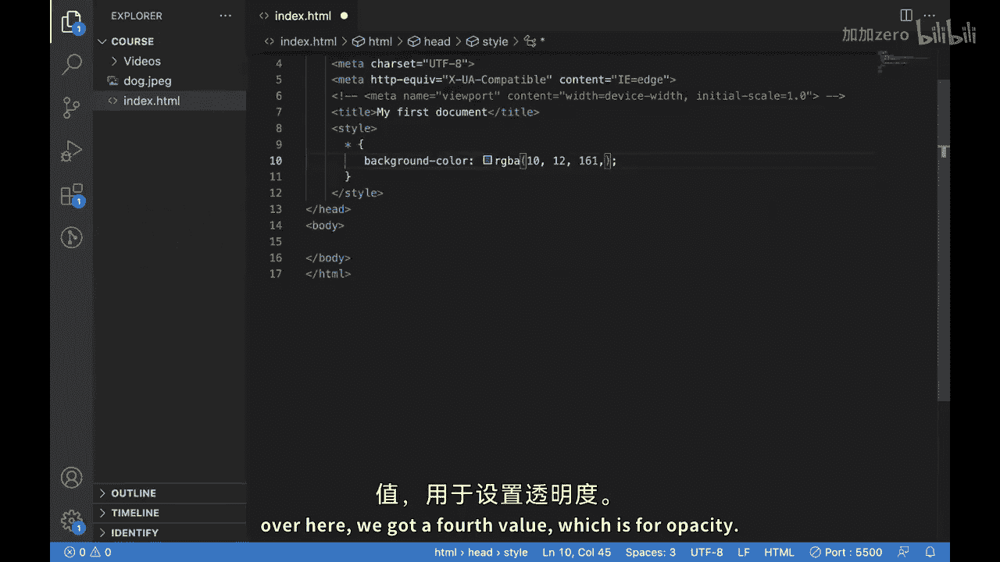

So let's say if we put 0。4。It became a little opaque。

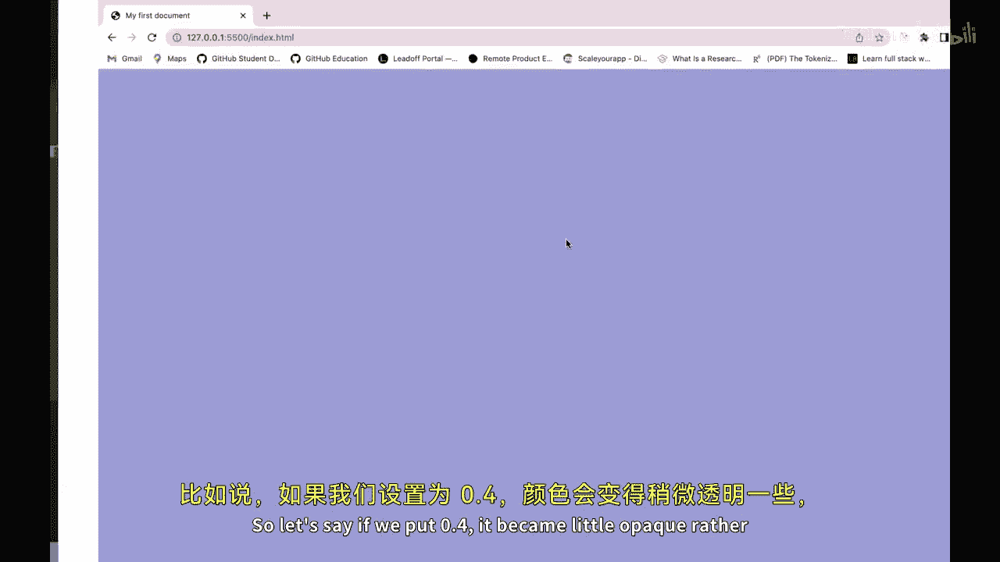

Well thenだ。Existing tight color。 so if we put zero。

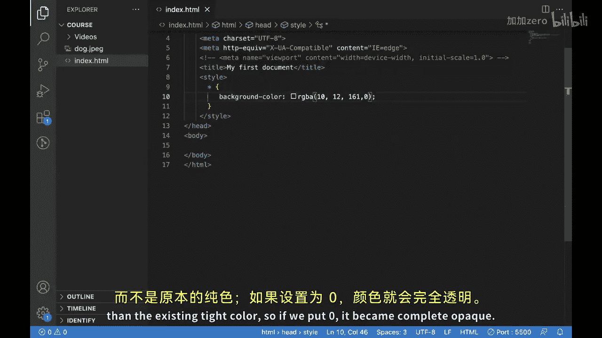

It became complete topic if we put one。It became the Daca。

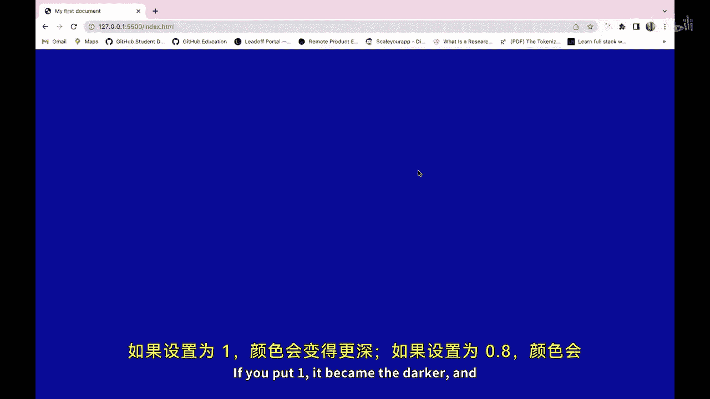

And if get point eight。It' will become little lighter。After RGBA at last。We can use xs over here。

To put our colors， so let's say if we put text code hash。

Should be able to put this white color over here if we change this X to something else， let's say。

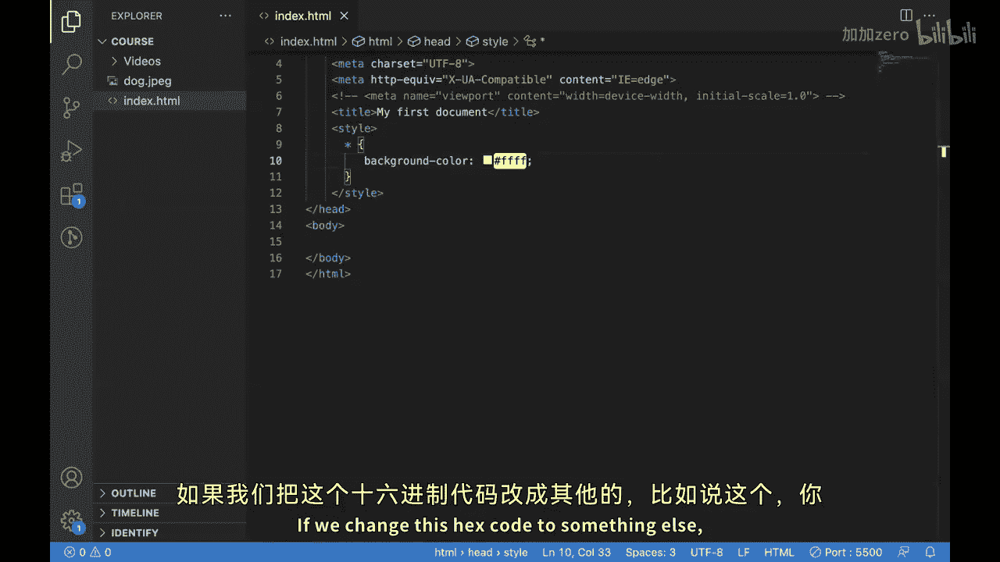

This one。You can see we are able to change our。This is how background color can be changed with the help of background color property in CSS。

And how we can apply color to it。We different ways。

Now you have a solid understanding of CS's we on color and how to use it effectively to enhance your website design。

So take the time to experiment with different colors。

 use contrast to improve read and create visually standing website that engage your users。

See you in next video。🎼。

