# 【Java全栈开发 专项课程（上）】Board Infinity—中英字幕 p106 p34_05_css-box-sizing -BV1tAygYoEj5_p106-

Welcome to this video on CSF box sing in the previous video we discussed the CSF box module and how it presents the layout and sizing of HTML elements on a web page。

In this video， we'll explore the CSS box sizing property and its different values。

The box sizing property allows you to control how the width and height of an element are calculated including the padding and border there are two values of boxizing content box and border box the deferred value of boxizing is content value which means that the width and height of an element are calculated based on the content of the element only this means that if you add padding or border to the element it will increase the size of the element potentially causing layout issues。

The border box value on the other hand includes the padding and border in the width and height calculation。

 this means that if you set the width of the element 200 pixels with a padding of 10 pixels and a border of 1 pixel the total width of the element will remain 100 pixels let's see them in action in our HTMLl document。

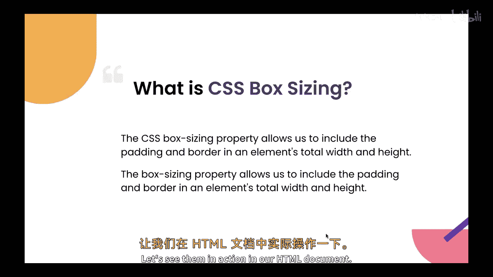

So this is our HTMLl document where we have seen how the box module works now let's see how the box sizing works over here。

So for checking that out， what I'll do。I letter a division。

And I' will put these two divisions inside that。They'll add an ID。So this I' call it me。

I put mean over here。What I'll do， I'll add a border of。分之。10 p， solid， black， you save this。

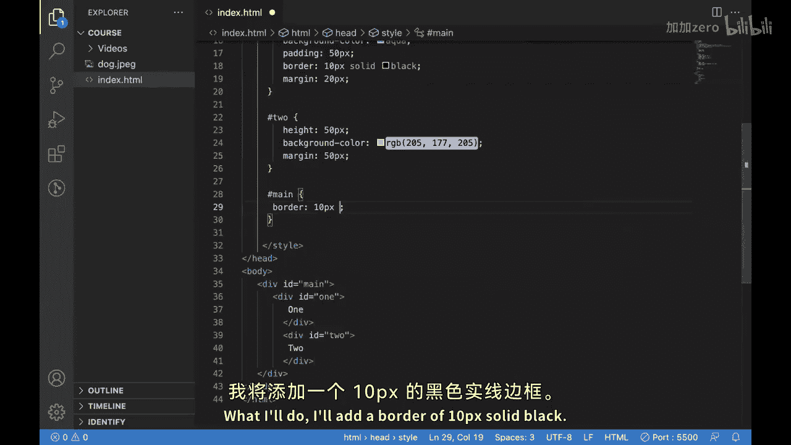

You can say it is little like this。

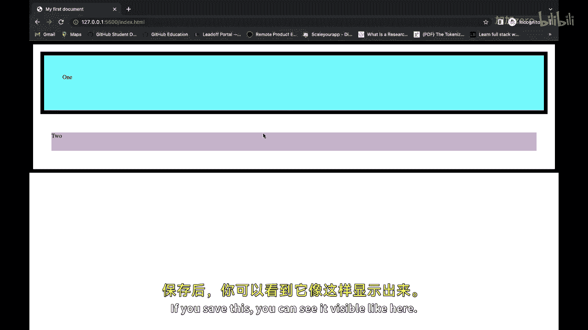

Now what I'll do， I'll assign some width to it。

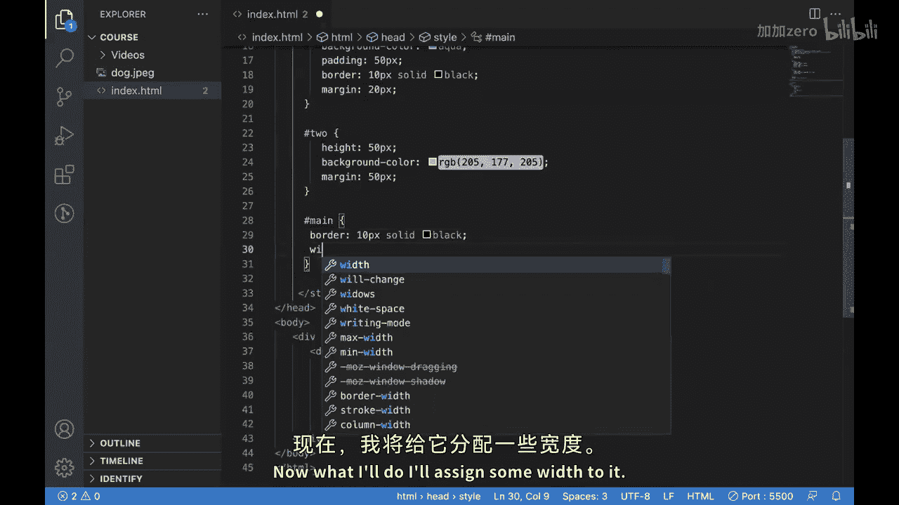

那てらさね。500 Vx now is looking like this。

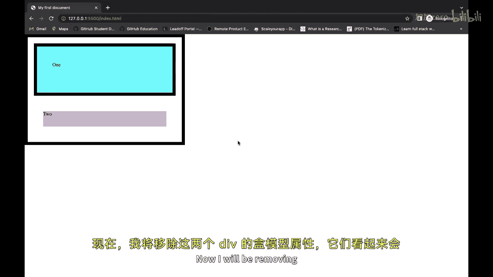

And now。Ill be moving。These properties。off。Box modeled from both the divisions and they are looking like this。

Well， let's say if I add some width to it， so I default the width is 100%， I want it。

To we remain safe， that's the putting be 100 person， it means that。

This division will take a width of 100%， or I would say the width of the main divisions。

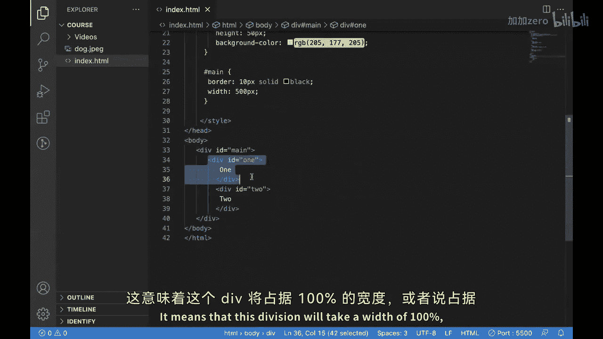

That's why nothing has to eat。

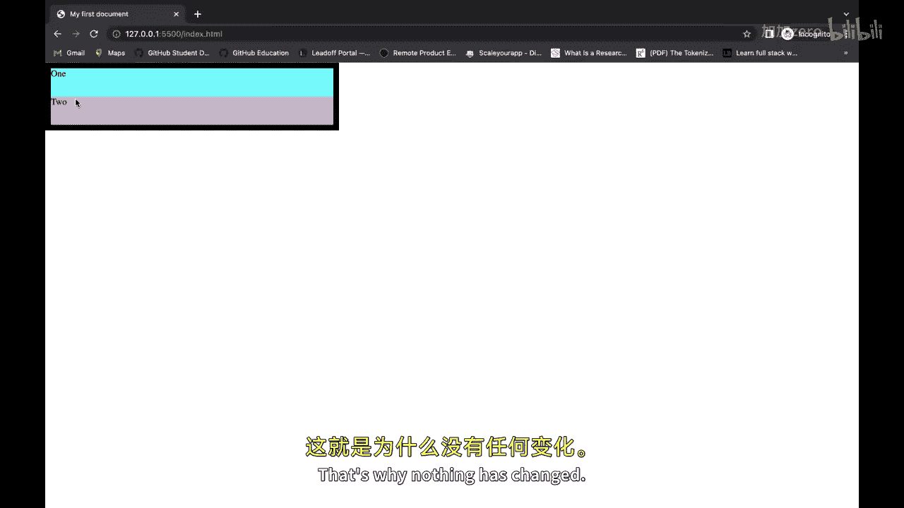

But no。If we put padding。

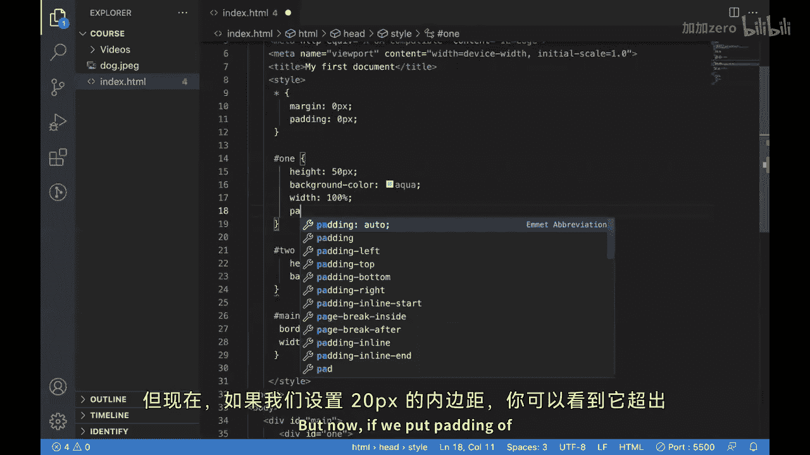

Over for DBx。You can see。😊，It is going outside our main division， why because。

If you check the box model for this one。It is now showing 20 px。

Let's say the default width is 200 px now it is adding 20 on it。On left。And20 on it on right。

 that side is becoming 240 p。And that's why it is going outside our main division。But how we can。

So how we get related this？

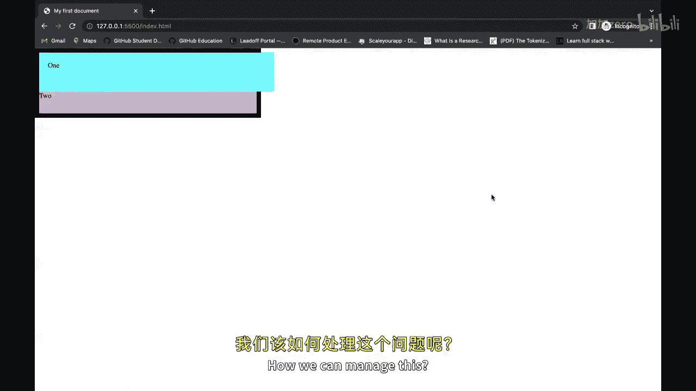

喂。For're doing that。You can use a property called box sizing。

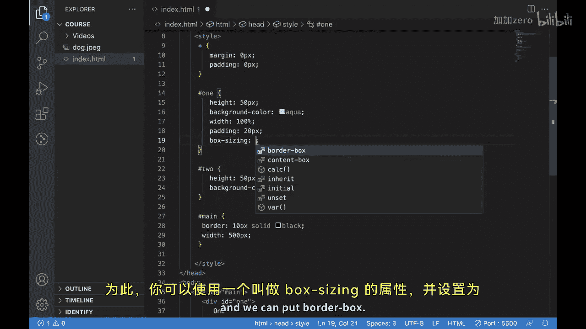

And we can put waterboard and after putting this。You can see it adjusted itself as well as we have the padding。

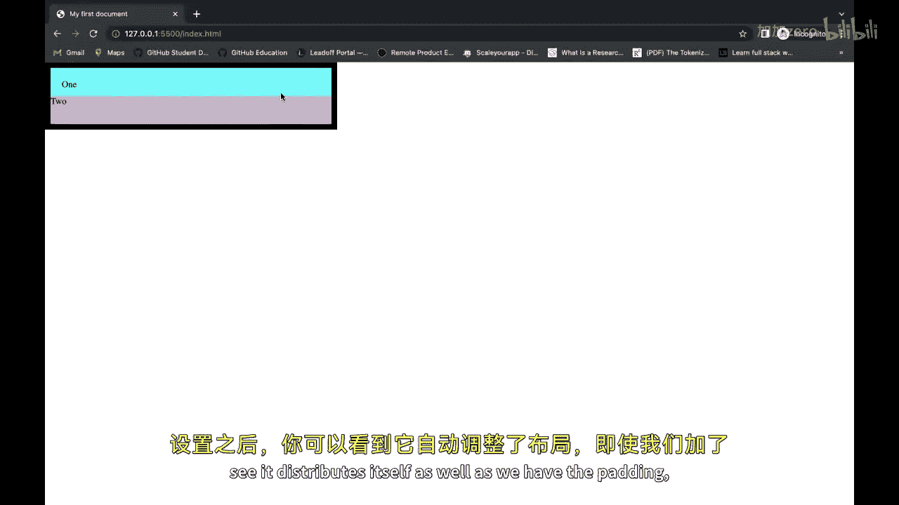

Similarly， if you put a border。Let's say a five here。多咧。

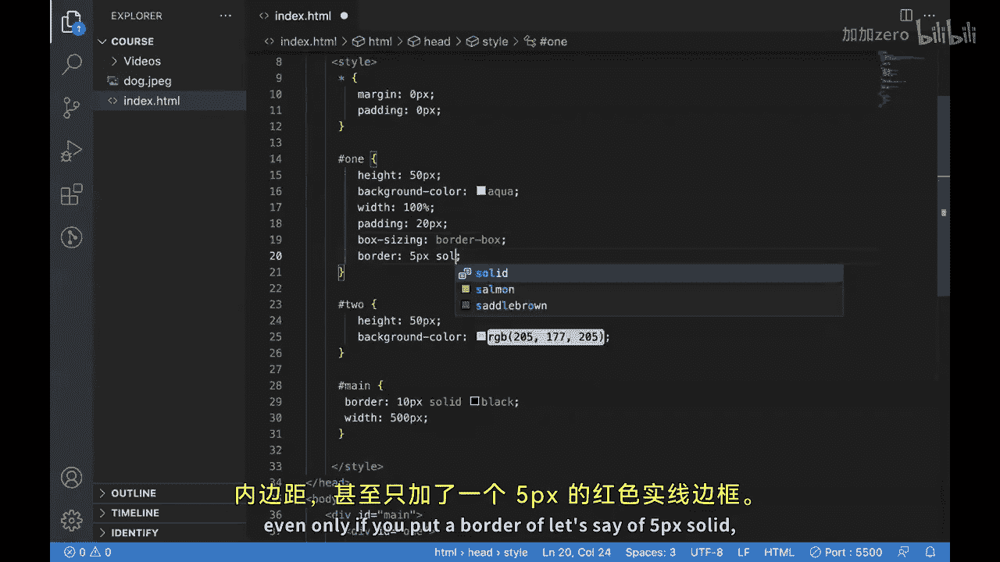

And color I'm putting in red。You can see it is adjusting itself。Insight that。Maximum width。

 which we have assigned to it， which is 500 ps。

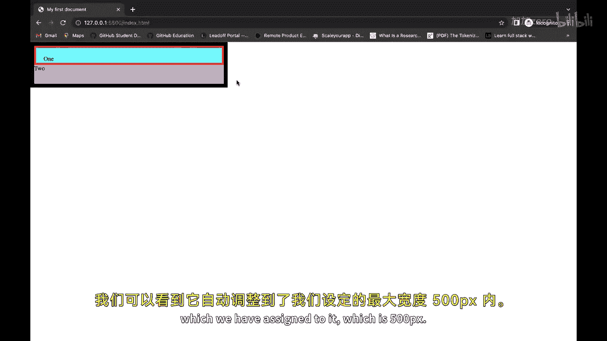

So that is how the box sizing works。So this is the border box value for box sizing and if you put。

Content box。As the value。So it will start going outside right with a content box in the default value and we have already seen the default behavior without boxyizing that is same as。

This content box。put murder books。系。

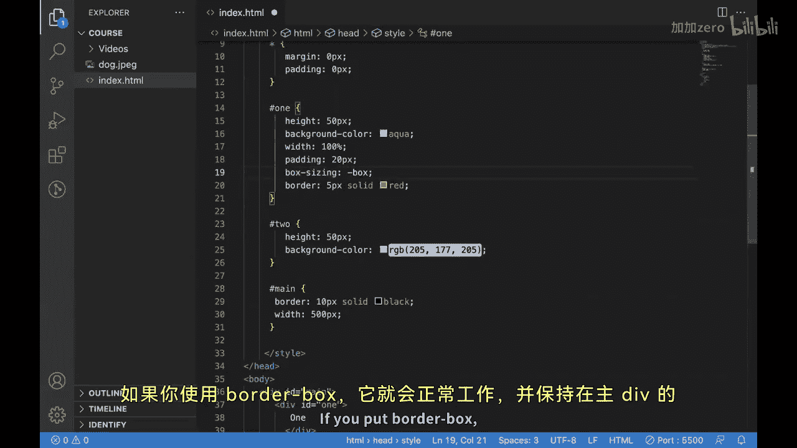

Whatever。No。It will work and it will conceite itself within the maximum width of the main division。

So that is one box I think。I hope you're able to understand it and well use it in your next HTML season project。

The you next video。

