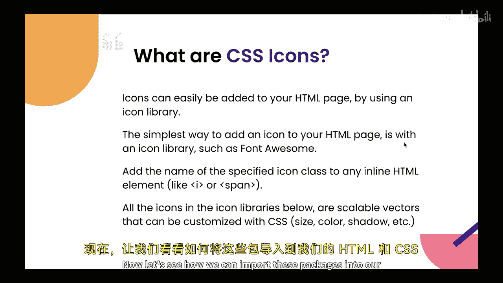
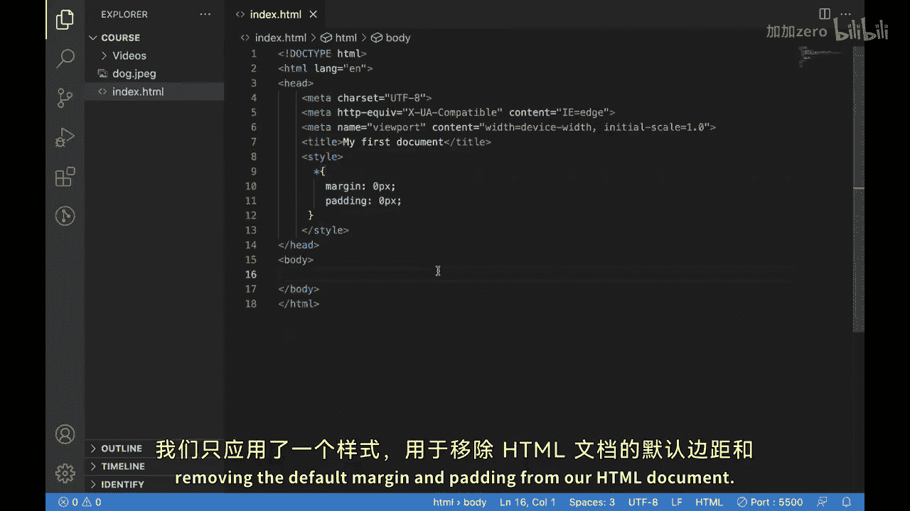
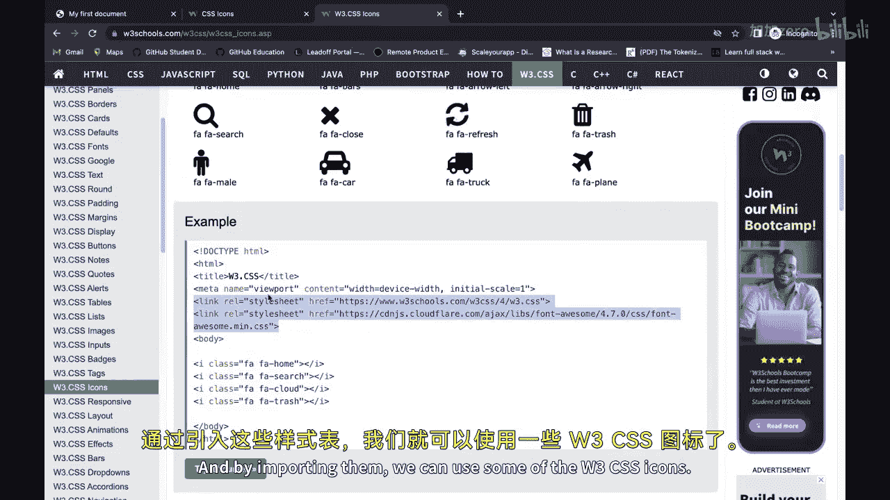
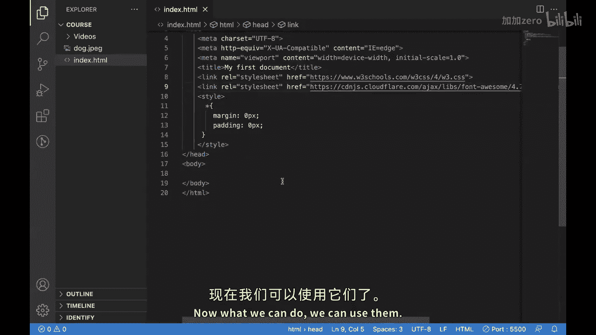
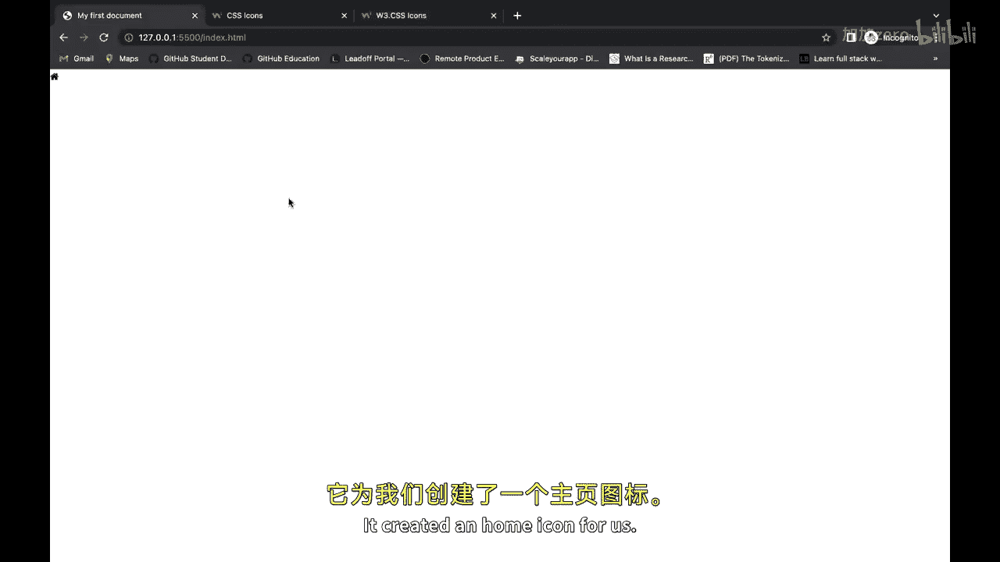
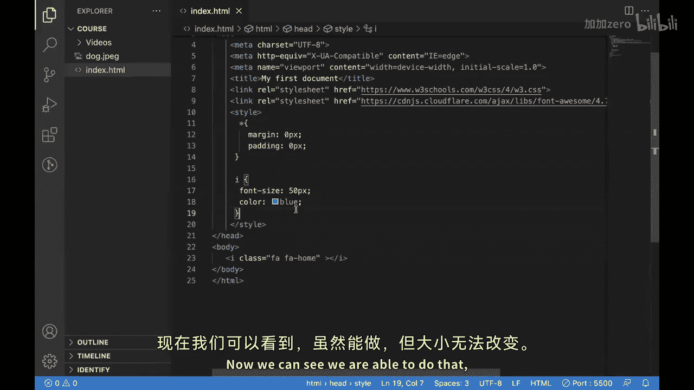
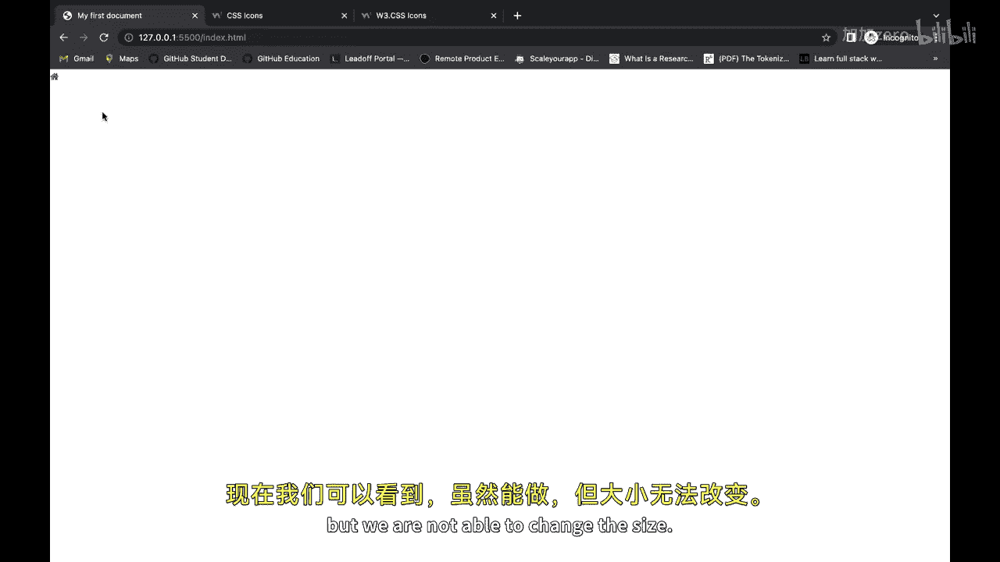
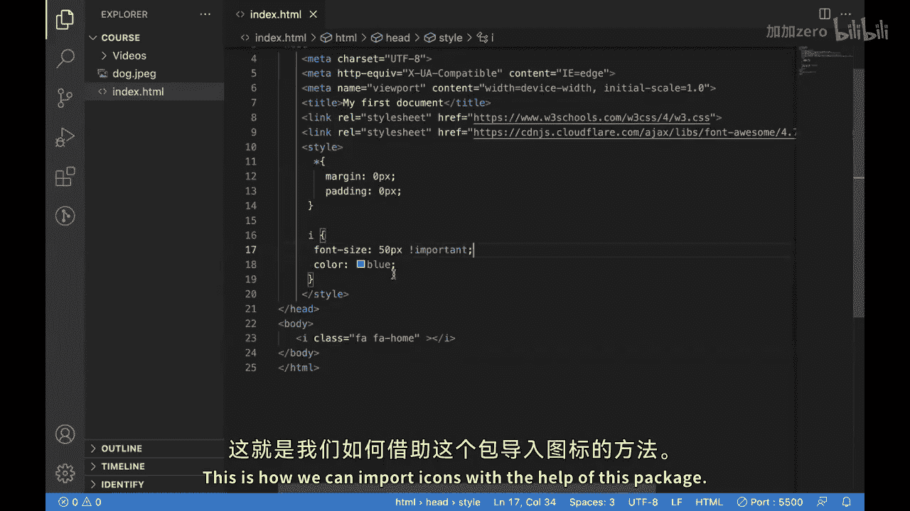
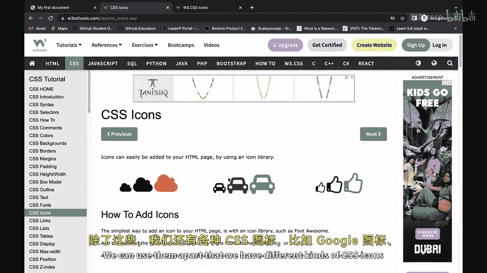
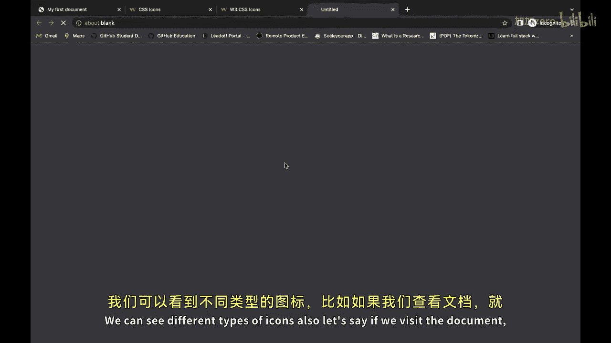

# 【Java全栈开发 专项课程（上）】Board Infinity—中英字幕 p108 p36_08_css-icon -BV1tAygYoEj5_p108-

H there。In our previous video， we have seen some of the CSS text related styling properties such as text decoration。

 text transform， text shadow， etc， and we have used them in our HTMLL CSS documents to put the styles into our text which is present in our web page。

In this video， we'll be looking into CSS icon。So there is no default way of putting CSs icons into your page or HTMLl web page。

For using icons， what we do， we use third party libraries such as Quaosum， bootstrap icons。

Google icons or W3 icons these properties we need to import them into our project and then they provide us the icons which we can use in our project to make it more interactive and interesting for a user to understand different different things Now let's see how we can import these packages into our HTML TsS code and then use them as per our use case。

This is our default HTML page currently we have nothing over here we just have the single style which we have applied for removing the default margin and padding from our HTML document。

If we see this out in the browser， it is looking like this。

Now for adding the icons as we know we need to use third party libraries。

 but lets just look into one of such libraries over here。

So this is the W3 C icons library and how we can use it so basically。These are the two。

Tile sheet links that we need to import in our document and by importing them。

 we can use some of the W3ces cycle。

For what I'll do， I'll copy these two。And put them over here。Theyre just indented。Okay。

 just one more space， yeah， it is looking fine now。Now what we can do， we can use them。

好。Over here you can see。We have the icon let just paste it over here and see how it is looking it created a home icon for us。

This is the icon tag and inside this。We need to use class。

And then we need to put these default classes， which are provided to us by。This lib reading。

And then it is loading the icon from this liability on the basis of this class。

We can also use our default style either we can style them over here by putting， let's say。One size。

I'll put 50 Bx。And no， it's either increased。这个来。We can write the inline style。哦。

We can write the style over here， we will put this I title selector。

And then we can do the theme thing。Born size。50 px and I just add some color to them。

And we can call it blue。Now you can see。

We are able to do that， but。We are not able to change the size。

喂。Because currently it is taking the size from the class itself now if we want to use this particular size that you have given over here。

We need to use something called。Important so what it does it by default make it compulsory for this icon tag to use this font size and if we save it now。

You can see the size have been increased。This is how we can import items with the help of this package。

Similarly， we have different different types of packages， such。Here you can see。

We have font tos andmics， we can use them。Apart that we have different different kinds of CSs icons present such as Google icons。

 bootsrap icons and we can import them like this and then use。

And I can from them from here。We can see different different types of icons also。

 let's say if we visit the document。

Then we'd be able to see the list of icons that are available inside this W3 CSs library。

 and then we can use them accordingly。Hope you are able to understand this and you will use these icons in your next project。

See you next video。

