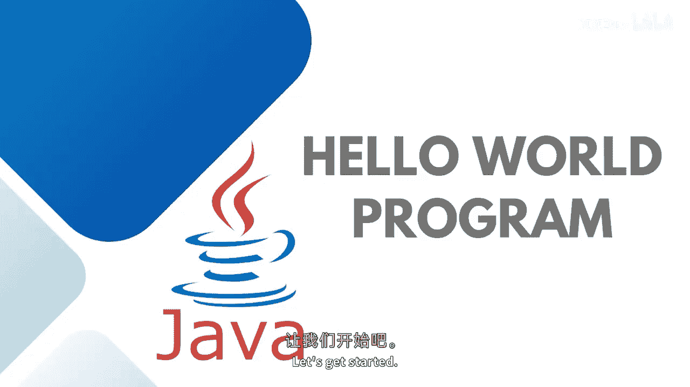
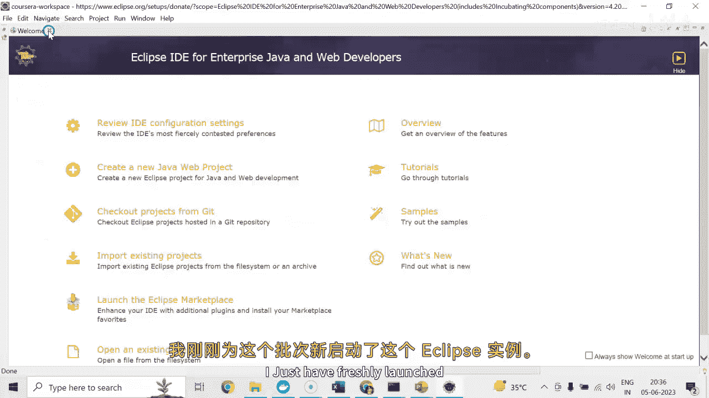
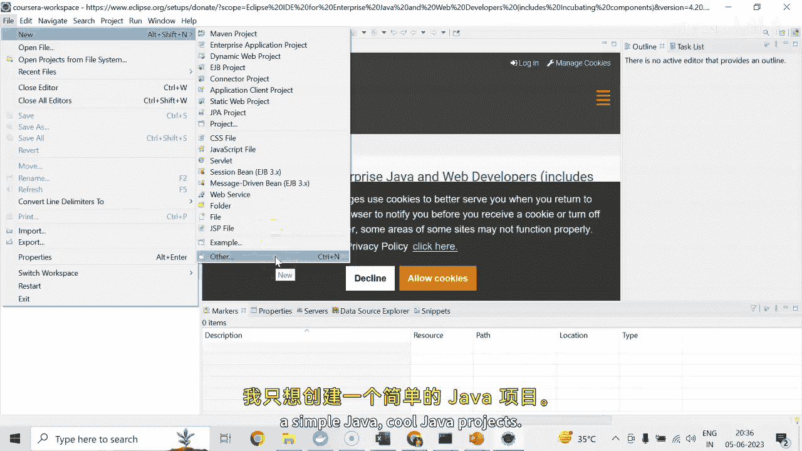
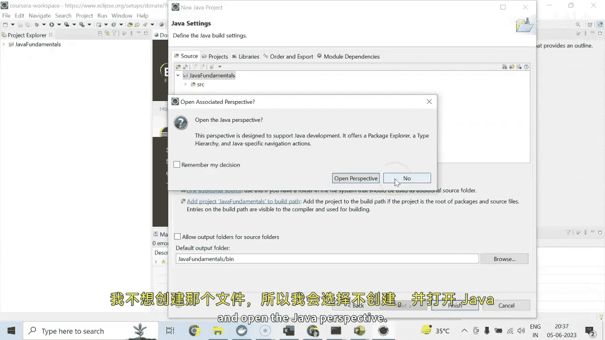
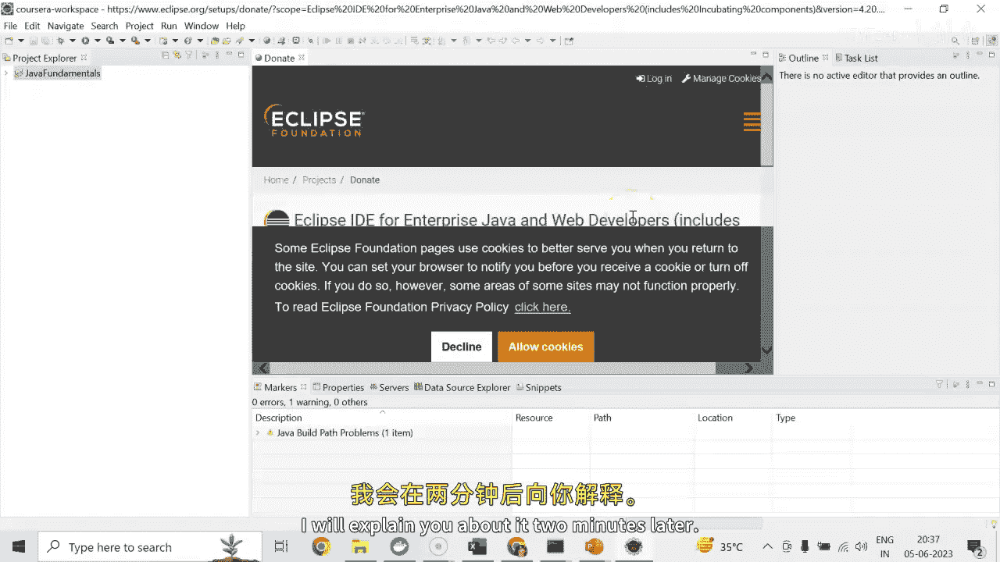

# 【Java全栈开发 专项课程（上）】Board Infinity—中英字幕 p11 p10_03_hello-world-java-program -BV1tAygYoEj5_p11-

Hi dear。 In this session， we will learn to write hover program in Java。😊。

A hollower is a simple program that outputs hollowloer on the screen。😊。

Since it's a very simple program， it's often used to introduce a new programming language to a newbiees。

 So let's get started。

As I discussed in my previous sessions， I will be using Eclipse I D E for entire Java development course。

😊。

I just have freshly launched this eclipse in stands for this batch。😊，I'll just go to file。New。Here。

 we have a lot more options to create the project， but I don't want to create any meven or Web project。

 I just wanted to create a simple Java core Java project。 So I'll go to others option。

And here I will look for the option， say Java project。The moment I will talk about Java。

 I'll write Java。 I'll get the Java project option here。I'll name this project as Java fundamentals。

You can see that it is automatically getting the Java standard edition environment that's installed in my machine。

 You can change it if it's not the right one selected。Jdi K is 19， in my case。I'll just say， next。

And finish。This will ask to create module info。t Java file to store the meta information about your project。

 I don't want to create that so I'll simply say dont create and open the Java perspective。

 you can say okay it will open it up， I will explain you about it two minutes later。

So here the Java fundamental project is created successfully。

 The moment you will extend it here we have SRC folder under which all the Java programs needs to be written on。

As I said， it's a h programme。 So I will simply go to SRC。

I will just simply right click on it and add a new class file。I'll name this class as Huello。

开 tell the。Option to add the package， I will be writing a basic as a package name。

 basicics is nothing but a folder will be created under the SRC。

 so I can segregate multiple concepts in different packages。As of now。

 what packages has different aspects which also helps in segregating the piece of code as per the concept or also modizing the application context and also helps in giving the accessibility to the code whether you wanted to access the。

Go from one package or not。I will tell you each and everything one by one ahead。 So as of now。

 I'm creating this package name as basics。And under this， a class， Hu will be created。

So you can see that there is a basic folder created。And under this package， I have a class ho。

 Just give me a minute。没这个。不。What next needs to be done is this is the basic haer。Class created。

 And under this， Im going to add a main method。 Main is the entry point of a programme。

 You can use a shortcut， just simply write name and use control。Space to get the en。

 And here is the main method there。I would like to print my output here that is system dot print dot out dot print Helen。

And writing here， the hallloered message。Simply right click anywhere in this piece of code run as Java application。

So here is the hlo message yet printed So how and what is the piece of code is being written。

 as I said its a Java hlo program。We are starting with the。Class hall。In Java。

 every application begins with a class definition， Halllo is the name of the class。

 and that' is the class definition in which we have a main method。This is the main method。

 Every application in Java must contain the main method that' is known as an entry point of the program。

 The Java compiler starts compiling the program from main method。

 and that's the one line gets executed。You can see that your main method is public， static。

 void and mean， although you will learn about all these things in our upcoming session。

This is the basic main method， which is the static does not needs any instance to create will not return anything。

 That's what it' void。 It's public because without invocation it's being accessed by the GVM to load your class onto the GVM。

There is a statement that you can see here。 system dot out dot printer in。

To print the standard output onto your screen system is the class out is the object and the print in is the method inside it that prints the ho word message or whatever you wanted to write it up。

Every valid Java application must have a class definition that matches the file。

 That's the point that you can remember here。For example， if the class name。

 public class is public and its name is mentioned here， the file name should be same hallow。

 ho in which you have a main method。In which you don't have a main method。

 that class not to be public and the filing not to be seen。

 The main method must be inside the class definition， and the class has to be public。

 The compiler executes the code starting from the main method only。

 So this is the takeaway from this Hu。 I hope the concept is pretty clear to all of you。

Stay tuned to learn more about Java practical implementation。

 See you in the next session until next time stay tuned， Thank you。🎼。

