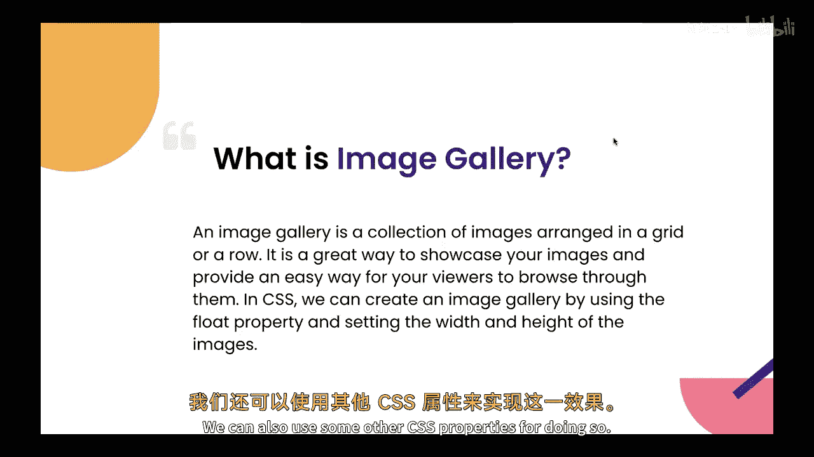
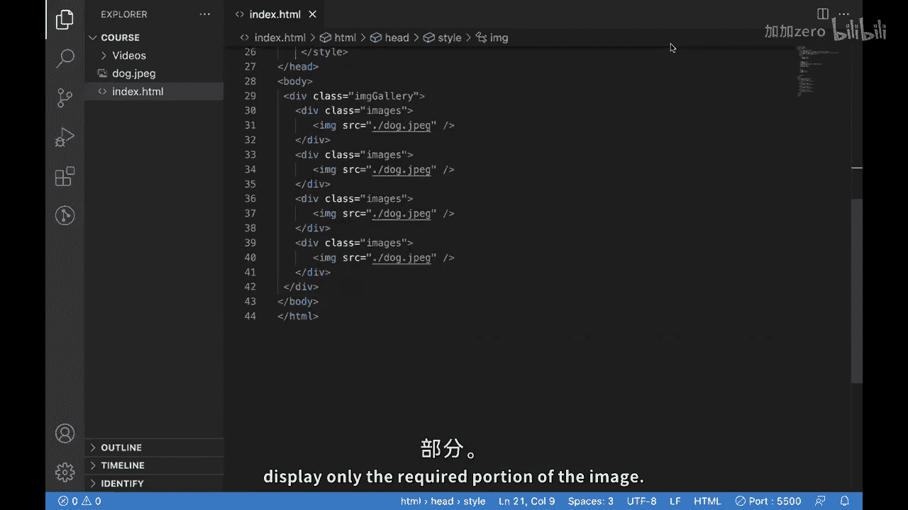
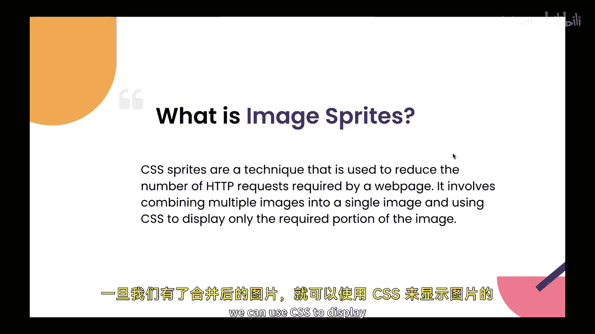
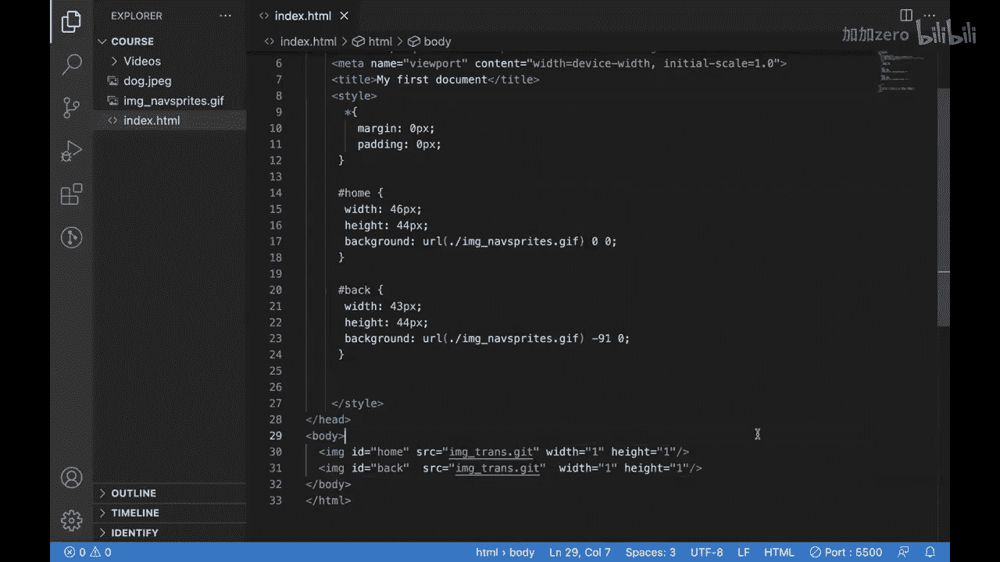
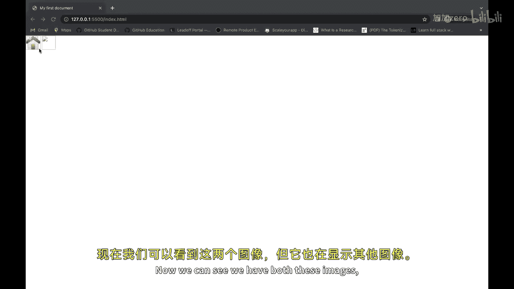
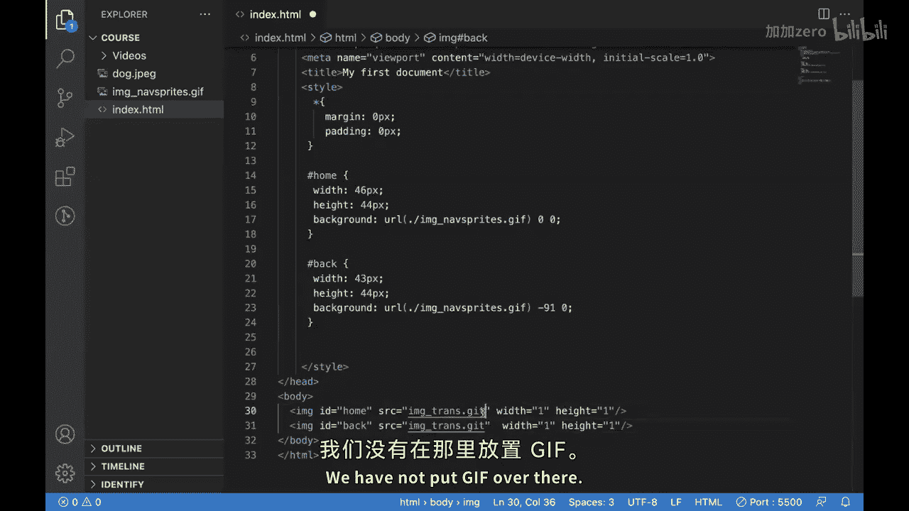
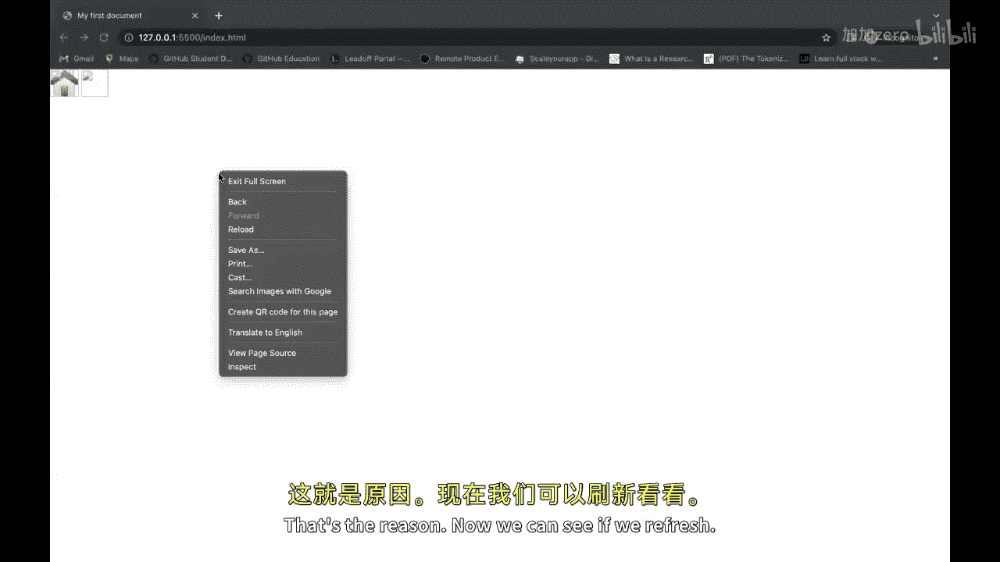
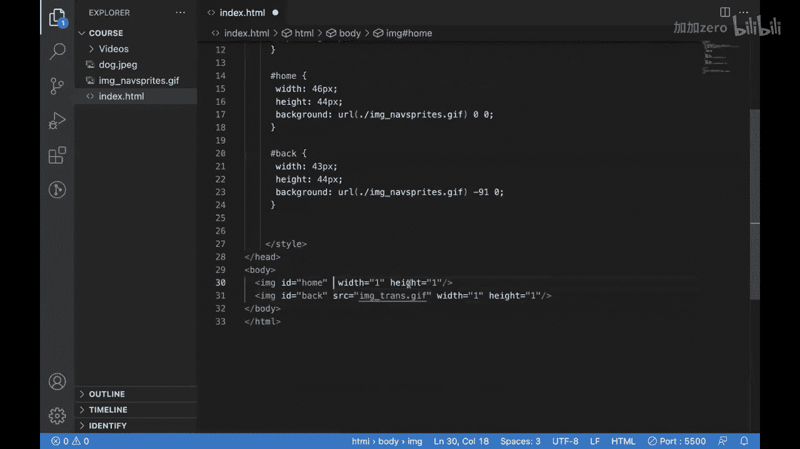
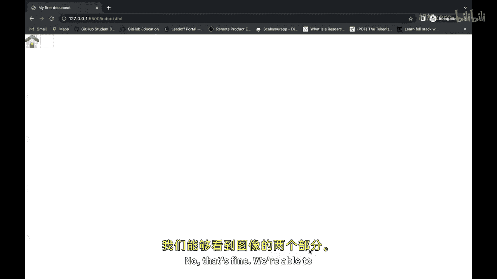
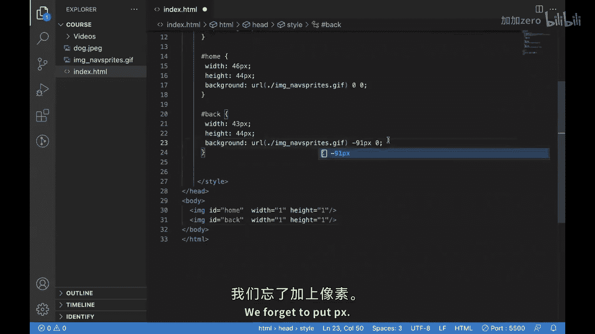

# 【Java全栈开发 专项课程（上）】Board Infinity—中英字幕 p113 p41_13_css-image-gallery-and-sprites -BV1tAygYoEj5_p113-

Hi there in our previous session we have seen how we can create that drop down button with the help of CSs in HMN。

I hope you might have tried that in our today's video we'll be looking into CSs image Gdy and Ses。

What is CSS image G？😡，Well， an image gallery is a collection of images arranged in a grid or a row。😊。

It is a great way to showcase your images and provide a easy way for your viewers to browse through them。

😊，In CSS， we can create an image gallery by using the float property and setting the width and height of the images we can also use some other CSS properties for doing so。

😊。

Let's just look into that。So this is our MT HTMLtml page and over here we can create a division which is which will be our main division for our image gallery。

And we can put a class。Miigality to it and then we can create the items。

It will be holding the value of images so we can call them。Images。

We can write the c for it by putting。The class is selectedor and then using the display。Great for it。

Putting。Some columns， so we canver。Great template columns and we would be having。

Three columns for what we can do， we can have repeat。3。And one FR。AndSimilarly。

 we can add some images over here。And then for this image is what we can do。

 we can apply some c to them also。First of all， we can put some gap over here also。

 where we will put。Gradro。And we can make it auto for now。And we can put some grid gap。

Of let's say 10 px。And for images。For now you can just put some images over here and let's see how they will look。

So what we can do we can with image tag。And then we can put the image inside the source。

we can do slash Dog。t jPg and for now we can just create a copy of this。

Po time just to check how it is looking。After receiving it。We can see we have images。

But they are too large， so what we can do， we can arrange them。

And I think what we can do is we can put 23。Vi it and for the images。You can use the theme。

We can put the width。P3 read。W blue。And we can put a height。Autto。

And we need to apply this for the image， not for the signal tag。

So this is that this is our image gallery， we can have multiple images over here as per our choice。

Now let's just move to our next topic。Which is image spites， so what is image spikeites？

It is a technique that is used to reduce the number of HB requests required by a webage。

It involves combining multiple images in a single image and using CSS to display only the required portion of the image to use CSS prices we first need to combine all our images into a single image we can do this with the help of a photo editing software or an online tool。

😊，Once we have our combined image， we can use the CSS to display only the required portion of the image let's look into that。

So what is Cs， so what is image strikes？It is a technique to reduce the H requests required by a web page it involves combining multiple image into a single image and using CSS to display only the required portion of the image to use CSS price we first need to combine all our images into a single image you can do this using a photo editing software or an online tool once we have our combined image we can use CSS to display only the required portion of the image let's look into that。

Now we can remove all this that we have done for image。Calgary。嗯。

Let me show you the combined image that I have。This is a combined image and you can see we have an home icon。

 a left arrow icon， a rightarrow icon。😊，And now well see how we can use them。

So what we will do for using it will be having。Some image tags。Like this。And inside this。

You'll be having different IDs for showing different part of the image， let's say home。

And then the next one。And we have a left arrow。You can put ID as back。But after this。

As we are using an image， we need to put something inside the source so we'll be putting。

Image the scores。Trans dot Gf。And same we'll be putting over here also。

We are only putting this because it will add a small transparent image because the source attribute cannot be empty。

Now after this， what we will be doing。We'll be adding some CSs。And for doing that， what we can do。

 we can use the ID。好。You can put some width to it。Which is 46 px。Some height to it。Which is again。

 44 px。And then we'll add a background。Andside that we'll put URL。And inside that URL， well put that。

Image space Gf。And after this， we can put。0，0 for adjusting it。Similarly。

 we can just copy paste this now。And we can put the back over here。And what we can do， we can。

Make this one as 43。And this one as。44， we can keep it same and over here what we'll do。

We will add minus 91 because we want to select the different part of the image。

And as we have these images over here， we also need to put some width and height。

 that we're putting in width。1 px and height 1 px because we are using a transparent image。

 it might not appear， so that's why we are putting this。if we saved this。We'd be able to see。Okay。

 we might have missed something somewhere， yeah。对れ。

So we need to save this， we need to refresh this， and now we can see we have both these images。

But it is also showing our。Images， so for doing this， what we can do y。

 we have not put GF over there test the rhythm now we can see。

A very fish。ok。Might have missed something again。Look we have saved it。嗯 everything seems fine。N。

到上系啊。

Yeah， now it is fine we are able to see。

Both the parts of our image。We forget to put px now， yes。

 we are able to see both the parts of our image。

So this is CSS image type。😡，I hope you are able to understand how you can create an image gallery an image sprite in CSS。

See you next video。

