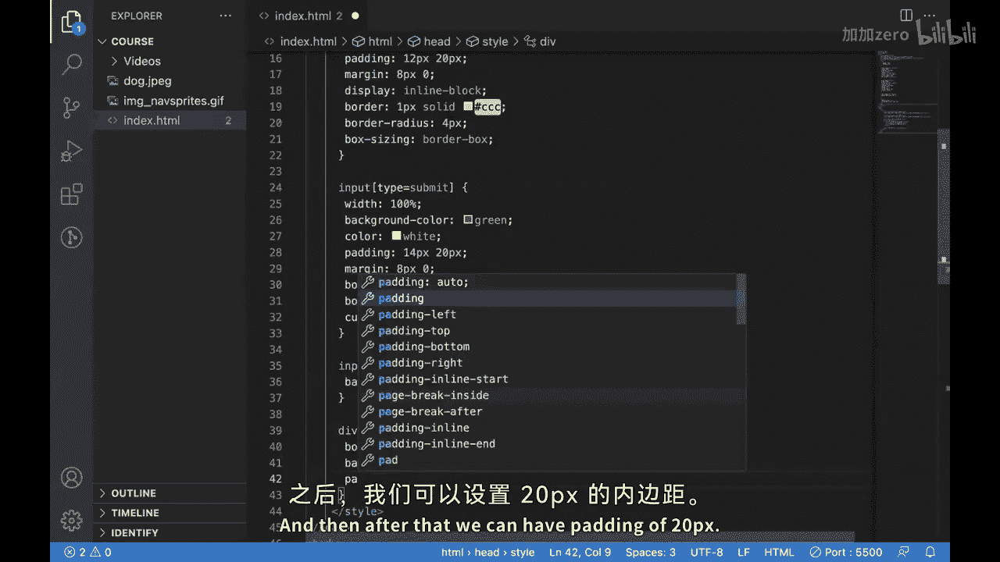
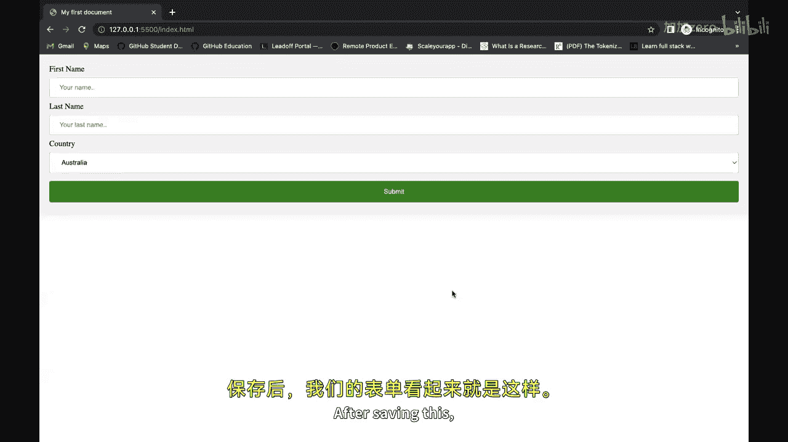
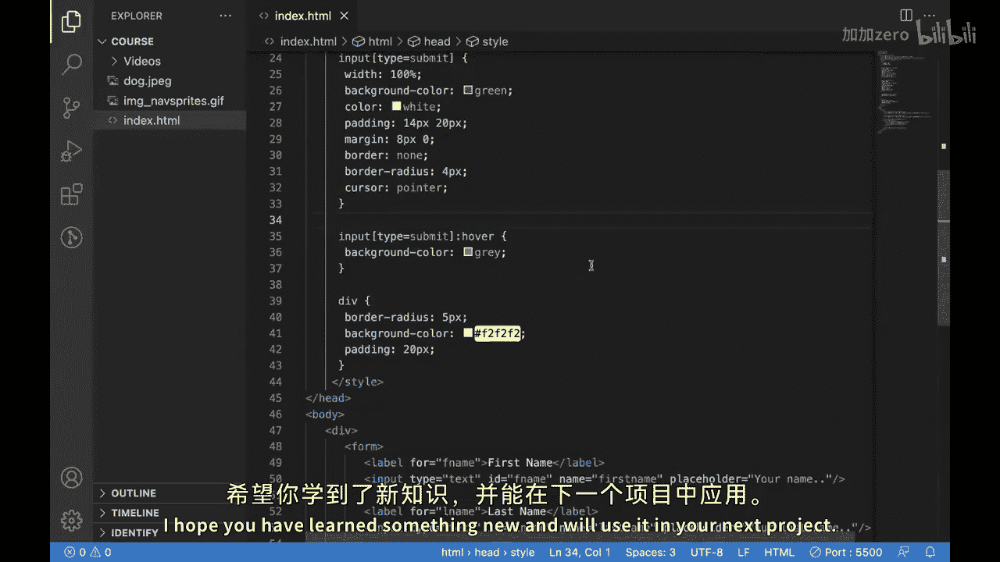

# 【Java全栈开发 专项课程（上）】Board Infinity—中英字幕 p115 p43_15_css-forms -BV1tAygYoEj5_p115-

Hi there， in update this video。We have learned that how we can style an image with the help of CSS and how we can use image inction with the help of CSS in our HTMLl page。

😊，In our today's video， we will be looking into CSS forms and how we can style them。

We all know about different types of cases forms and different input types。In today's video。

 we'll see how we can tile them。An IM document with the help of CSS。不来 see that。

So this is our empty estimate document， and I just create a form over here。For doing that。

 well be creating a division。And inside this。We'll be creating a phone。Willll add label。

And we'll be having our first field as。First。你。And then we'll be creating an input tag。Will put。

Type X to it。After that。We'll add an ID。We callll it F name。And over here we'll add an attribute。

 which is called4 and we'll put F name， it means that with label is full。Afne。

Which is this input fee。We can put a name， we'll call it first name。And we'll put a placeholder。

With return your。namee。Now， similarly。We'll be having a second label in field。

And then we'll be having over here as last name。You can put L name。E name。Last name。

And then we can write your last name over here。After that， we can have another label。

We can put the country。Then we can put for as country because we'll be creating。

A particular dropdown。For the help of the select tag。Put our phone。嗯。We'll put an ID S。

Country for this one also， that's why we are mapping this label with this election。

Now we'll create options。Will put some name。Let's say Australia。Then what we can do。

 we can put some value， I'll call it a US。And copy paste this twice。 I'll add more countries。

 let's say。Canada， CNN。Then USA， I'll put USA。After this。At last。

 we can have a submit button because that is necessary for submitting a form。

So we'll be having an input tag for that with type submit。And we'll be having the value。

As sum for this。S capital， yes， no we see it is looking like this。So I just add some into it。

So for doing that， what we will do。We'll first add some CSs who are。Input text fields。ho we can do。

It by doing something like this。And then。We want to keep same style for the select also。

We'll add some width of 100%。Faddding。We'll make it 12 px and 20 px。After this。

 we'll be having some margin of 8 px。And zero。Then we'll put display。

We'll put type as in block after that we'll have border。Would one be act。我咧。And we'll put color as。

This， which is great。Then we'll put water radius of 4 px。

And then we'll put box sizing because we don't want the layout to。Abrupt itself。After that。

 what we can do， we can just copy paste this and。Can write the same for input types submit。

And what we can do， we can make the width for this also as undercurcent。

And we can add some background color color。Which should be green。Then we can have some color。

 which should be white。Then some padding。And we can put at 14 px and 20 px。Of a Dar some margin。

8 be x and zero。啊 for that。SomeB， which might be present over there default， we need to remove that。

Well add a about radius。Or4 Bx。And at last， we want the cursor there to be。Poiner。Great。

Now we want to add some whole effect for this button also for doing that。Well copy this。

 paste it over here， add。好啊。And we would background color， let's say as。I know we can make it。

Greatre。😊，那 by冷够。Now for our division， we want to do something for that to that division。

What we can do。You can put a border radius of 5 prex。You can have a background color。We can make it。

Kind of an north white and then after that we can have padding。

Of 20 px。Well receiving this。

This is how our form looks like。So this is how we can add styles。Into our input boxes。And into us。

 he is form。I hope you have learned something new and will use it in your next project。

See in next video。🎼。

