# Java全栈开发专项课程（上）：第45章：CSS object-fit与object-position属性详解 🖼️

在本节课中，我们将学习如何使用CSS的 `object-fit` 和 `object-position` 属性来控制HTML元素内图像的显示方式。这两个属性对于处理不同尺寸的图片、保持图片比例以及在容器内精确定位图片至关重要。

在上一节中，我们介绍了如何使用CSS来美化HTML表单。本节中，我们来看看如何精确控制图片在其容器内的显示。

## 理解 `object-fit` 属性

`object-fit` 属性定义了图片（或视频）应如何调整自身以适应其容器。其默认值为 `fill`。

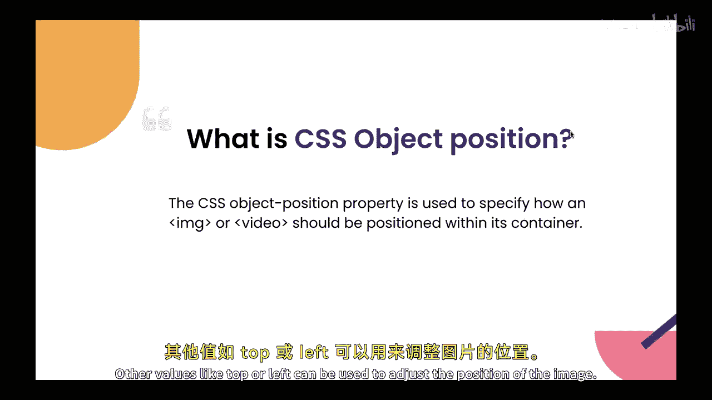

以下是 `object-fit` 属性的主要取值及其含义：

*   **`fill`**： 这是默认值。图片会被拉伸以完全填满容器，这可能导致图片变形。
*   **`contain`**： 图片会保持其原始宽高比，并缩放至**完全被容器容纳**。这通常会在图片周围留下空白区域。
*   **`cover`**： 图片会保持其原始宽高比，并缩放至**完全覆盖容器**。图片的某些部分可能会被裁剪掉。
*   **`none`**： 图片**不会被调整大小**，将保持其原始尺寸显示。如果图片比容器大，则只有部分图片可见。
*   **`scale-down`**： 图片会缩小到 `none` 或 `contain` 中尺寸更小的那个版本。

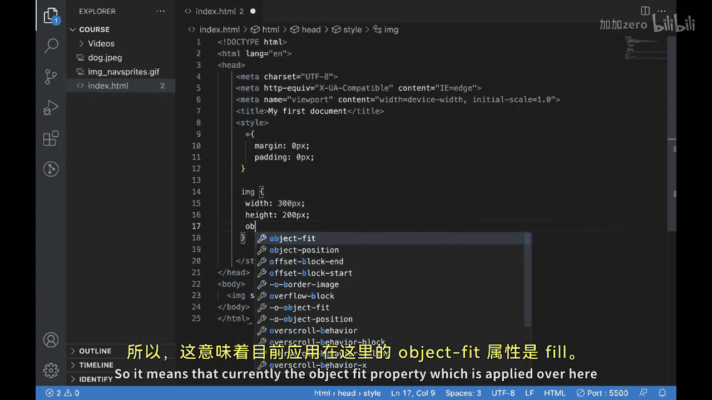

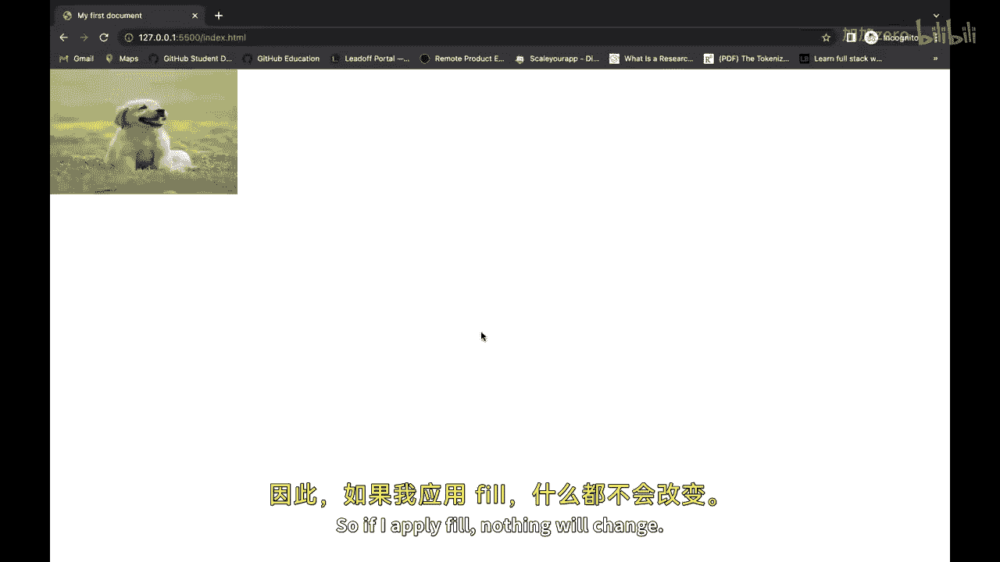

在CSS中，其基本语法为：
```css
img {
  object-fit: contain; /* 或其他值 */
}
```

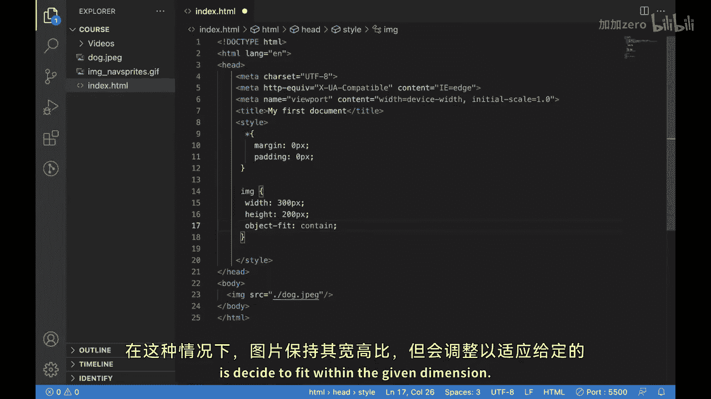

## 理解 `object-position` 属性

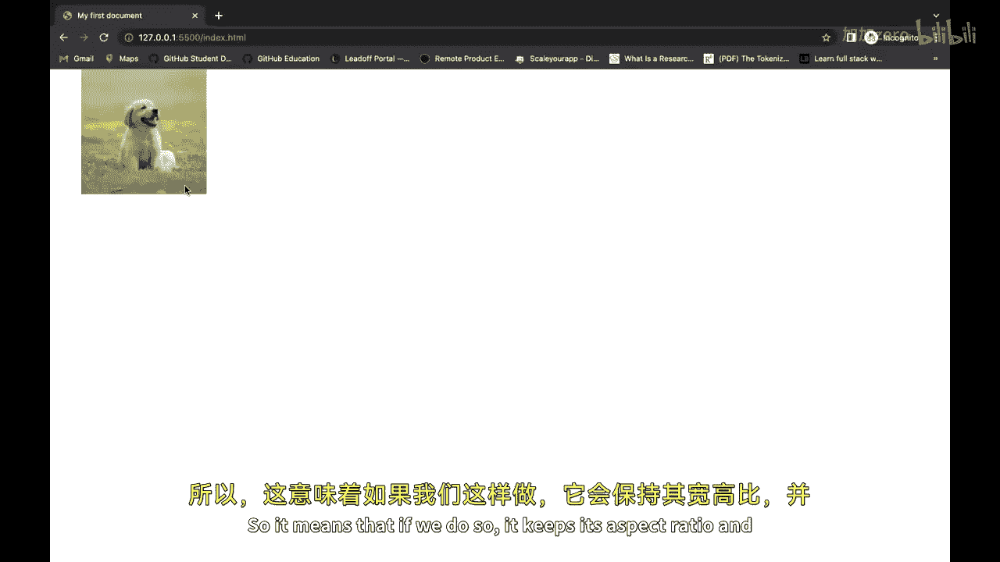

`object-position` 属性用于指定图片在其容器内的位置。它通常与 `object-fit` 属性（尤其是 `cover` 或 `none`）结合使用，以控制图片的哪一部分被显示。

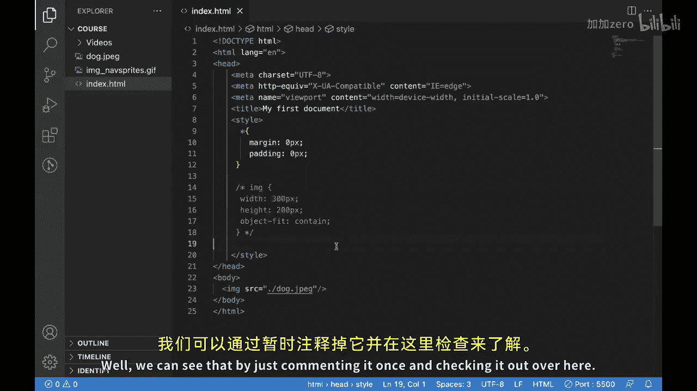


其默认值为 `50% 50%`，表示图片在水平和垂直方向上都居中。

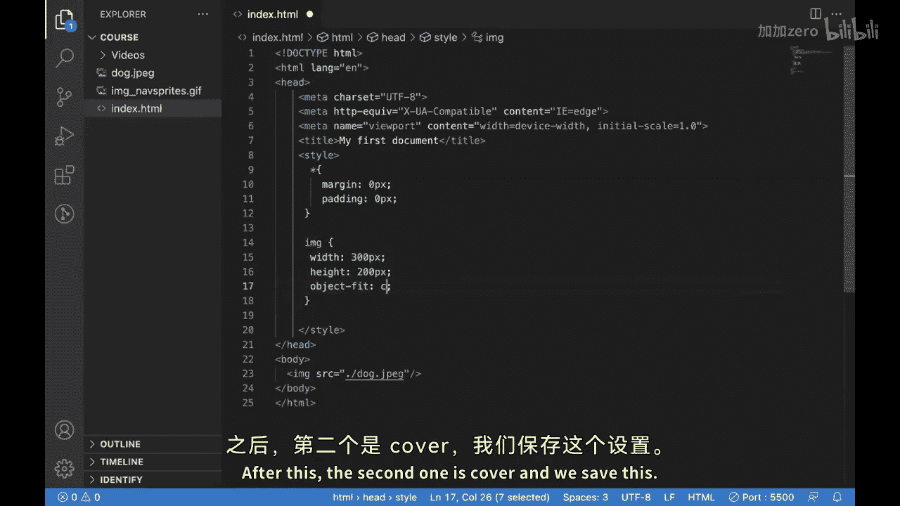

在CSS中，其基本语法为：
```css
img {
  object-fit: cover;
  object-position: 25% 75%; /* 调整图片的显示焦点 */
}
```

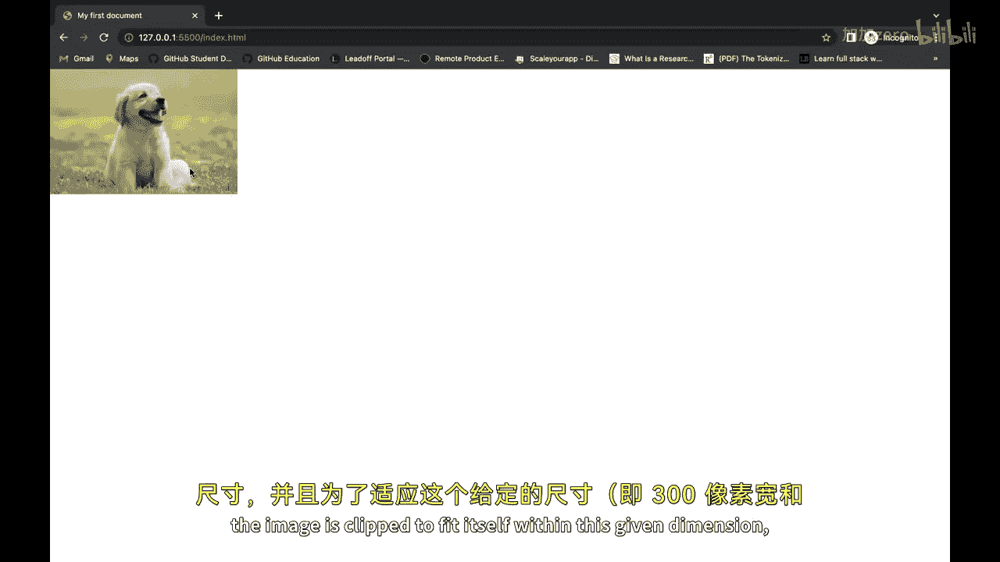

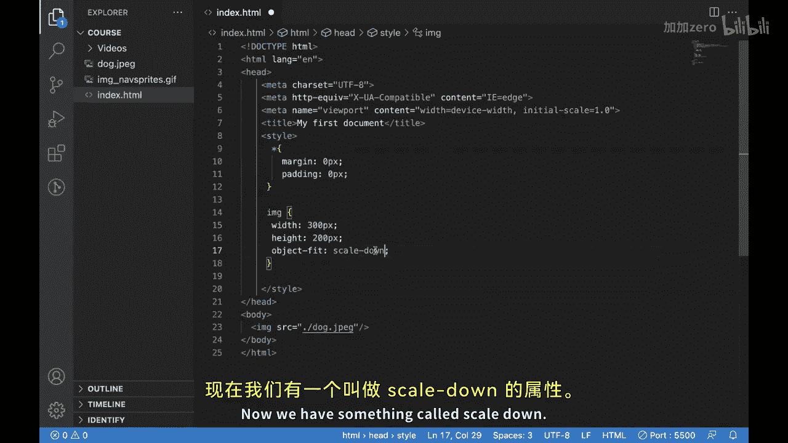

## 属性应用实例

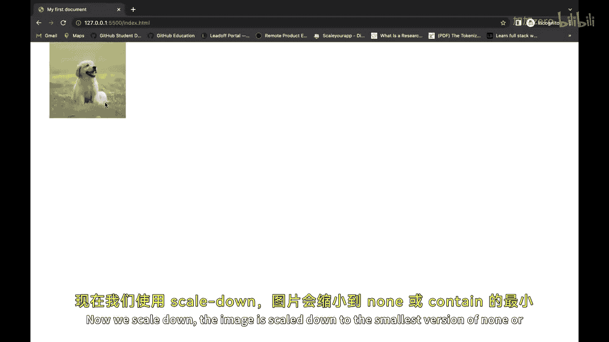

假设我们有一个固定尺寸为 `300px` 宽、`200px` 高的容器，并放入一张图片。

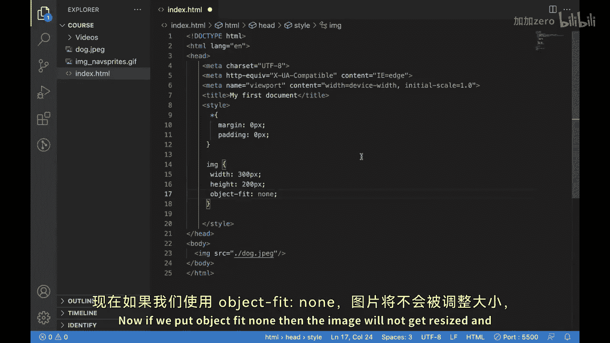

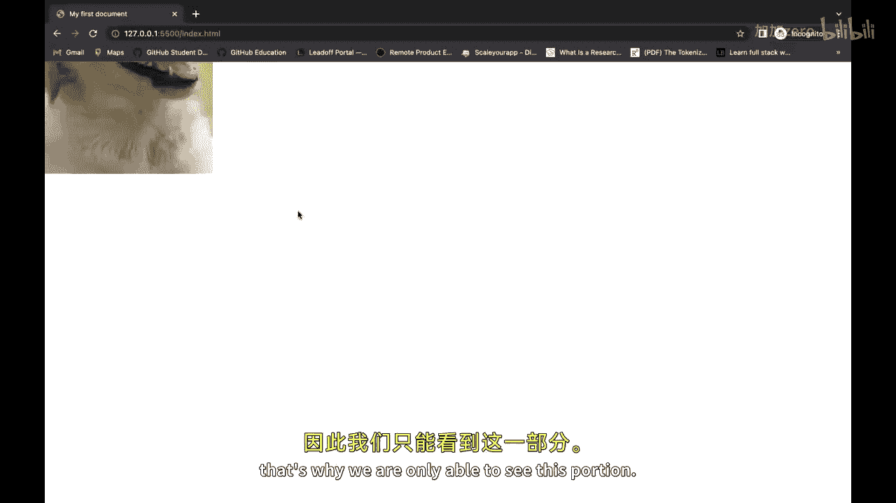

以下是不同属性值组合的效果演示：

1.  **`object-fit: fill`**
    *   图片被拉伸以填满整个容器，完全无视原始宽高比，导致变形。

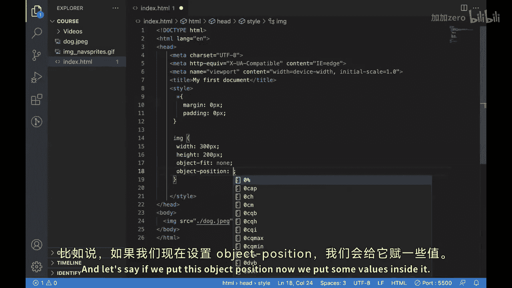

2.  **`object-fit: contain`**
    *   图片保持宽高比，并缩放至能完整放入容器。由于容器比例与图片不同，上下或左右会出现空白区域。

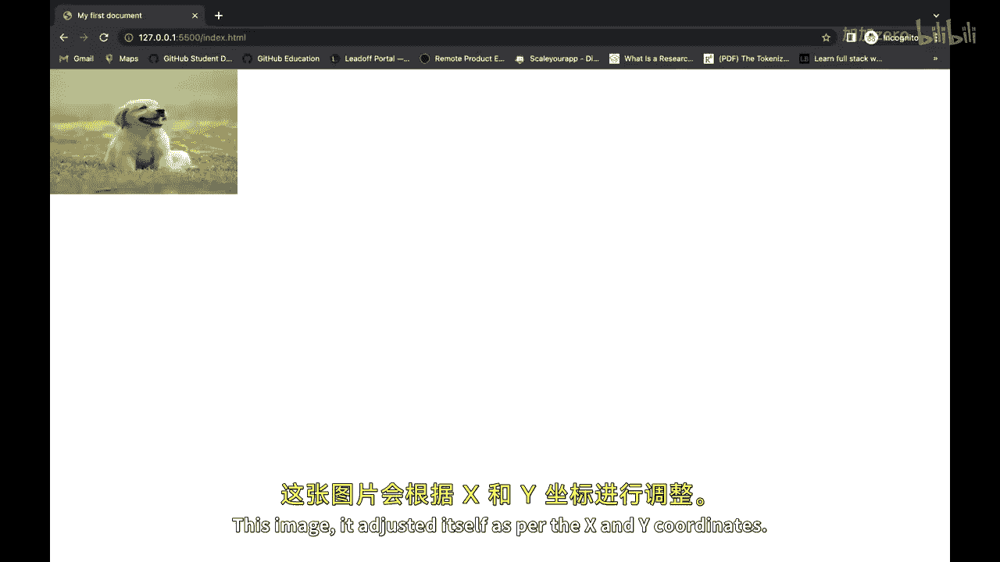

3.  **`object-fit: cover`**
    *   图片保持宽高比，并缩放至完全覆盖容器。由于容器比例与图片不同，图片的边缘部分会被裁剪。

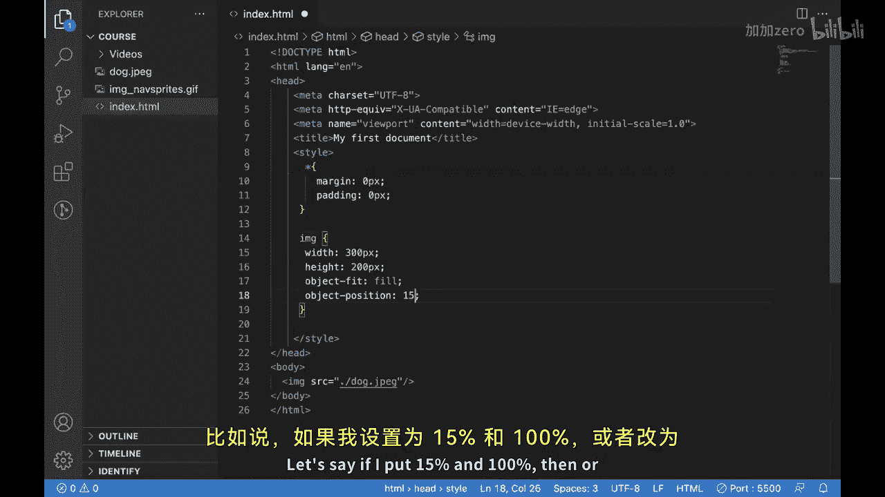

4.  **`object-fit: none`**
    *   图片保持原始尺寸。由于容器较小，我们只能看到图片的中心部分。

5.  **结合 `object-position`**
    *   当我们使用 `object-fit: cover` 或 `none` 时，可以配合 `object-position` 来调整图片的显示焦点。
    *   例如，`object-position: 20% 80%` 会将图片水平方向20%、垂直方向80%的点对准容器的对应位置，从而改变被裁剪或显示的区域。


本节课中，我们一起学习了CSS的 `object-fit` 和 `object-position` 属性。`object-fit` 控制图片如何适应容器，避免拉伸变形；`object-position` 则用于精确定位图片在容器内的显示区域。掌握这两个属性，能让你在网页开发中更自如地处理各类图像布局问题。希望你能在接下来的项目中灵活运用它们。