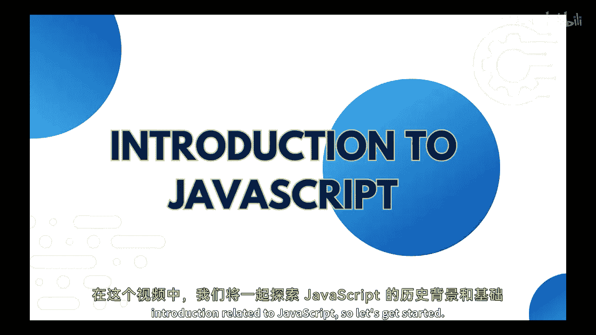
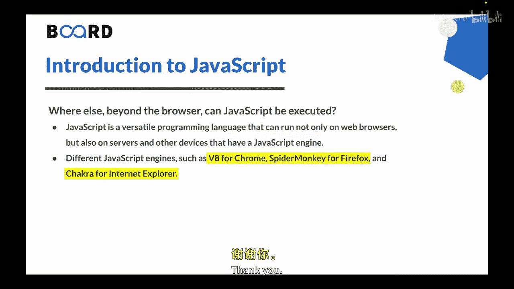

# JavaScript入门：01：JavaScript简介 🚀

在本节课中，我们将学习JavaScript的历史和基本介绍。

## 概述

JavaScript是一种编程语言，用于为网站添加交互功能。它通常与HTML和CSS一起使用，使网站更具动态性和吸引力。简单来说，JavaScript允许您为网页添加功能。

## 什么是JavaScript？

JavaScript是一种编程语言，用于为网站添加交互功能。它通常与HTML和CSS一起使用，使网站更具动态性和吸引力。

简单来说，JavaScript允许您为网页添加功能。例如，您可以使用JavaScript创建交互式表单、添加动画，并在用户与网页交互时创建动态效果。

JavaScript的一个优点是它在网络浏览器中运行，这意味着几乎任何带有网络浏览器的设备都可以使用它。这使其成为创建跨平台应用程序的强大工具，可在台式电脑、平板电脑和智能手机上使用。

## 为什么叫JavaScript？

JavaScript最初由Netscape Communications的Brendan Eich创建。这门语言最初被称为Mocha，但后来更名为LiveScript。

将语言更名为JavaScript的决定主要是Netscape出于营销考虑做出的。当时，该公司正与微软进行激烈的浏览器大战，他们希望通过让语言听起来与Java相似来利用Java的流行度。这有助于形成一种观念，即JavaScript是Java的补充技术，尽管这两种语言有很大不同。

JavaScript已成为世界上使用最广泛的编程语言之一，并且是当今Web开发人员的重要工具。事实上，根据一些估计，互联网上超过95%的网站都使用JavaScript。

## JavaScript可以在浏览器之外执行吗？

JavaScript是一种多功能的编程语言，可用于创建前端和后端应用程序。

它主要以在Web开发中的使用而闻名，用于为网页添加交互性和动态效果。然而，JavaScript也可用于构建在Web服务器上运行的服务器端应用程序，以及桌面和移动应用程序，甚至可以在物联网设备上运行。

这种多功能性是JavaScript的最大优势之一，因为它允许开发人员使用单一编程语言在各种平台和设备上构建应用程序。这不仅使开发更高效，还使开发人员能够创建交互式和响应式的用户界面，可以实时响应用户输入。

## 浏览器中的JavaScript引擎

Web浏览器使用不同的JavaScript引擎来解释和执行JavaScript代码。例如，Chrome使用V8，Firefox使用SpiderMonkey，Internet Explorer使用Chakra。每个引擎都有其独特的功能和性能特点。

## 浏览器中JavaScript可以执行哪些任务？

以下是浏览器中JavaScript可以执行的一些主要任务：

*   **操作HTML和CSS**：JavaScript可以更改网页上元素的样式和内容，例如，通过隐藏或显示元素，或更改其颜色、大小，或者为其添加动画。
*   **处理用户事件**：JavaScript可以响应用户与页面的交互，例如点击按钮、提交表单或滚动，并触发相应的操作，例如显示消息或更新页面内容。
*   **验证表单**：JavaScript可以检查Web表单中的用户输入，例如，确保必填字段不为空、电话号码有效或密码符合特定标准。
*   **添加交互性**：JavaScript可以向网页添加交互元素，例如下拉菜单、图像滑块或弹出窗口，以增强用户体验并吸引用户关注内容。
*   **发起HTTP请求**：JavaScript可以使用HTTP请求从服务器获取数据或将数据发送到服务器，例如，动态更新页面内容或在不重新加载页面的情况下提交表单。
*   **存储和操作数据**：JavaScript可以将数据存储在变量、数组和对象中，例如，记住用户偏好或跟踪游戏分数，并使用内置函数（如排序或筛选）来操作数据。

## 总结

本节课中我们一起学习了JavaScript的基础知识。JavaScript是一种高级动态编程语言，用于创建交互式网页和Web应用程序。它最初被称为Mocha，后来更名为LiveScript，最终出于营销目的更名为JavaScript。虽然它主要与Web开发相关，但JavaScript也可以在服务器和其他拥有JavaScript引擎的设备上使用。凭借其多功能性和普及度，JavaScript已成为现代Web开发的基础语言。

本视频内容到此结束。在下一个视频中，我们将学习如何设置您的开发环境。下个视频再见。谢谢。