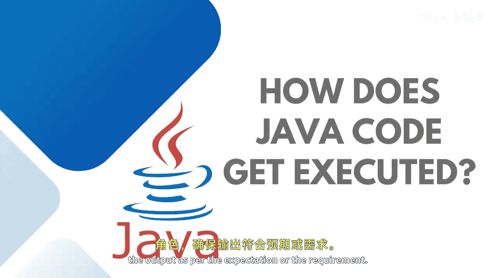

# Java全栈开发：P12：Java代码的执行过程 🚀


在本节课中，我们将要学习Java代码是如何在计算机上被执行的。我们将详细探讨从编写源代码到最终输出结果的全过程，并理解Java虚拟机（JVM）、Java开发工具包（JDK）和Java运行时环境（JRE）在其中扮演的关键角色。



---

## 概述：Java程序的执行之旅

Java程序的执行并非一步到位，而是一个涉及多个组件的流程。这个过程确保了Java“一次编写，到处运行”的特性。接下来，我们将分步拆解这个流程。

## 第一步：从源代码到字节码

首先，我们编写一个以 `.java` 为扩展名的程序，这被称为Java源代码。计算机无法直接理解这种源代码。

因此，我们需要使用编译器将源代码编译成字节码。字节码文件的扩展名是 `.class`。这个过程可以用以下伪代码表示：

```
源代码 (.java) -> 编译器 (javac) -> 字节码 (.class)
```

生成的字节码同样无法被计算机硬件直接理解，这就需要Java虚拟机（JVM）登场。

## 第二步：JVM加载与执行字节码

JVM是一个平台特定的软件，这意味着每个操作系统都有其对应的JVM版本。JVM会加载你的 `.class` 字节码文件。

JVM内部包含一个Java解释器，它的职责是将字节码逐步转换为目标计算机能够理解的机器码，从而产生程序输出。简单来说：

```
字节码 (.class) -> JVM（含解释器）-> 机器码 -> 程序输出
```

由于JVM的存在，只要目标机器安装了正确的JVM，任何Java字节码都可以在其上运行。这实现了Java的跨平台可移植性。

## 第三步：字节码验证与类加载

字节码通过网络或本地方式被传送到运行时环境（JRE）后，JVM会首先对其进行验证。JVM内置了一个字节码验证器，它在类被加载到运行时环境之后工作。

这个验证器确保字节码是有效且可访问的，同时保护计算机免受各种病毒和不安全网站的威胁。JVM内部还包含了程序运行所需的各种库。

## 第四步：程序执行与JIT编译

一旦类被成功加载到JVM上，Java程序的执行就正式开始了。JVM作为解释器，会逐步解释执行你的代码。

现代JVM为了提高执行速度，采用了即时编译（JIT）技术。JVM可以同时执行多项任务，JIT编译器也被称为“热点编译器”，因为它能找出字节码中被频繁执行的“热点”部分，并将其直接编译为高效的机器码。

## 关于编译与解释的常见问题

一个常见的问题是：Java是编译型语言还是解释型语言？

*   **编译器**：指将源代码转换为字节码的工具（例如 `javac`）。
*   **解释器**：指将字节码转换为机器码的编程工具（例如JVM中的解释器）。

因此，我们可以得出结论：**Java既是编译型语言，也是解释型语言**。因为源代码首先被编译成字节码（编译过程），然后相同的字节码在JVM上被解释执行（解释过程）。

---

## 总结


本节课我们一起学习了Java代码的执行过程。我们了解到，这个过程始于 `.java` 源代码，经过编译成为 `.class` 字节码，最后由平台特定的JVM加载、验证并解释执行（或通过JIT编译优化）。正是JVM的存在，使得Java具备了强大的跨平台能力。现在，你已经准备好编写自己的Java程序，并让它们按照预期运行了。