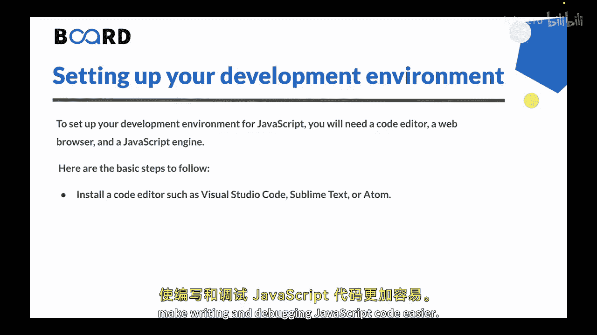
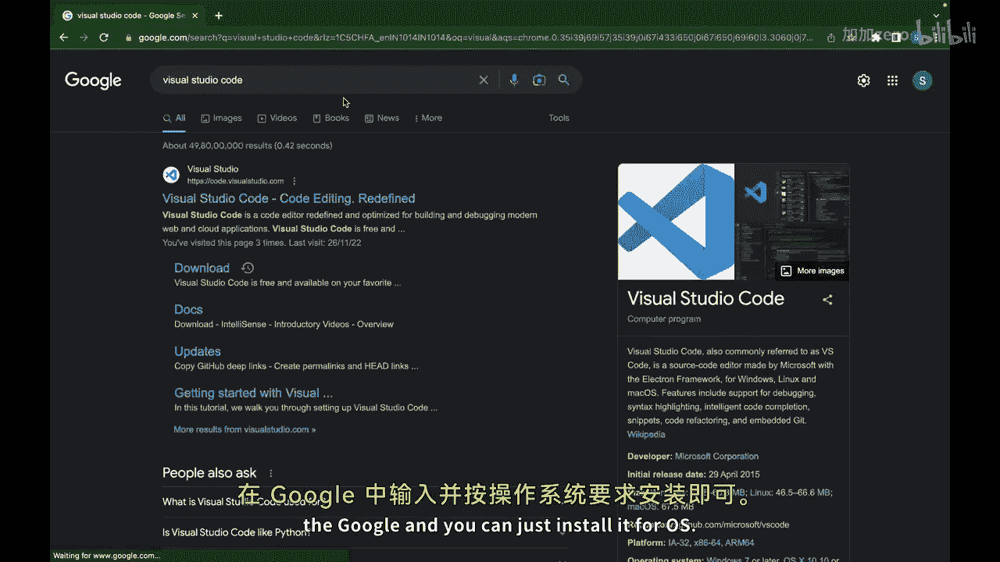

# 【Java全栈开发 专项课程（上）】Board Infinity—中英字幕 p120 p48_03_setting-up-your-development-environment -BV1tAygYoEj5_p120-

Hi there In the previous video we saw introduction to JavaScript Now in this video we will set up our development environment for JavaScript so let's get started。

To set up your development environment， you need a code editor， a web browser and a ja engine。

A code editor enables us to write and organize our code with features such as syntax highlighting。

 auto completion and word formatting。It also provides us with debugging tools to identify and fix errors in our code。

A web browser is necessary for testing our ja code in a real world environment。

 It allows to see how our code interacts with HTMLtml and CSs on our web page and to test features such as user interactions and SP request a jascript engine enables us to run jascript code outside of a web browser which is useful for building server side applications。

 command line tools and other types of applications that do not rely on web browser。

You can follow these basic steps for your development environment。So， the first step is。

You can install a code editor。 You can choose from variety of free and paid code editors。

 such as visual studio code， sublime text or atom。 These editors provide features such as syntax highlighting。

 auto completion and debugging tools that make writing and debugging jascript code easier。

 You can just go to Google。 And let's say if you want to install visual studio code。

 you can just type。😊。

In the Google， and you can just install it for your OS。

。Second is to install a web browser you can choose from popular web browsers such as Google Chrome。

 Mozular Firefox or Microsoft Edge。 These browsers have built in developer tools that enable you to inspect and debug your ja code in real time。

 Last but not the least， you have to install a jascript engine。

 So most modern web browsers come with their own jascript engine。

 but you can also install standalone engines such as node J or Rno。

These engines allow you to execute ja code outside of a web browser， for example。

 to build server side applications or command line tools。 So once you have these tools set up。

 you can start writing and running ja code in your coator and test it on your web browser or ja engine。

So this is all for this video in the next video we will write our very first JavaScript program see you in the next video。

 Thank you。🎼。

