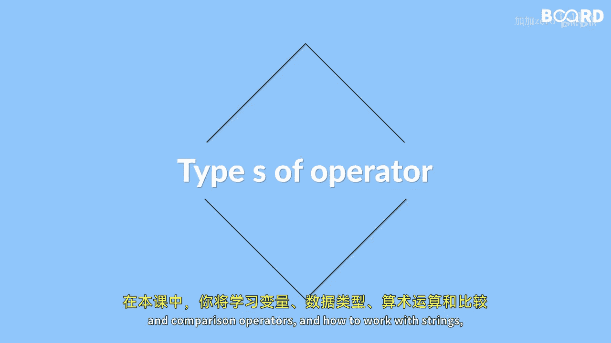

# Java全栈开发 专项课程（上）：01：JavaScript 基础概念入门

在本节课中，我们将学习 JavaScript 的核心基础概念，包括变量、数据类型、运算符以及控制结构。这些是构建任何 JavaScript 程序的基石。

## 变量与数据类型

上一节我们介绍了本课程的学习目标，本节中我们来看看 JavaScript 中存储和表示信息的基础：变量与数据类型。

变量是用于存储数据值的容器。在 JavaScript 中，你可以使用 `let`、`const` 或 `var` 来声明变量。

JavaScript 的数据类型主要分为两大类：原始类型和复杂类型。

以下是主要的原始数据类型：



*   **字符串**：用于表示文本，用单引号或双引号包裹。例如：`let name = "Alice";`
*   **数字**：用于表示整数或浮点数。例如：`let age = 25;` 或 `let price = 19.99;`
*   **布尔值**：表示逻辑真或假，只有两个值：`true` 和 `false`。例如：`let isLoggedIn = true;`

除了原始类型，JavaScript 还有更复杂的引用类型，例如数组和对象，它们用于存储集合或键值对数据。

## 运算符

了解了如何存储数据后，我们需要学习如何操作这些数据。运算符允许我们对值进行计算和比较。

算术运算符用于执行基本的数学运算。

以下是常用的算术运算符：

*   **加法**：`+`
*   **减法**：`-`
*   **乘法**：`*`
*   **除法**：`/`
*   **取余**：`%`

比较运算符用于比较两个值，并返回一个布尔值（`true` 或 `false`）。

以下是常用的比较运算符：

*   **等于**：`==` （值相等）
*   **严格等于**：`===` （值和类型都相等）
*   **不等于**：`!=`
*   **大于**：`>`
*   **小于**：`<`
*   **大于等于**：`>=`
*   **小于等于**：`<=`

## 控制结构与函数

掌握了数据和运算符，下一步是控制代码的执行流程。这通过条件语句和循环结构来实现。

条件语句（如 `if...else`）允许你根据不同的条件执行不同的代码块。

循环结构（如 `for` 循环和 `while` 循环）让你能够重复执行一段代码，直到满足特定条件。

函数是可重复使用的代码块，用于执行特定任务。定义函数可以提高代码的复用性和组织性。

一个简单的函数定义如下：
```javascript
function greet(name) {
    return "Hello, " + name;
}
```

## 字符串操作

字符串是编程中最常用的数据类型之一。JavaScript 提供了丰富的方法来操作字符串，例如连接字符串、获取子字符串、转换大小写等。

本节课中我们一起学习了 JavaScript 的基础概念。你了解了变量如何存储数据，认识了字符串、数字、布尔值等数据类型，学会了使用算术和比较运算符进行计算与判断，并初步接触了条件语句、循环和函数来控制程序逻辑。这些知识为你进一步深入学习 JavaScript 和全栈开发奠定了坚实的基础。