# JavaScript 全栈开发：03：理解数据类型 📊

在本节课中，我们将要学习 JavaScript 中的数据类型。数据类型定义了程序中可以存储和操作的数据种类。理解数据类型是编写有效、无错误代码的基础。

上一节我们介绍了 JavaScript 中的变量，本节中我们来看看变量可以存储哪些不同类型的数据。

## 什么是数据类型？

在 JavaScript 中，数据类型代表了可以在程序中存储和操作的数据种类。

以下是 JavaScript 中一些常见的数据类型。

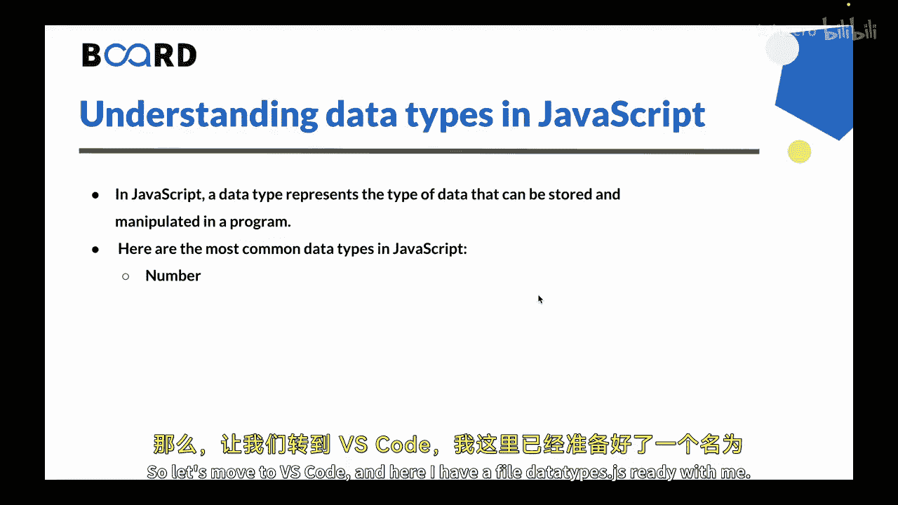

### 1. 数字类型 (Number)

数字类型用于表示整数和浮点数。在 JavaScript 中，数字使用 `Number` 类型表示。

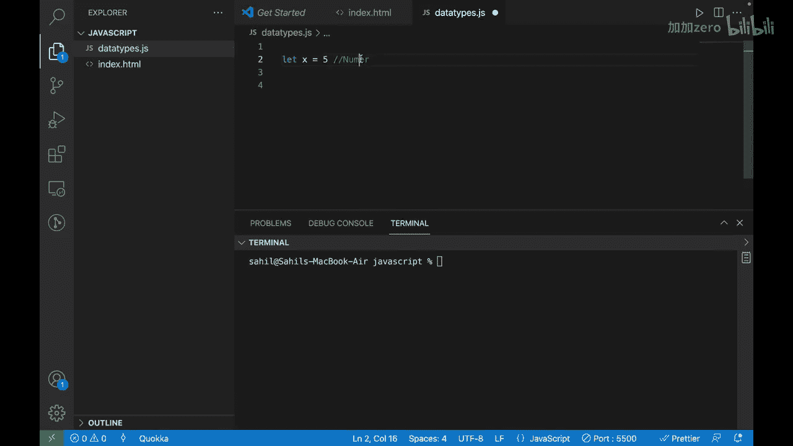

让我们通过一个例子来理解。在代码中，可以这样创建一个数字类型的变量：

```javascript
let x = 5;
```

这创建了一个名为 `x` 的变量，其类型为数字，值为 `5`。

### 2. 大整数类型 (BigInt)

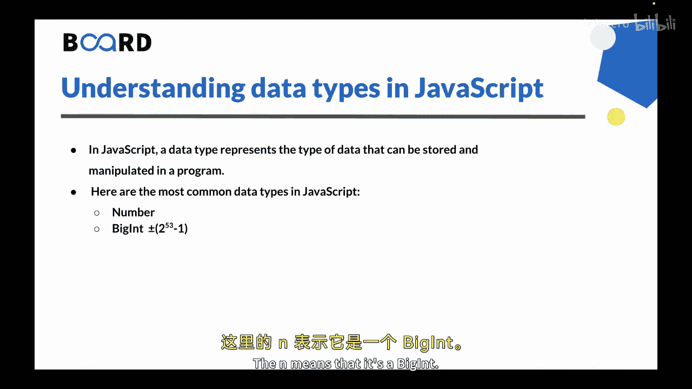

对于大多数用途，数字类型的范围（从 `-(2^53 - 1)` 到 `2^53 - 1`）已经足够。但有时我们需要处理任意长度的超大整数，例如在密码学或微秒级时间戳的场景中。

`BigInt` 类型是最近添加到语言中的，用于表示任意长度的整数。一个大整数值通过在整数末尾附加 `n` 来创建。

以下是创建 `BigInt` 的示例：

```javascript
const bigInt = 1234567890123456789012345678901234567890n;
```

如果你想检查任何变量的类型，可以使用 `typeof` 操作符：

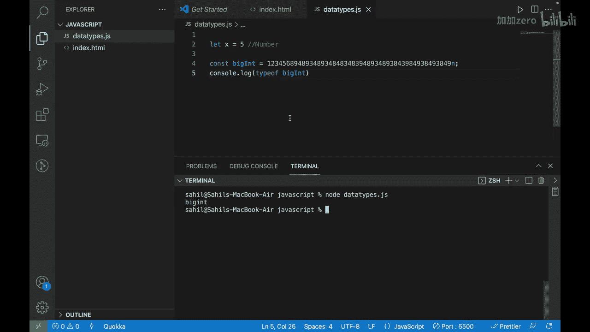

```javascript
console.log(typeof bigInt); // 输出: bigint
```

大整数类型很少需要，但在必要时可以像这样使用。

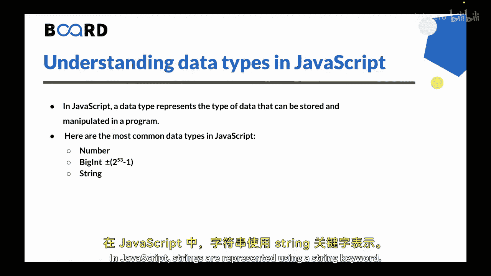

### 3. 字符串类型 (String)

字符串类型用于表示一个字符序列。在 JavaScript 中，字符串使用 `String` 类型表示。

让我们看一个例子。要创建一个字符串，可以这样写：

```javascript
let name = “John”;
```


这创建了一个名为 `name` 的变量，其类型为字符串，值为 `“John”`。同样，你可以使用 `typeof` 操作符来检查其类型。

### 4. 布尔类型 (Boolean)

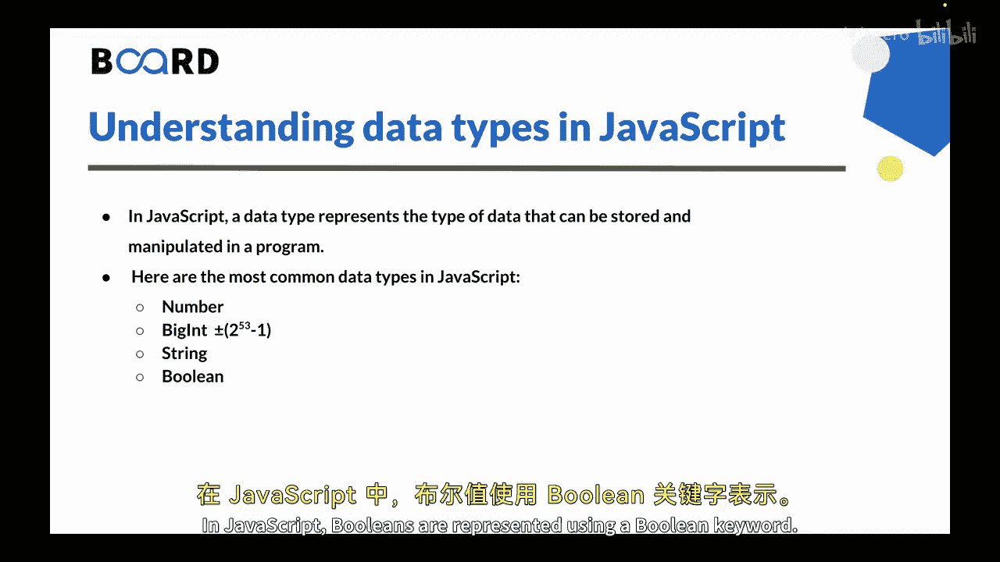

布尔类型表示一个逻辑值，它只能是 `true`（真）或 `false`（假）。在 JavaScript 中，布尔值使用 `Boolean` 类型表示。

看一个例子。要创建一个持有布尔值的变量，可以这样写：

```javascript
let isTrue = true;
```

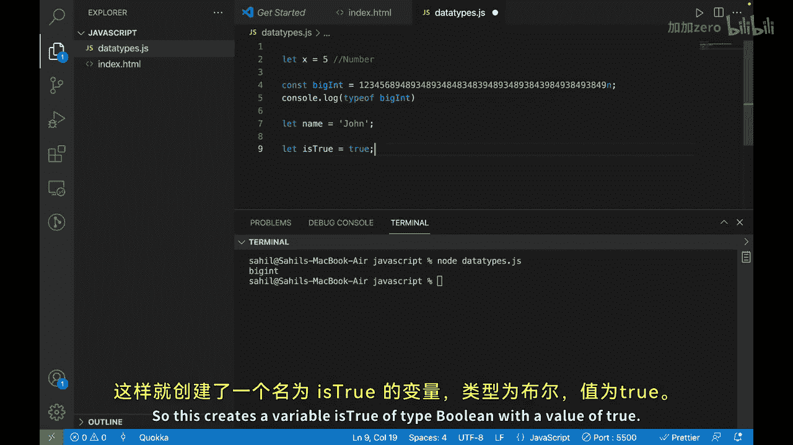

这创建了一个名为 `isTrue` 的变量，其类型为布尔型，值为 `true`。

### 5. 空值类型 (Null)

空值类型用于表示一个对象值的故意缺失。它使用 `null` 关键字表示，是一个独立的数据类型。

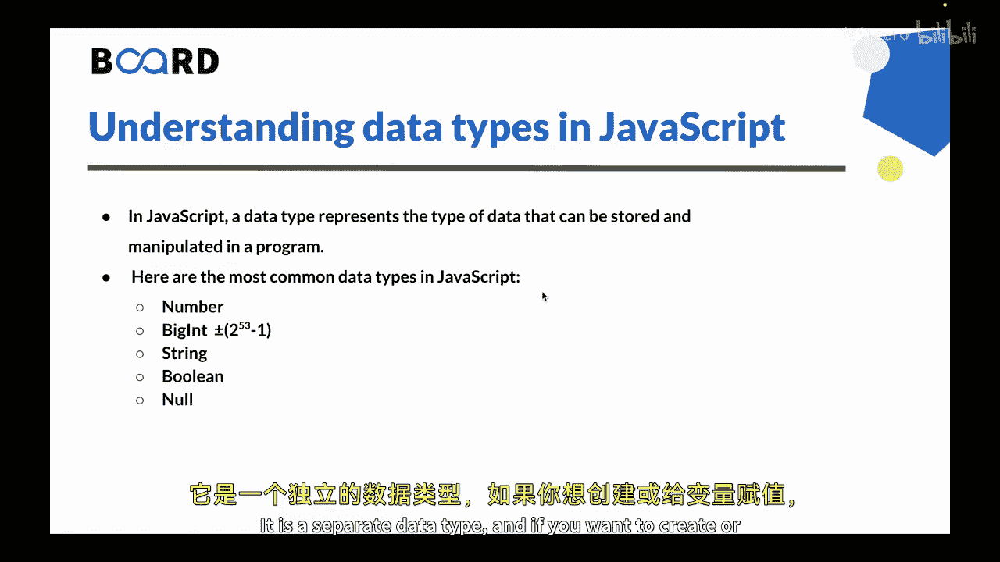

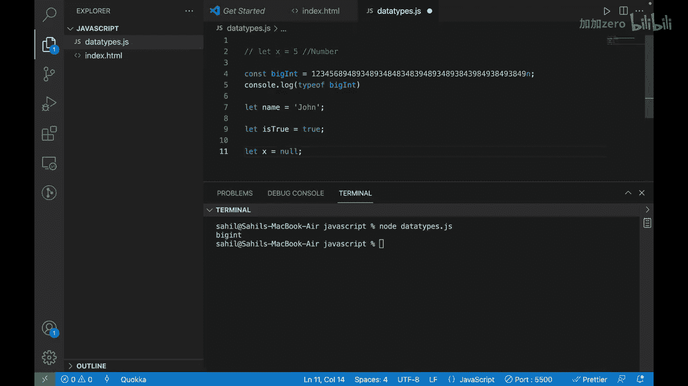

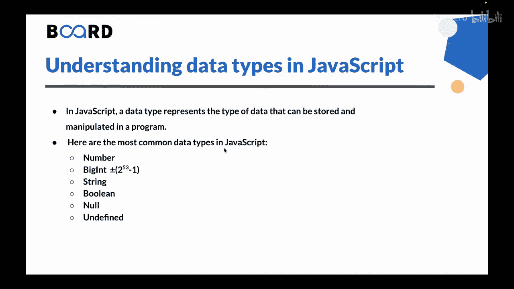

要为一个变量赋予空值，可以这样写：

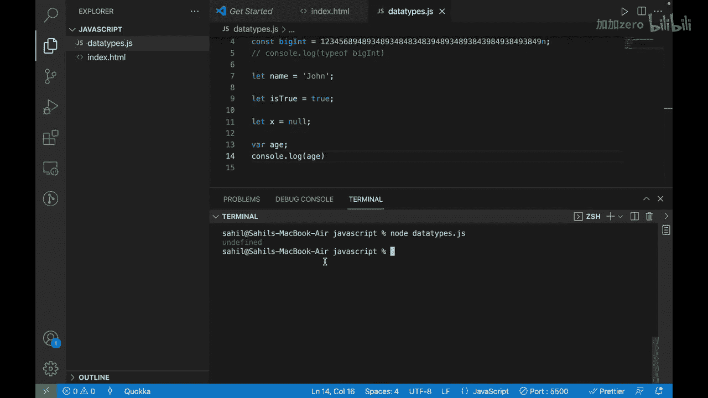

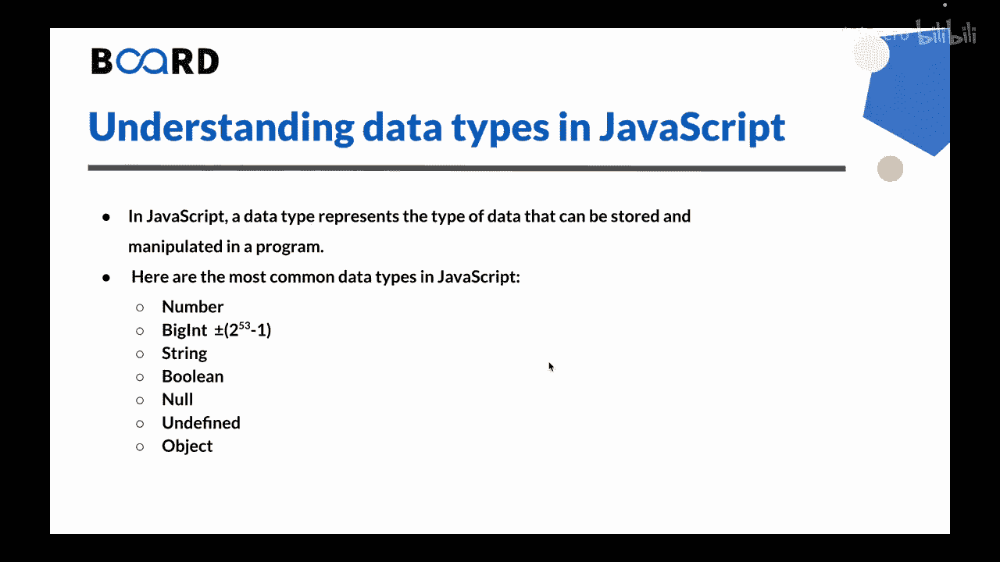

```javascript
let emptyValue = null;
```

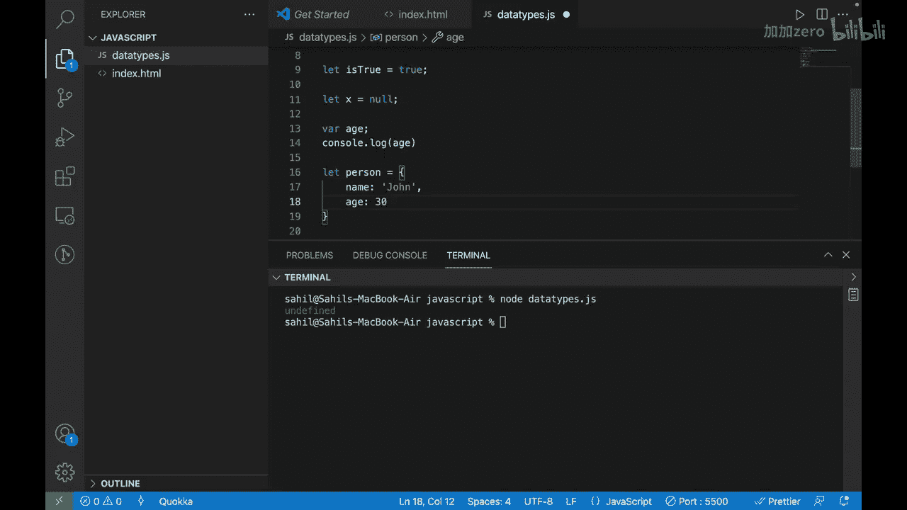

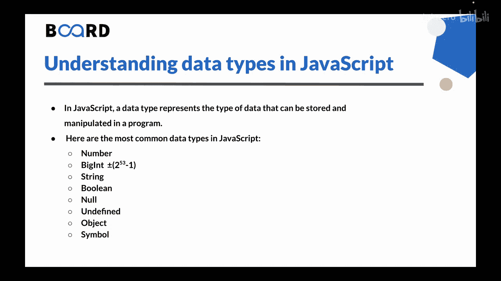

---

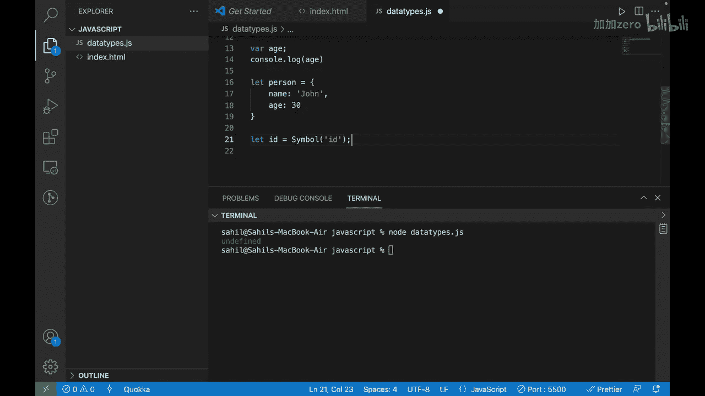


本节课中我们一起学习了 JavaScript 中的五种基本数据类型：**数字 (Number)**、**大整数 (BigInt)**、**字符串 (String)**、**布尔 (Boolean)** 和 **空值 (Null)**。理解这些类型是掌握变量操作和后续学习更复杂概念的关键。在下一节中，我们将探讨其他数据类型，如未定义 (Undefined) 和对象 (Object)。