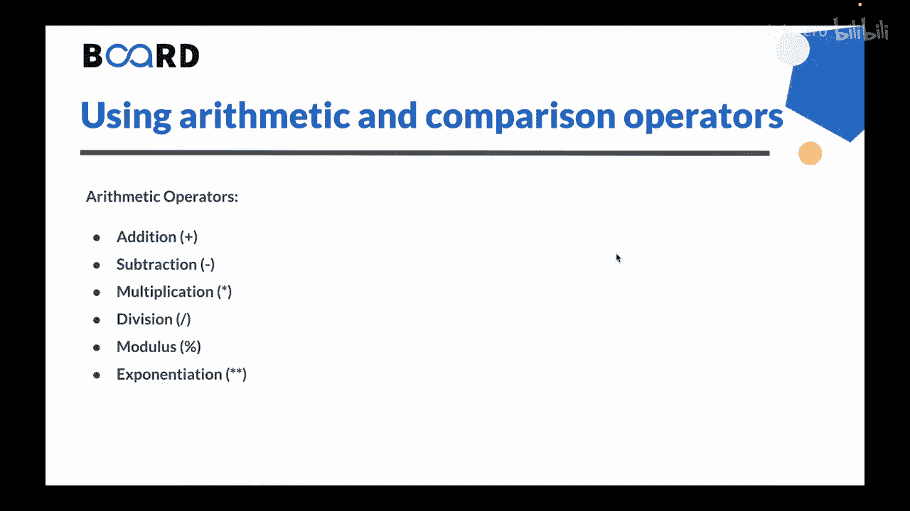
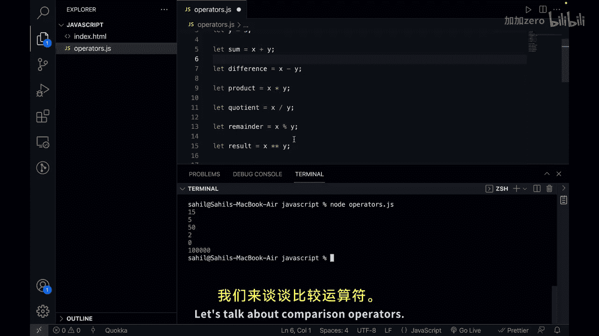
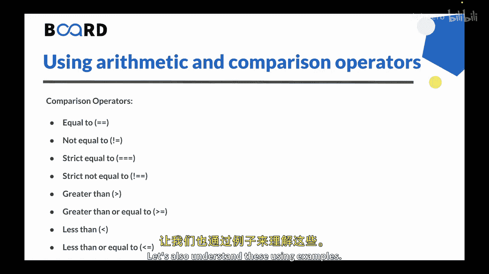
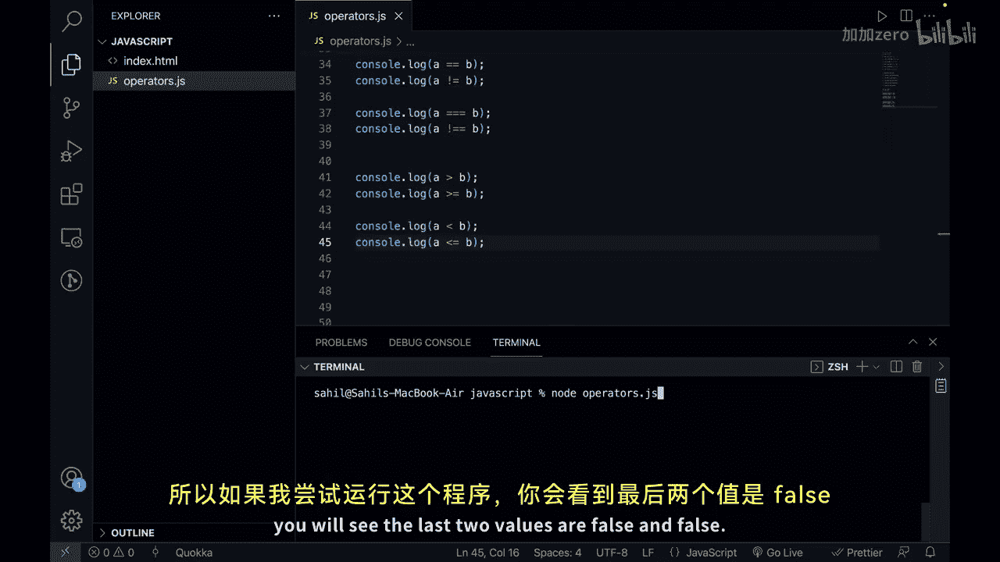

# 【Java全栈开发 专项课程（上）】Board Infinity—中英字幕 p125 p53_04_using-arithmetic-and-comparison-operators -BV1tAygYoEj5_p125-

Hi there。 In the previous video， we learned data types in Javascript。Now， in this video。

 we will learn about arithmetic and comparison operators in Java。 So let's get started。

Let's talk about arithmetic operators， first。Arithmetic operators in jascript are used to perform mathematical calculations on numerical values。

 As you can see one of the arithmetic operator is addition。Then we have subtraction。Vulttiplication。

 division， mods and exponentation。These are some symbols that you can use for these operators。

Let's go to the V S code and understand them by examples。

So I'm in my VS code。And let's create two variables first。So， we can say late。X。

 and let's give it on number 10。And we can say let y and lets give it a value of5。

We want to perform arithmetic operations。So let's talk about addition so we can say let sum and addition would be x plus y。

 this is the addition operator。Then I can just say console to log sum。

So the result that is stored for x plus y is in the variable sum and as soon as I click on save and run this program。

 lets say node operators do Js， you can see the output is 15。Similarly。

 let's take the other examples as well。If you want to calculate the difference。

 you can say let difference。And this would be equal to x minus y。 This is a subion。Operator。

For multiplication， you can say let。Product。And it would be X。In2 why。 So we use this star symbol。

This will give you the multiplication of x and y。Then， we have division。

So we can say let that squarer variable called quotient。And let's make it equal to。X divided by y。

 So we use this symbol here。Then， we have modulus。So we use to normally calculate remainders using a modulus that is a percentage a symbol。

So let's create a variable。 Let's say remainder。And we can make it equal to x person y。Then last。

 we have exponunciation。 So for that， we have。Double multiplication symbols。

What do I mean is let's create a variable let result。And。

If you want to calculate the exponential value， you can say x。Two times this。 And then why。

So just like we were doing console do lock， sum， let's get all the values here。

So we have console log lock some。Then let's copy and paste and put difference here。

Then we can put product here。And then let's put quotient here。And then we can say， remainder。

And in the end， we can just say result。So let's click on save and let me clear up the terminal and I will run this program again。

So， let's say node。And we have。Operators dot J S， you can see we get the output。

 So sum is 15 difference is 5。And product is 50。Then， cautiontient is。2 remainder is0。

 and the result is。One luck。So this is how you can actually。Use arithmetic operators in Javascript。

Let's talk about comparison operators。

So， comparison operators in JavaScript are used to compare values and in turn they return a Boolean value that is either true or false based on the comparison result。

The following are the comparison operators in Java。We have equal to。We have not equal to。

Then we have strict equal to。Then we have strict， not equal to。Then， greater than。

Greater than equal to and similarly for less than and less than equal to。Let's also understand these。

 using examples。

Remember， the output will always be a boolean value。

So let's go here and let's comment everything out。 It's clear up the terminal， as well。

And let's start with comparison operators。So let's take two values。 Let's say， let a to be。10 again。

 And let's take B2 B 5。Now， what we have to do is we have to compare。

 so lets use the equal to operator first so we can say console lot log。A equal equal B。

And what should be the output here。Sa if I run this program。

You will see we get the output as false because。10 is not equal to 5。

Then we can set not equal to so we can just copy this。

 The only thing we have to change is the symbol that is not equal to。And if I run this program now。

You will see that we get the value false and the second one we get the value is true。And of course。

10 is not equal to 5。Similarly， we can check for street equal。So Str also checks that data for it。

And then we have strict not equal as well。 The only thing in both the cases is that you have to add one equal to sign extra。

 So this is。Strict equal to。 and this is strict， not equal to。Again， the output would be same。

So if I run this program， you will see false true and false true。Then we let。

 let's look at the other remaining operators as well。So， we have greater than。

So we can say console lot log， this would be a greater than B。

And then we have greater than or equal to。 So it will be like this。So let's see the output。

 Let me clear up the terminal。 And if I run this program， you will see we get the output as。

True and true， in both the cases。So， a is yes greater than B。

 and it also satisfies this condition as well。Similarly， we have less than operators。

So rather than doing this， we can use the opposite bracket。

And now we have less than and less than equal to。So if I try to run this program。

 you will see the last。

2 values are false and false。So let's summarize this。

Arithmetic operators in jascript are used for mathematical calculations such as add， Subtraction。

 multiplication， division， et cetera。 Comp operators， on the other hand。

 are used to compare values and return a Boolean value based on the comparison result。

 such as equal to not equal to greater than less than and so on。

 These operators are fundamental in jascript programming。

 And understanding how to use them is very essential for the big。 This is all for this video。

 In the next video we will understand arrays in jascript。 See you in the next video。 Thank you。😊，🎼。

