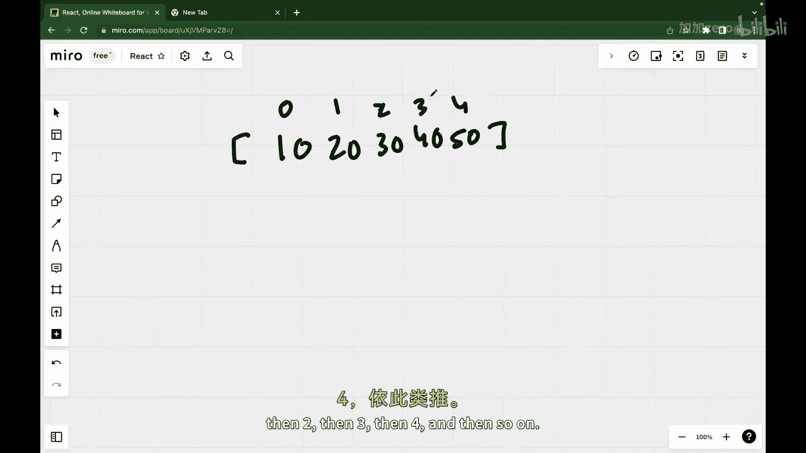
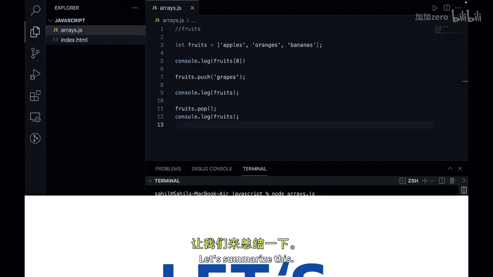
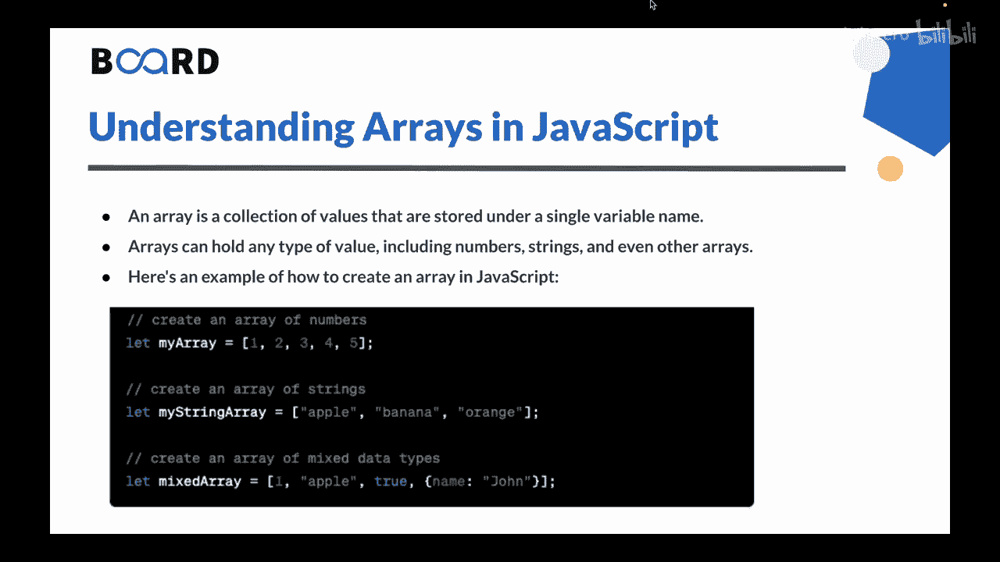

# 【Java全栈开发 专项课程（上）】Board Infinity—中英字幕 p126 p54_05_arrays-in-javascript -BV1tAygYoEj5_p126-

Hi there in the previous video we learn arithmetic and comparison operators in JavaScript now in this video we will learn eras in JavaScript so let's get started。

In programming， an error is a collection of values that are stored under a single variable link。

As can hold any type of value， including numbers， strings and even other errorss。

Each value in an array is accessed through its index。

 which starts at 0 for the first value in the array lets understand by an example。

So let's say that we have array of numbers and it normally starts with square brackets。

 So let's say we have numbers as。等。20。30。40 and 50。In this example。

 we have an array and you can call it as my array or whatever the variable name you want to give。

 it contains5 values，102030，40 and 50 each value is stored in a separate slot in the array which is identified by its index number and how we can identify So the first value in the array 10 is stored in slot 0 and that is called as index。

The second value 20 is stored in slot 1， then 2。Then 3， then 4， and then so on。

Let's also see the error example in VS code。You can think of array in JavaScript like a draw with multiple compartments。

Each compartment has a label and you can put things in each compartment。 for example。

 lets say that you ever draw label fluids。So what we want here is inside the drawer。

 you have compartments labeled as apples， oranges and bananas。

 you can put one or more fruits in each compartment， Similarlyly in jascript。

 you can create an array called fruits and store multiple values in it。

 the array can contain different types of values like strings numbers or even other areass。

You can access the values in the area by using an index number。

 just like opening a specific compartment in the draw。So let's create an array of fruits。So。

 we can say， let。Yeah。Let fruits。 And let's put some fruits here。 So this is an array。

 and we can put apples。Oranges。And let's also put bananas。 So this is an array of string。

 All these values are strings。How to access the first element in the array。

 we can just say console dot log。And how to access this。

 you can save fruits and you can use this square bracket rotation and you can pass the index。

 So fruits at index 0 will give you the output as apples。 Let's test it out。 I click on save。

 And if I run this program， that is node。😊，E is， you will see that we get the values as apples。

 if you say fruits at index 1， you will get oranges。

There are also some built in methods in ja for errorss。 for example。

 let's see you want to add a new fruit to this array。So if we can do it， we can save fruits。Dot push。

Let's say we want to add grapes。And now if I just print out。The original areas。

 let's say console or clock， and let's console fruits。

So lets run the program and you will see here that the graphs has been pushed at the end of the array。

Similarly， we have a pop method as well。So what we can do is， we can say。Fruits， dot pop。

And if I do console dolock fruits again。And let's run this program。

 you will see we get back the original error。Why because the last value that is scraps is popped out from the end of the error。

There are more built in methods， but these are some， or you can say the most used methods in array。

Let's summarize this。

So array is a collection of values that are stored under a single variable name。

 errorss can hold any type of value including numbers， strings and even other arrays。

You can also see the syntax here。Here we have area of numbers， area of strings， and。

The last one is mixed area that is area of mixed data types。

You can create an array JavaScriptscript using square brackets and separating the values with comma。

 you can access the values in an array using the index number of the value you want to retrieve。

 for example， fruits add index1。You can modify the values in an area by assigning a new value to a specific index。

Areas also have built methods that you can use to manipulate the data in the area。

 such as push to add a value to the end of the array and pop to remove the last value from the error。

Understanding areas is a very important concept in programming as they allow you to store and access multiple values under a single variable link。

This is all for this video in the next video we will understand about strings and string manipulation in JavaScript。

See you in the next video。 Thank you。

