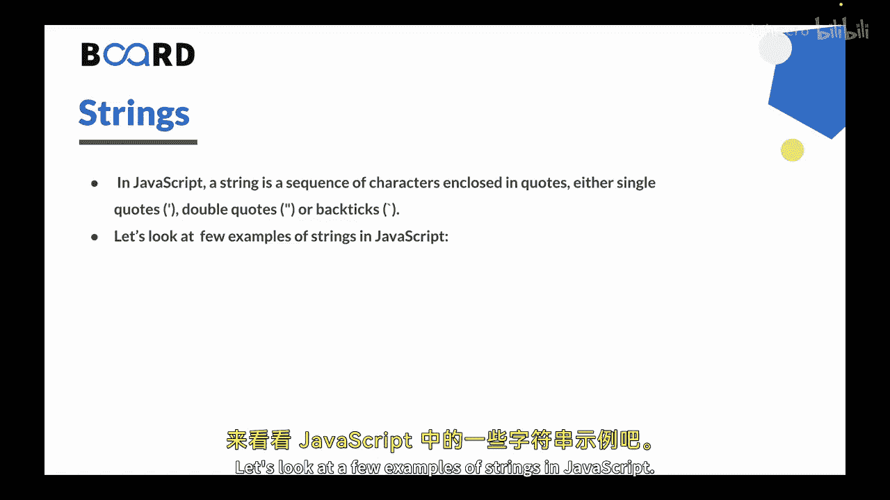
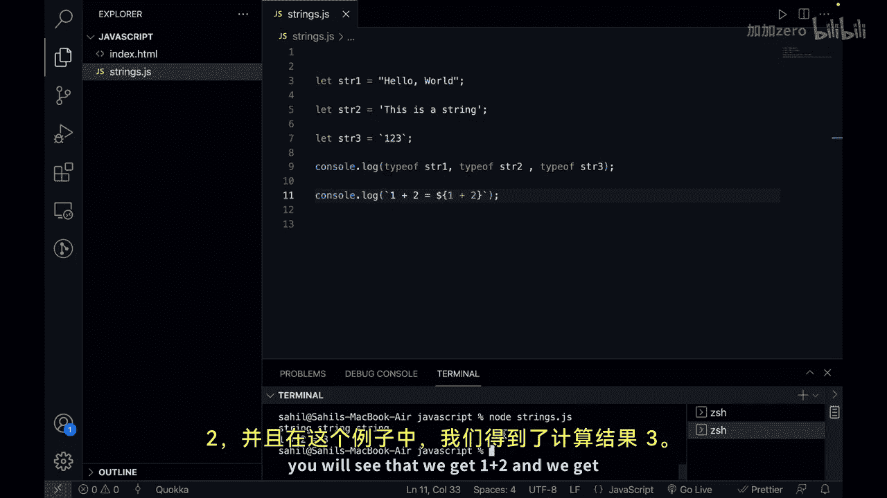
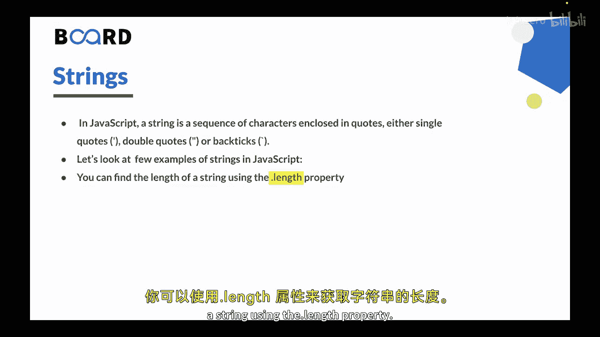
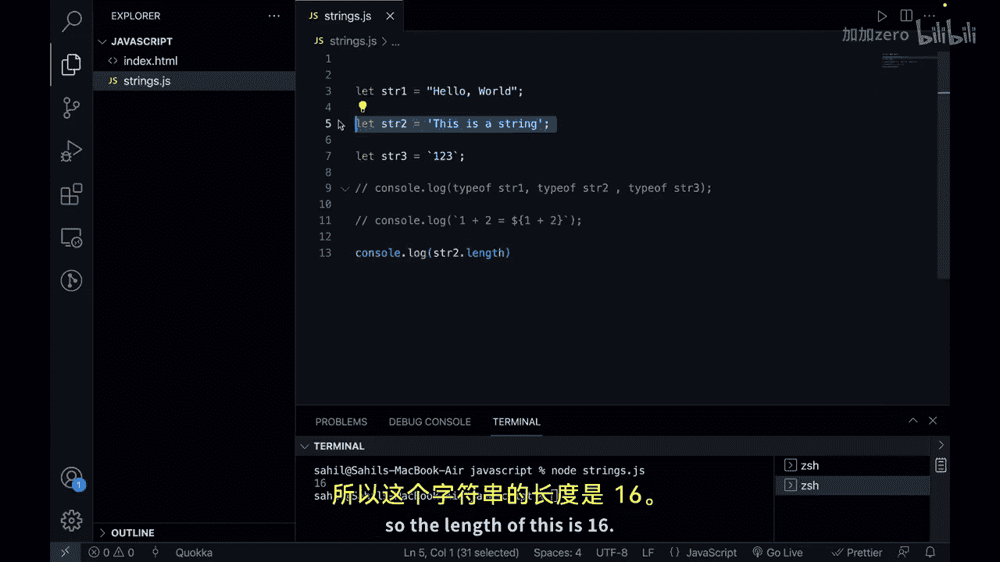
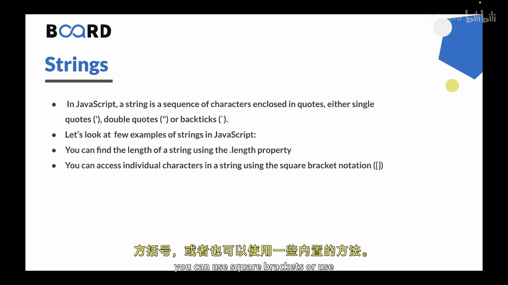
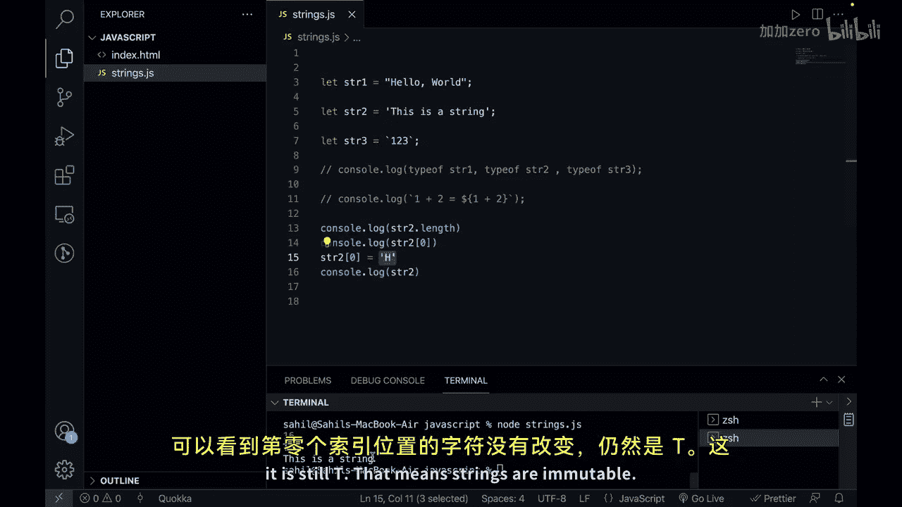

# 【Java全栈开发 专项课程（上）】Board Infinity—中英字幕 p127 p55_06_working-with-strings -BV1tAygYoEj5_p127-

H there in the previous video we learned about arrays now in this video we will learn strings in JavaScript so let's get started。

In JavaScript， the textual data is stored as strings。

There is no separate type for a single character。A string is a sequence of characters enclosed in quotes。

 either single codes， double quotes or backtics。Let's look at a few examples of strings in JavaScript。

So let' us go to the vs code and here I have a file that is string。 js。Let's create。

Strings with all the quotes。So， let's say。Let SR 1。This is a variable。

 and we can use double quotes so we can say hello， world。Now this is a string， if you want。

 you can check using type of operator that you will do。Second， we can say let SCR 2。

And we can just type anything this time， you will note that。I'm using a single code。

So let's say this is a string。And lastly， we can use backtics as well， so we can say let S R 3。

This is the third variable and let's say  one，2，3， and this is now a string。Of course。

 if you can console it， you will get the outputs on the console， but lets us do the type of them。

So let's say console lot lock。Type of SCR1。明讲吗？Can say， type of SR 2。Comma， and then you can say。

Type of STR 3。And let's open up the terminal and let's run this program。

So I say node and string dot Js， you will see that we get the output as string string and string。

 so all these are type of strips。Single and double chs are essentially the same。Baact texts， however。

 allows to embed any expression into the string that means they have some kind of extended functionality。

 Let's see that as well。So here I would say console dot Lo。And here we can just use ba ticks。

 we can say one plus2 to be equal to， and we can embed an expression using a dollar and curly bracket sign。

And we can say  one plus 2。And it will evaluate the expression and then convert it into the string。

So now if I try to run this program again， you will see that we get one plus 2 and we get the evaluated expression that is3 in this case。

You can find the length of a string using the dot length property。😡。

So let's see how length property works。So here we have a string and lets say we are taking SR2。

 I will comment rest of the code。And then I can say console do lock。And you get SR 2。Taught length。

Many people get confused in they try to access this like this， this is not a function。

 this is not a method， it is a property so property does not have parenthes。

So now if I try to run this program， you will see that we have the output。As 16。

 So the length of this is 16。

You can access individual characters in a string using the square bracket notation just like an array to get a character add some position。

 let's say pause you can use square brackets or use some built in methods as well。

So let's say if you want to get or access the first letter of the string or the first character of the string。

 you can say console do lock。And we can see your ST and let's say you want to get add index 0。

So if I click on save and if I try to run this program， you will see that we get the value as p。

You can access more characters using their indexes。

One more important thing to notice that strings are immutable。

 that means strings can be changed in JavaScript， it is impossible to change a character。

So what I will do is we have add0 position the character as t。Let's do what。 Let's say SR。

2 at index0。 and let's give it H。And now， let's run this program。You will see that it is key。

 but if I console this again in the end， lets see what do we get as the output。So if I run it again。

 you will see that we get this is a string only and you can see that the character at index 0 has not changed it is still t that means strings are immutable。

So let's summarize this。In Java， we have strings which are used to store textual data Strs are a sequence of characters enclosing codes。

 including single code， double codes or batics。Baacts are of expressions to be embedded into a string using dollar and curlib brackets。

The length property of a string returns its length。To access the characters at specific position。

 square brackets or built in methods can be used。Stringings are immutable in jascript and cannot be changed。

 It means it is possible。Not to change a character。

The length of a string can be found using dot length property and individual characters access using the square bracketnot。

This is all for this video In the next video， we will see string manipulation in JavaScript。

 Thank you。

