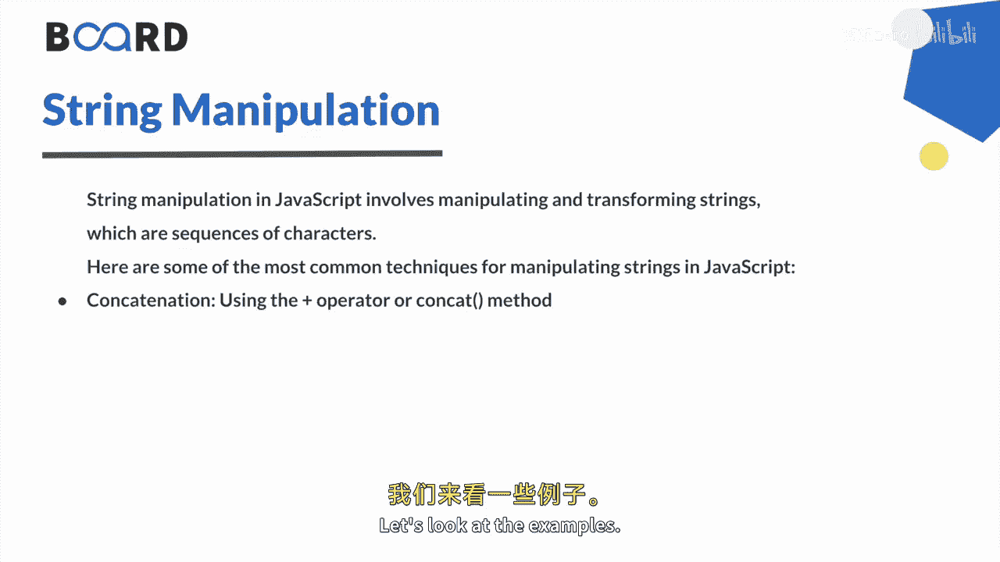
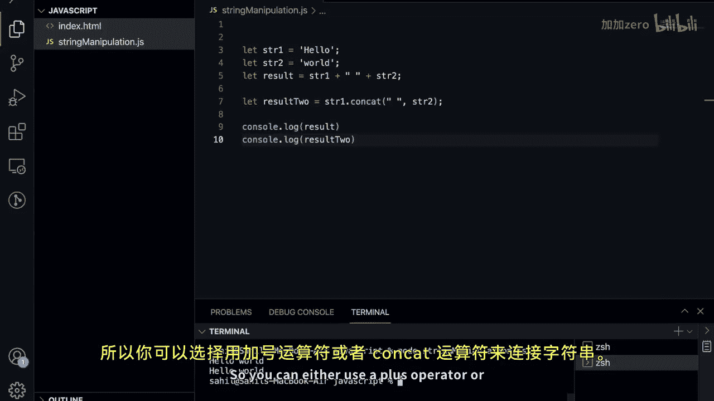
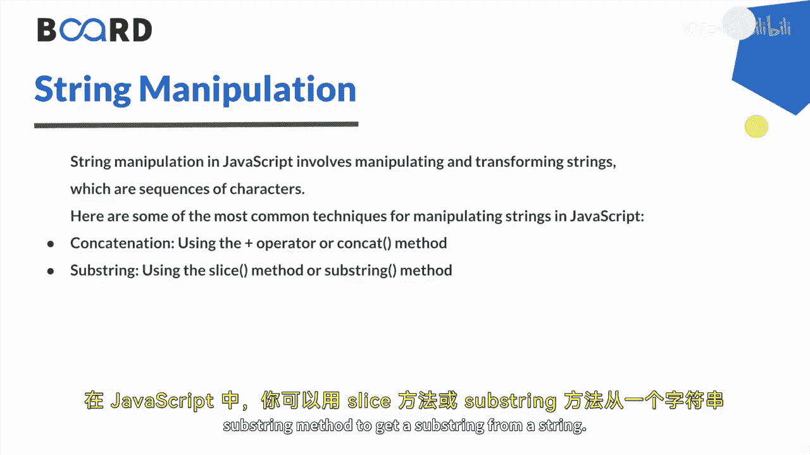
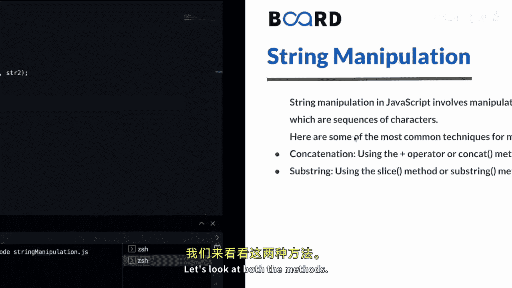
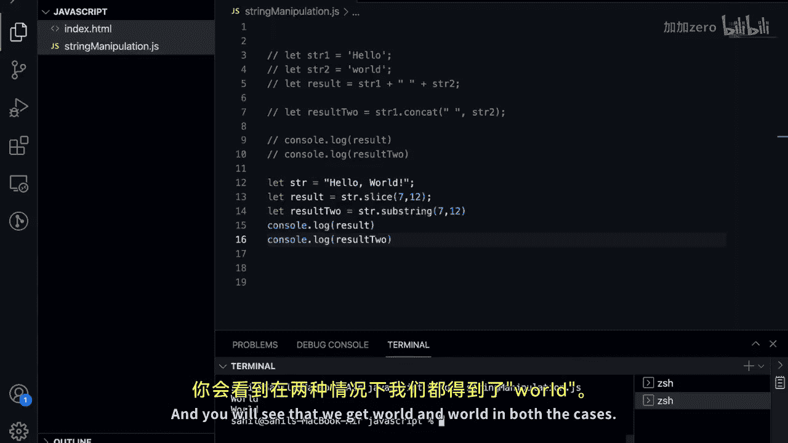

# 【Java全栈开发 专项课程（上）】Board Infinity—中英字幕 p128 p56_07_working-with-string-manipulation -BV1tAygYoEj5_p128-

Hi there in the previous video we learned strings Now in this video we will learn string manipulation in JavaScript。

So let's get started。String manipulation refers to the process of modifying or manipulating a string of characters in some way to achieve a desired output。

A spring in a sequence of characters enclosed in quotes such as hellello world。

So string manipulation in JavaScript involves manipulating and transforming strings。

 which are sequence of characters。Let's look at some most common techniques for manipulating strings in JavaScript。

The first one is concatetnation。So concatenation is the process of joining two or more strings together to create a new string。

In JavaScript you can concatenate strings using the plus operator or the contact method。

Let's look at the examples。

So let's go to the VS code。And here I have a file that is string manipulation dot Gs。

So let's create two strings， let STR1， and this would be。Hello。😊。

And let's create another string that would be led STR 2， and this would be word。

And let's use these two operators and methods。So the plus operator can be used to concatenate two or more strings。

So we can say let result。And it would be equal to STR。1。

Then we can see plus and then we add to add a space so lets add some empty space then again this plus operator and then SR2。

If I do console or log result。We should get the two added strings。Meanwhile。

 let's also perform the same thing using a con method。

 the conca method can be used to concatenate two most things together。

So here we have this result and let's say。Let result 2。And in this case， you will use a con method。

So we'll say string  one。Thought contact。And we want to add a space and then we want to add string2 and lets also do console log lock result2。

Now， if I click on save， let's open up the terminal and let's run this program。So I would say node。

String manipulation do Gs and you will see in both the cases we get the same output。

So you can either use a plus operator or a concad operator for adding the strings。

So the second one is substr， a substr is a portion of a string that you can extract in jascript you can use either the slice method or substr method to get a substr from a string。

 Let's look at both the methods。

So here we are in the Vs code again and let me comment these things and let's look at how to get get a sub string。

So first let's use a slice method。Lets comm these as well so we can create a single string。

 let's say STR and lets skip it hell world。And here what we want to do is we can say let result。

And we want to get a portion of it so we can say STr。Dot slice and here we can pass。

 let's say7 and 12 as the indexes。So this slice method extracts a section of a string and it returns a new string without modifying the original string。

You can pass one or two arguments here we are passing two arguments。

If you pass one argument the slice method will return all the characters from that index to the end of the string if you pass two arguments in this case the slice method will return all the characters from the first index up to but not including the second index。

So here if I do console do lock result。We should get the output as wide， so let's run this program。

And you will see we get1 as well， let's also look at a sub string method。

So same what we can do is we can say let result to。And here we can say ST dot substr。

And here we can pass again7 and 12。So this sub method extracts a section of a string and again it returns a new string without modifying the original string。

Here also you can pass one or two arguments here we are passing two arguments so this method will return all the characters from the first index up to but not including the second index。

 so here also if I do console lot log result2 we should get the same output。

So let's run this program。And you will see that we get wall and world in both the cases。😊。

So let's summarize this。In JavaScript string manipulation is the process of performing operations on strings such as concatenating。

 extracting substrs， and there are many more like replacing characters and changing the case of the letters。

We have seen the most used one you can of course explore the other ones as well concatenation can be achieved using a plus operator or the content method that we have seen substrs method can be extracted using the slice method or the substring method you can also explore replace method to uppercase or lowercase method for casing of the letters。

Then you can also explore trim method for removing the white space。

Note that each of these methods returns a new string and does not modify the original one。

This is all for this video， see you in the next video， Thank you。

