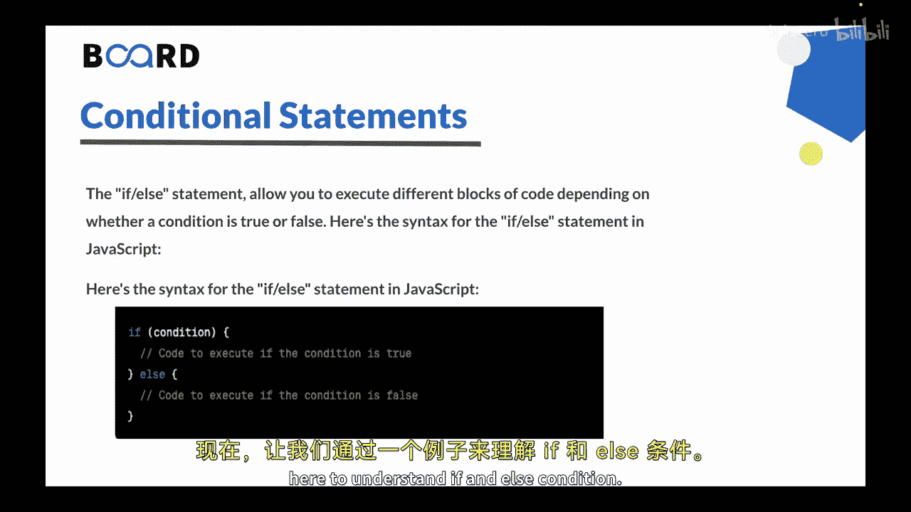
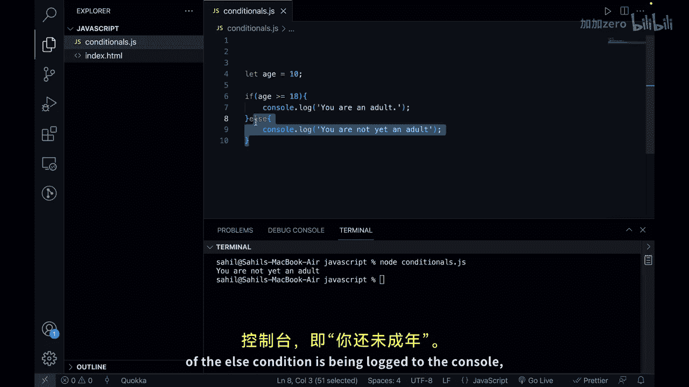
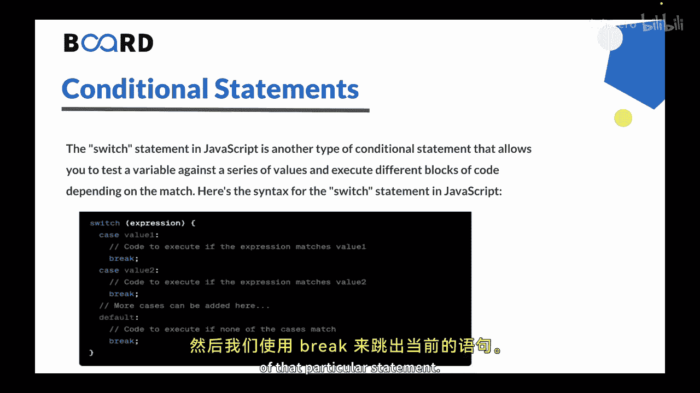
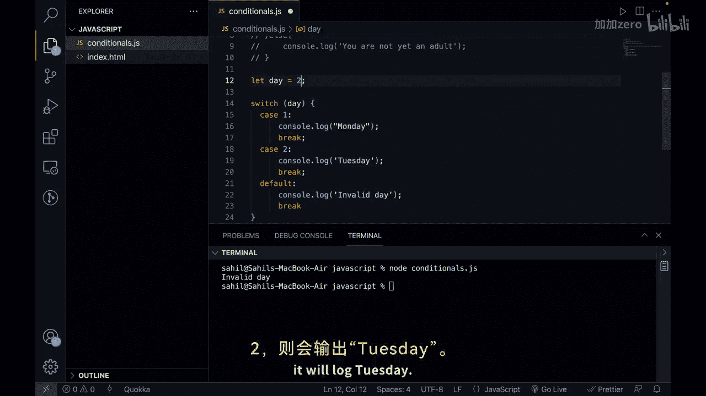

# 【Java全栈开发 专项课程（上）】Board Infinity—中英字幕 p129 p57_08_conditional-statements-if-else-switch -BV1tAygYoEj5_p129-

Hi there in the previous video we learn string manipulation now in this video we will learn conditional statements in JavaScript。

So let's get started。In JavaScript， condition statements allow you to perform different actions based on different conditions。

The two most common condition statements in JavaScript are if else and switch cases。

The F statements allows you to execute different blocks of code depending on whether a condition is true or false。

😊，Let's look at the syntax for if L statement in Java。

Now let's also see an example here to understand if an else condition。

So let's move to the VS code。And here what I will do is Ill just create a variable， let's say H。

And let's make it 18。I want to add a condition here。 I want to say if。H is greater than equal to 18。

Then I will open up the curly brackets and I'll just print out console Lo lock。Let's say。

 you are an adult。Then I will just have a else condition。Yes。Consl dot lock。I can say， you are not。

Yet an adult。One thing is to notice that this else condition is an optional you can just use if condition。

But else is used to handle edge cases more easily。So。

 let us see the output of this code as you can see the variable ages 18。

 that means it is coming under the F condition。So if I try to run this program。

You can see that it prints you are an editor。But if I make it less than  it。

 let's say 10 or something。And now if I are in this program， you will see that the output is。

 you are not yet an edit。In this example， this if statement checks whether the value of the age variable is greater than or equal to weighting if the condition is true。

 it executes a code inside these curly brackets that follow the if statement。😊。

If the condition is false， the code inside the curly brackets。😊。

Of the else condition is being logged to the console that is you are not an adult。

Next is switch statement。So the Swis statement in JavaScript is another type of conditional statement that allows you to test the variable against a series of values and execute different blocks of code depending upon the match。

😊，Let's look at the syntax here。You can see we are using a bunch of statements that is switch， case。

 break， all these things。So it takes an expression and based on the cases it executes some piece of code。

 then we have a break to break out of that particular statement。

Let's also create an example for this。So let me comment everything here and lets say that we are creating a variable day and the day is2。

So we are writing a switch statement and we want to evaluate an expression。

 lets say on the basis of day， on the value of day。😊，I want to execute the switch statement。

So here what I want to do is I want to say if。The case is one。That means if the day is one。

In that case， I can just say console lot lock。Monday。😊。

And we can just break because we got the value。We can say， case 2。

And here we can say console lotlock Tuesday。And then， we can break out。Similar。

 you can create it till Friday。😊，That would be case1 to case5。But in the end。

 we also want to have a default case if the value is something other than all these cases right so we can have a default case at this point and it is important to add it。

So I can say default， just console do lock。Chain valid day。

And we can just break it out of this so it's statement。So let's try to run this code。And I would say。

 node。Let's clear it first and I would say node conditioners and you can see the output is Tuesday because the day is2。

Let's give the D S 10 and let's try to run this again。You will see that the output is invalid day。

So in this example， the switch statement checks the value of the day variable and executes a code block associated with the matching case label。

😊，In this case。It is logging invalid day， but if we change it to2， it will log Tuesday。

So let's summarize this。😡，Conditional statements in JavaScript allows you to execute different blocks of code depending on whether a condition is true or false。

The F statement is used to test a single condition and execute different code blocks based on its truth value while the switch statement is used to test a variable against a series of values and execute different blocks of code based on the match。

😊，One important thing to notice that the Swiss statement is often used as an alternative to long chain of if L statements to make it more readable。

 especially when you have lot of cases to check。😡，This is all for this video in the next video we will see looping structures in JavaScript。

See you in the next video。 Thank you。🎼。

