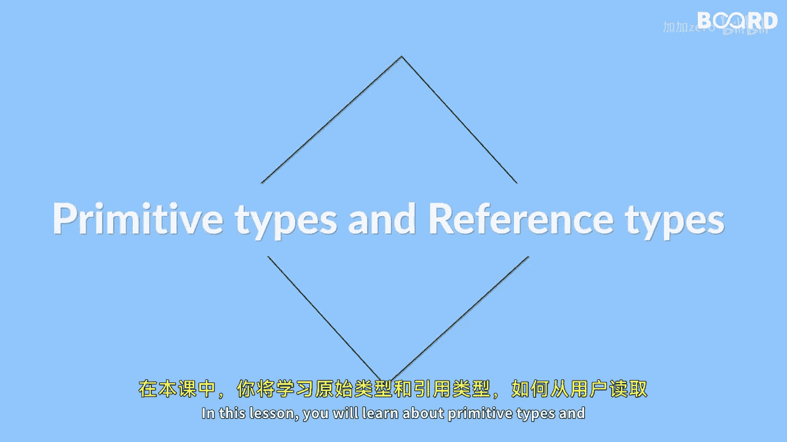

# Java全栈开发 专项课程（上）：13：原始类型、引用类型与类型转换

在本节课中，我们将学习Java中的两种数据类型：原始类型和引用类型。我们还将探讨如何从用户那里读取输入，以及如何在Java中进行类型转换。这些是构建Java程序的基础知识。

## 原始类型与引用类型

Java的数据类型主要分为两大类：原始类型和引用类型。

原始类型是Java语言内置的基本数据类型。它们直接存储值，并且不是对象。以下是Java中主要的原始类型：

*   **整数类型**：用于存储整数。
    *   `byte`：8位有符号整数。
    *   `short`：16位有符号整数。
    *   `int`：32位有符号整数（最常用）。
    *   `long`：64位有符号整数。
*   **浮点类型**：用于存储带小数点的数字。
    *   `float`：单精度32位浮点数。
    *   `double`：双精度64位浮点数（最常用）。
*   **字符类型**：用于存储单个字符。
    *   `char`：16位Unicode字符。
*   **布尔类型**：用于存储逻辑值。
    *   `boolean`：值为 `true` 或 `false`。

引用类型则更为复杂，它们是通过类创建的对象。引用变量存储的是对象在内存中的地址（引用），而不是对象本身的值。常见的引用类型包括：

*   **数组**：用于存储同一类型的多个元素。
*   **字符串**：`String` 类，用于存储文本。
*   以及所有其他自定义或Java内置的类。

## 从用户读取输入



上一节我们介绍了数据类型，本节中我们来看看如何让程序与用户交互。在Java中，我们可以使用 `Scanner` 类来从键盘读取用户的输入。

要使用 `Scanner`，首先需要导入它，然后创建一个 `Scanner` 对象，并将其与标准输入流（通常是键盘）关联。以下是基本步骤：

1.  导入 `java.util.Scanner` 包。
2.  创建 `Scanner` 对象。
3.  使用 `Scanner` 对象的方法（如 `nextInt()`， `nextDouble()`， `nextLine()`）读取特定类型的输入。

以下是一个简单的代码示例：

```java
import java.util.Scanner; // 1. 导入Scanner类

public class UserInputExample {
    public static void main(String[] args) {
        Scanner scanner = new Scanner(System.in); // 2. 创建Scanner对象

        System.out.print("请输入一个整数：");
        int number = scanner.nextInt(); // 3. 读取一个整数

        System.out.println("你输入的数是：" + number);
        scanner.close(); // 使用完毕后关闭scanner
    }
}
```

## 类型转换

了解了如何获取用户输入后，我们有时需要处理不同类型数据之间的转换。类型转换是将一个数据类型的值转换为另一个数据类型的过程。Java中的类型转换主要分为两种：隐式转换和显式转换。

**隐式转换（自动类型转换）**：当将一个小范围类型的值赋给一个大范围类型的变量时，Java会自动进行转换，因为这种转换是安全的，不会造成数据丢失。例如，将 `int` 赋值给 `double`。

```java
int myInt = 9;
double myDouble = myInt; // 自动将int转换为double
// 现在 myDouble 的值为 9.0
```

**显式转换（强制类型转换）**：当需要将一个大范围类型的值赋给一个小范围类型的变量时，必须进行显式转换。这需要在值前加上目标类型并用括号括起来。这种转换可能导致数据精度丢失或溢出。

```java
double myDouble = 9.78;
int myInt = (int) myDouble; // 手动将double转换为int
// 现在 myInt 的值为 9（小数部分被截断）
```

## 总结

本节课中我们一起学习了Java编程的几个核心概念。我们首先区分了**原始类型**（如 `int`， `double`， `boolean`）和**引用类型**（如 `String`， 数组）。接着，我们掌握了如何使用 **`Scanner` 类**从用户那里读取输入，使程序具备交互能力。最后，我们探讨了**类型转换**，包括由编译器自动完成的隐式转换和需要程序员手动指定的显式转换。理解这些基础知识对于编写功能完整的Java程序至关重要。