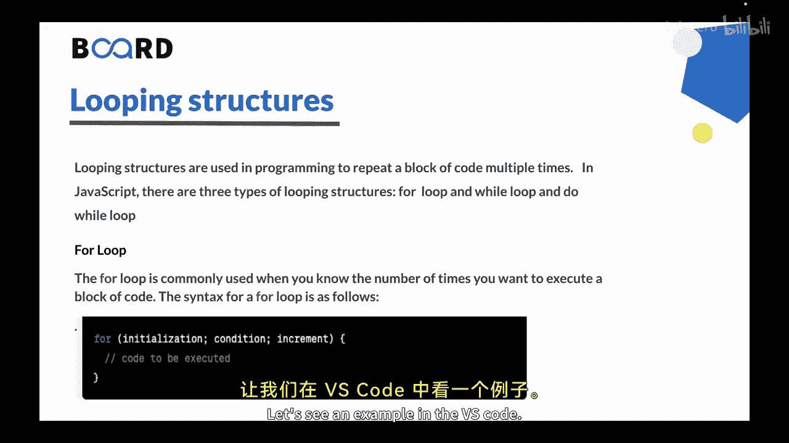
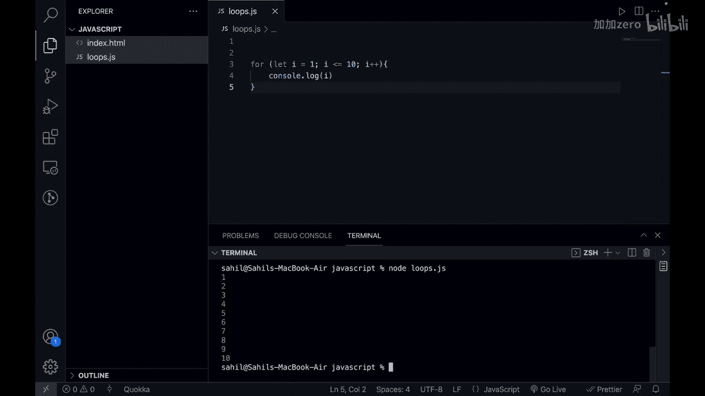
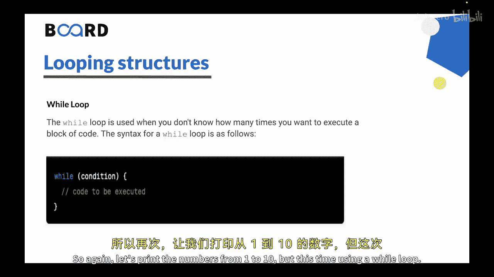
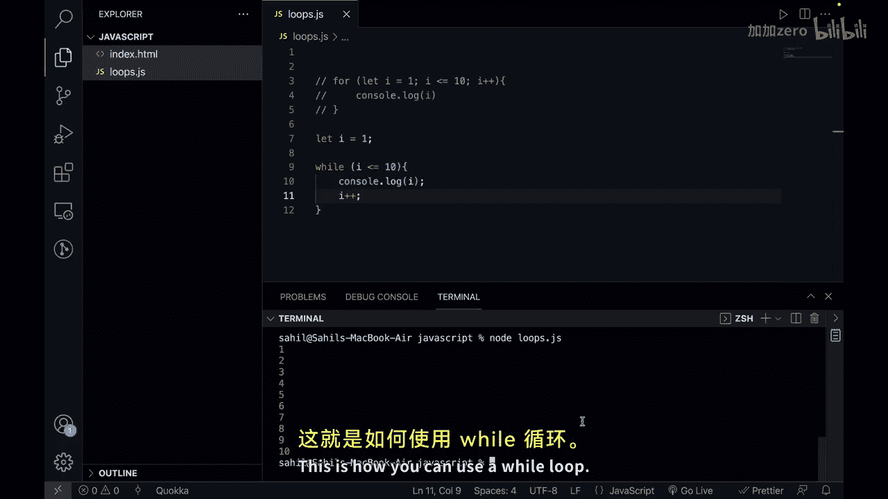
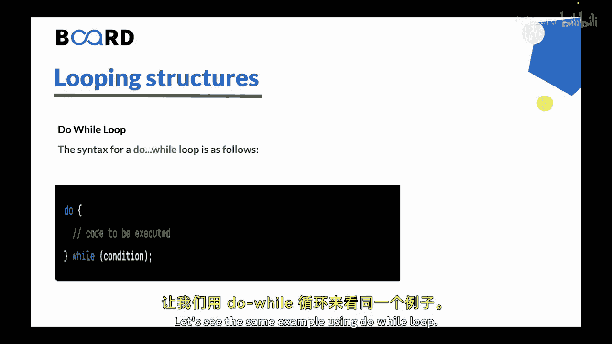
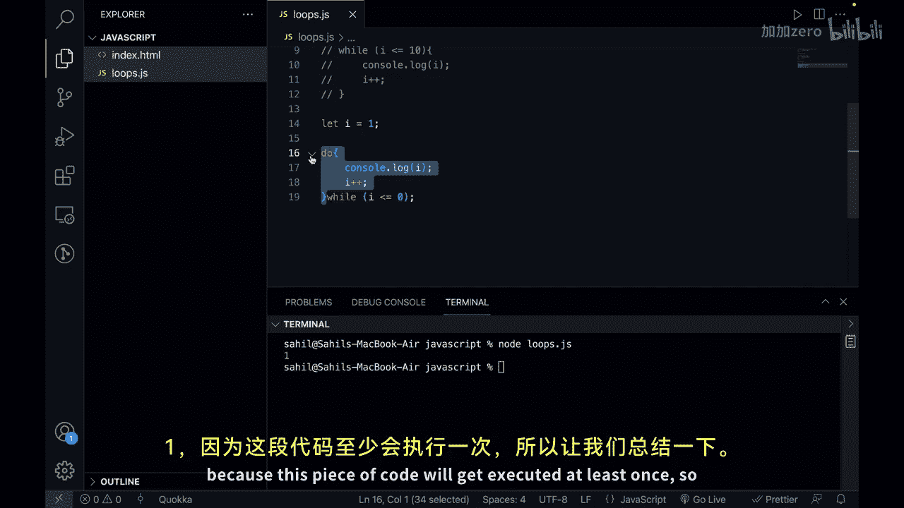

# 【Java全栈开发 专项课程（上）】Board Infinity—中英字幕 p130 p58_09_looping-structures-for-while -BV1tAygYoEj5_p130-

Hi there in the previous video we learn conditional statements in JavaScript now in this video we will learn looping structures。

So let's get started。Looping structures are used in programming to repeat a block of code multiple times。

In JavaScript there are three types of looping structures； we have fall loops。

 while loops and2 loops。Let's discuss each one of them。In detail， so first is for loop。

The for loop is a commonly used loop when you know the number of times you want to execute a block of code。

😡，This is the syntax of the for loop。The initialization statement is executed before the loop starts and is usually used to declare and initialize a variable。

😊，Here we have initialization option there。The condition is then evaluated at the beginning of each2 penetrationtration and if it is true。

 the code inside the loop is executed。😊，The increment statement is executed at the end of each loop byration and is typically used to update the value of the loop counter。

Let's see an example in the VS code。

So here I have a file that is loop or Gs and lets create a for loop that prints the number from 1 to 10。

A very naive approach would be that you are doing console statements up to 1 till 10。

 but let's say you have to run a loop 400 items。 you have to print 1 hundred items or let's say thousand items。

 Then writing the statement one by one can consume a lot of time。

That's why we need to consider something as loops。So， we can save4。And we can initialize a variable。

 let's say， I。And it will start from one。And I would be less than equal to 10。

And then you can say I plus plus。And here we can just see。Consul Lolock， I。So， first I will be one。

 it will check the condition yes，1 is less than equal to 10。

 it will print one and then it will move to that is i equals to 2 that is i plus plus so lets open up the terminal and run this program。

So here I would say node and loop dot js， you can see we get the output as 12 10 as the numbers。

Let's move to the next loop。That is viu。So， the while loop is used when you don't know how many times you want to execute a block of code。

Let's see the syntax of value loop。So here you can see that the condition is evaluated at the beginning of each loop iteration and if it is true the code inside the loop is executed。

 the loop continues to execute until the condition becomes false。😊，So again。

 let's print the numbers from 1 to 10， but this time using a while loop。

So I will comment it out and here I would say let I to be one here we are initializing the eye before signing the loop。

And then we can see， why。I is less than equal to 10。

 What we want to do here is we just want to run a block of code where we can say console lot log I。

 and then we are incrementing the I that is i plus plus。Or an easy at， it is i equals to i plus 1。

If I click on save and let's run this program again， you will see we get the same output。

This is how you get news of by loop。

Let's move on to the next loop。😡，So， the next loop is。不外路。The doy loop is similar to the Y loop。

 but it has a different behavior。Let's see the syntax of the du value loop。So in a Dubai loop。

 the code inside the loop is executed at least once why because。😡，Condition is checked after the。

Code block， you can see here that we have code to be executed， and then we have a value condition。

 So regardless of whether the condition is true or false。

 the code inside the loop is executed at least once after the code inside the loop is executed。

 the condition is then evaluated。 If the condition is true。

 the loop continues to execute If the condition is false， the loop will exit。

 Let's see the same example using due value。

So if I go here and let's comment this out。And what we can do here is we can say， let I to be one。

And let's say， do。Console dot log， I。And we can say， I plus， plus。And after that， we can say why。

We are checking the condition here。 I is less than equal to 10。

So here the output would be exactly the same。 So let's try to run this program。

 I will clear up the terminal， and you can see that we get the same output。

What did we mean was that it will regardless of the condition it will get executed。

 so lets say we say I is less than equal to0 and this condition is false right because even when the I is equal to1 you will see that this condition is not meeting。

 but then if we try to run this program。You will see that we get the output as one because this piece of code will get executed at least once。

So let's summarize this。Javascript provides three male looping structures that is for while and do while the fall loop is useful when you know the number of times you want to execute a block of code while the while loop is useful when you don't know how many times you want to execute a block of code on the other hand the Du while loop is similar to the while loop but it always executes a code inside the loop at least once before checking the condition。

By using these looping structures， you can iterate over collections of data or perform reetitive tasks in your JavaScript programs。

This is all for this video。 In the next video， we will learn about functions and its scope。

 See you in the next video。 Thank you。😊，🎼。

